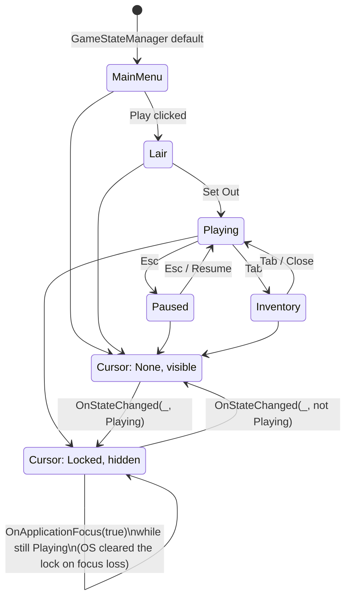

# [Issue #8] Mouse is not locked or hidden during play

**GitHub:** https://github.com/Ajw2003/PlunderSpell/issues/8
**Labels:** `bug` `ui`
**Phase:** Phase 0 — Unblock the loop

**Blocks:** nothing structurally — no other backlog issue depends on this landing first. It is a
soft precondition for #7 (no crosshair) reading correctly: a free, visible OS pointer drifting
around on top of a fixed IMGUI crosshair at screen centre would make the crosshair confusing rather
than clarifying, but #7 can be implemented without this landing first (see #7's plan).
**Blocked by:** none — `GameStateManager`, `GameState.StateChanged` and `UIRoot`'s
state-driven visibility pattern this plan extends all already exist and are exercised by
`UIScreenshotPlayModeTests` today.

## Problem

The cursor stays free and visible throughout a raid. Mouse-look fights the OS pointer, and the
pointer can leave the game window entirely (multi-monitor, borderless windowed) with nothing
pulling it back.

## Current state

Nothing in the runtime assembly ever sets `Cursor.lockState` or `Cursor.visible` for the raid's
actual player. Confirmed by a repo-wide read of every hit for `Cursor.lockState`/`Cursor.visible`:

- `Assets/_Project/Scripts/Runtime/Player/PlayerInputController.cs:19` sets
  `Cursor.lockState = CursorLockMode.Locked` unconditionally in `Awake()`, and
  `PlayerInputController.cs:65` sets it back to `CursorLockMode.None` inside
  `OnOpenInventoryPerformed` — but this class is the **legacy** `Player` namespace controller
  (`PlayerStateMachine` + `PlayerInputController`), wired only by
  `Assets/_Project/Scripts/Editor/TestSceneBuilder.cs:85-120`'s `BuildPlayerPrefab`. It is not part
  of the raid loop at all — `Assets/_Project/Scripts/Editor/RaidSceneBuilder.cs:259-305`'s
  `BuildPlayer()` never adds it. `Cursor.visible` is never touched by this class either, so even
  where this old lock call does run, the pointer stays drawn (Unity leaves `Cursor.visible` at its
  default `true` unless something sets it `false`).
- The raid's real controller, `FreeLookPlaytestController`
  (`Assets/_Project/Scripts/Runtime/Playtest/FreeLookPlaytestController.cs:16-140`), reads
  `Input.GetAxis("Mouse X"/"Mouse Y")` directly in `Look()` (lines 68-78) and never references
  `Cursor` at all — confirmed by reading the file in full; there is no `using` for anything that
  would touch cursor state and no call site.
- No other file in `Assets/_Project/Scripts/Runtime/` references `Cursor.lockState` or
  `Cursor.visible` (repo-wide grep, two matches total, both cited above, both in the disconnected
  legacy controller).

**The state machine this needs to key off already exists and is already the pattern the codebase
uses for exactly this class of problem.** `GameStateManager`
(`Assets/_Project/Scripts/Runtime/Core/GameFlow/GameStateManager.cs:6-24`) exposes `CurrentState`
and a `StateChanged` event; `GameState`
(`Assets/_Project/Scripts/Runtime/Core/GameFlow/GameState.cs:3-13`) has exactly the eight values the
issue's acceptance criteria enumerate (`MainMenu`, `Lair`, `Playing`, `Paused`, `Inventory`,
`Settings`, plus `GameOver`/`Victory` which the issue doesn't mention but which are reachable states
too). `UIRoot.ApplyState` (`Assets/_Project/Scripts/Runtime/UI/UIRoot.cs:69-83`) is the existing
precedent for "one method maps `GameState` to a visual side effect, subscribed once via
`StateChanged`" — it does this for screen visibility; this issue needs the same shape for cursor
state, not a new pattern.

`UIBootstrapper` (`Assets/_Project/Scripts/Runtime/UI/UIBootstrapper.cs:13-24`) runs
`[RuntimeInitializeOnLoadMethod(RuntimeInitializeLoadType.AfterSceneLoad)]` in **every** scene,
including `RaidScene` opened directly — it builds a `DontDestroyOnLoad` `GameObject("UIRoot",
typeof(UIRoot), typeof(GameFlowInput))` (`UIBootstrapper.cs:37-42`). `GameState.CurrentState`
defaults to `MainMenu` (`GameStateManager.cs:8`), so pressing Play on `RaidScene` today shows the
main menu canvas over a world whose player already has full mouse-look — this is the same root
defect issue #9 documents for movement/interaction, and it is the concrete repro for this issue too:
open `RaidScene`, press Play, and the OS cursor is already free over a scene that has not been
"entered" by any GameState transition yet.

## Root cause / gap analysis

Cursor state was never wired to anything. The one place that *does* touch `Cursor.lockState` is in
a controller (`PlayerInputController`) that predates the raid loop and is not part of it — so even
that isolated, unconditional lock (with no matching visibility change, and no release path except
opening the inventory) does not reach the scene this issue is about. The fix is not "add a missing
call," it is "add the missing subscriber" — the same `GameState.StateChanged` event `UIRoot` already
listens to needs a second listener that maps state to `Cursor.lockState`/`Cursor.visible`, plus an
`OnApplicationFocus` handler, since Windows (and every other platform) silently clears
`CursorLockMode.Locked` back to `None` when the application loses focus and does **not** restore it
automatically on refocus — nothing in the codebase handles this today (repo-wide grep for
`OnApplicationFocus` returns nothing).

## Relationship to #9

#9 gates player *input components* (`FreeLookPlaytestController`, `PushToCastController`,
`LootInteractor`) by `GameState`; this issue gates *cursor chrome* by the same `GameState`. They are
independently landable — a locked-and-hidden cursor over a world that still responds to WASD is
still a bug (#9's bug), and gated input under a free OS cursor is still a bug (this issue's bug) —
but a human playtesting either fix in isolation will find the other bug immediately, so land them
together for a coherent verification pass even though neither implementation depends on the other's
code. Both consume `GameStateManager.StateChanged`; neither needs to touch the other's files.

## Implementation plan

1. **Add `CursorStateController`** to
   `Assets/_Project/Scripts/Runtime/UI/CursorStateController.cs` (new file, `Plunderspell.UI`
   namespace/assembly — same as `UIRoot`/`GameFlowInput`, no new assembly reference needed since
   `Cursor` and `Application` are plain `UnityEngine`). Deliberately a sibling of `UIRoot`, not a
   method folded into it: `UIRoot`'s own doc comment scopes it to "owns the Canvas and every
   top-level screen" (`UIRoot.cs:7`) — cursor state is a different concern that happens to key off
   the same event.

   ```csharp
   using Plunderspell.Core;
   using UnityEngine;

   namespace Plunderspell.UI
   {
       /// <summary>
       /// Locks and hides the cursor while GameState.Playing, releases it everywhere else. Also
       /// re-applies on regaining application focus: the OS clears CursorLockMode.Locked back to
       /// None on focus loss (alt-tab, clicking another window) and Unity does not restore it
       /// automatically, so without this the cursor comes back free after every alt-tab.
       /// </summary>
       [DisallowMultipleComponent]
       public class CursorStateController : MonoBehaviour
       {
           private void OnEnable()
           {
               GameServices.GameState.StateChanged += OnStateChanged;
               Apply(GameServices.GameState.CurrentState);
           }

           private void OnDisable()
           {
               if (GameServices.GameState != null)
                   GameServices.GameState.StateChanged -= OnStateChanged;
           }

           private void OnStateChanged(GameState previous, GameState next) => Apply(next);

           private void OnApplicationFocus(bool hasFocus)
           {
               if (hasFocus && GameServices.GameState != null)
                   Apply(GameServices.GameState.CurrentState);
           }

           private static void Apply(GameState state)
           {
               bool playing = state == GameState.Playing;
               Cursor.lockState = playing ? CursorLockMode.Locked : CursorLockMode.None;
               Cursor.visible = !playing;
           }
       }
   }
   ```

   `OnEnable`/`OnDisable` mirror the subscribe/unsubscribe pattern `UIRoot` already uses in
   `Awake`/`OnDestroy` (`UIRoot.cs:32`, `44`) and `RaidBootstrapper` uses in `OnEnable`/`OnDisable`
   (`RaidBootstrapper.cs:49`, `57`) — using `OnEnable`/`OnDisable` rather than `Awake`/`OnDestroy`
   here specifically because `OnApplicationFocus` pairs naturally with the same enable/disable
   lifecycle and because `GameServices.GameState` must already be initialised (`UIBootstrapper.cs:21`
   calls `GameServices.Initialize()` before creating this object) — `OnEnable` runs after `Awake`
   on the same frame the object is created, by which point initialization has already happened in
   `UIBootstrapper.Bootstrap()`'s own method body (line 21 before line 23's `CreateUIRoot()`).

2. **Wire it into `UIBootstrapper`.** Add the component to the same `DontDestroyOnLoad` object as
   `UIRoot`/`GameFlowInput`:

   ```csharp
   // UIBootstrapper.cs:39, change:
   var go = new GameObject("UIRoot", typeof(UIRoot), typeof(GameFlowInput));
   // to:
   var go = new GameObject("UIRoot", typeof(UIRoot), typeof(GameFlowInput),
       typeof(CursorStateController));
   ```

   This guarantees the cursor controller exists in every scene `UIBootstrapper` runs in (`RaidScene`
   opened directly, any future dedicated menu scene, the combat test scene once #18 lands) without
   any scene-specific wiring — the same reason `UIRoot` and `GameFlowInput` are built this way.

## Testing & verification plan

- **EditMode:** none of this issue's logic is meaningfully unit-testable in isolation — `Apply` is a
  two-line switch with no branching worth asserting beyond "Playing locks, everything else doesn't,"
  which is better proven by the PlayMode test below than by mocking `Cursor` (a static engine API
  with no seam to intercept). Skip a dedicated EditMode test rather than write one that asserts
  nothing beyond the compiler.
- **PlayMode:** extend `Assets/_Project/Scripts/Tests/PlayMode/UIScreenshotPlayModeTests.cs`
  (namespace `Plunderspell.Tests.PlayMode`, already in `Plunderspell.Tests.PlayMode.asmdef` which
  references `Plunderspell.Core`/`Plunderspell.UI`) — it already drives
  `GameServices.GameState.ChangeState(...)` across every `GameState` value in one `[UnityTest]`
  (`CapturesAllUIScreens`, lines 51-65). Add assertions after each `ChangeState` call:
  `Assert.AreEqual(state == GameState.Playing ? CursorLockMode.Locked : CursorLockMode.None,
  Cursor.lockState)` and the matching `Cursor.visible` check. This reuses the existing state-cycling
  test rather than adding a second one that duplicates its setup.
- Focus-loss/refocus (`OnApplicationFocus`) cannot be driven from an automated test — Unity's test
  runner does not simulate OS focus events — so this half of the acceptance criteria is a **manual
  gate**: alt-tab out of a Play session while `GameState.Playing`, confirm the cursor is not left
  free when focus returns.
- **No confirmed Unity Editor install is verified in this working environment.** The code sketch
  above matches the project's existing conventions and compiles against APIs already used elsewhere
  in the same assembly (`Cursor`, `Application`, `GameServices`), but has not been run through the
  real Unity 6000.3.15f1 toolchain — treat the PlayMode assertions and the manual alt-tab gate as
  what a human (or a driven-Editor CLI session) must run before closing the issue.

## Acceptance criteria

- [ ] Cursor is locked (`CursorLockMode.Locked`) and hidden (`Cursor.visible == false`) in
      `GameState.Playing`.
- [ ] Cursor is released (`CursorLockMode.None`) and visible in `MainMenu`, `Lair`, `Paused`,
      `Inventory`, `Settings` (and, not named by the issue but reachable, `GameOver`/`Victory`).
- [ ] Focus loss / alt-tab does not leave the cursor in the wrong state — re-entering the
      application while `Playing` re-locks and re-hides it.

## Visual



## Effort & risk

**S.** One new ~35-line file plus a one-line `UIBootstrapper` edit, keying off an event that already
exists and is already exercised by an automated test.

Risks:
- **`TestSceneBuilder`'s legacy player conflicts with this fix.** `PlayerInputController.Awake()`
  (`PlayerInputController.cs:19`) unconditionally sets `Cursor.lockState = CursorLockMode.Locked` the
  moment that prefab wakes up. `UIBootstrapper` runs in *every* scene, including `TestScene` — so
  once `CursorStateController` exists, `TestScene`'s default `GameState.MainMenu` will immediately
  set `Cursor.lockState = None` via `Apply()`, and whichever of the two `Awake()`/`OnEnable()` calls
  happens to run last on that frame wins the race. This plan does not touch `PlayerInputController`
  (it is out of scope — a different, disconnected controller for a different, disconnected scene) but
  the conflict should be flagged for whoever next touches `TestSceneBuilder`: either give `TestScene`
  its own reason to be in `GameState.Playing` (a bootstrapper that calls
  `GameServices.GameState.ChangeState(GameState.Playing)` on start) or accept that the legacy
  controller's cursor lock is redundant and remove it once `TestSceneBuilder` is retired.
- **No confirmed Unity Editor install** in this working environment — see "Testing & verification
  plan."

## Definition of done

`Cursor.lockState`/`Cursor.visible` track `GameState` through every documented transition
(`MainMenu → Lair → Playing → Paused → Playing`, `Playing → Inventory → Playing`), verified by the
extended `UIScreenshotPlayModeTests`, and a human confirms alt-tabbing out of and back into a
`Playing` session does not leave the cursor free.
