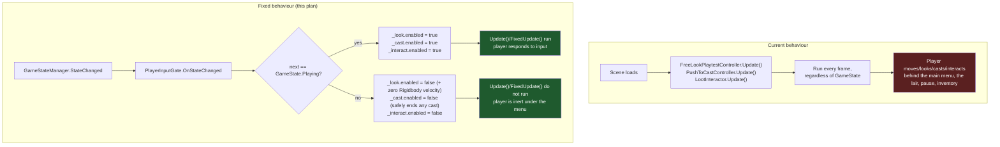

# [Issue #9] Player can still move and look around while the main menu is open

**GitHub:** https://github.com/Ajw2003/PlunderSpell/issues/9
**Labels:** `bug` `ui`
**Phase:** Phase 0 — Unblock the loop

**Blocks:** nothing structurally in the backlog. It is a soft precondition for #7's crosshair
reading correctly while paused/in the menu — without this fix, `LootInteractor.Update()`
(`Assets/_Project/Scripts/Runtime/Loot/LootInteractor.cs:55-67`) keeps raycasting and keeps
responding to the interact/drop keys even while a menu has focus, so pressing `E` behind an open
pause menu can open a door or pick something up with the menu still on screen — a second, sharper
symptom of the same root cause #7's plan notes only in passing.
**Blocked by:** none — `GameStateManager`, `GameState.StateChanged` and the menu flow
(`MainMenuScreen` → `LairScreen` → `Playing`) this needs to gate against already exist and are
already exercised by `GameFlowInput` and `RaidBootstrapper`.

## Problem

Movement, mouse-look, interaction and casting stay active no matter what `GameState` the game is
in. Opening the main menu, the lair, the pause menu or the inventory does not stop the world from
responding to input behind it.

## Current state

**Nothing in the player's input path reads `GameState` at all.** Confirmed by reading every
component `RaidSceneBuilder.BuildPlayer()` (`Assets/_Project/Scripts/Editor/RaidSceneBuilder.cs:259-305`)
attaches to the player object — `Rigidbody`, `CapsuleCollider`, `StatusEffectReceiver`,
`AcousticEmitter`, `FootstepNoiseEmitter`, `PushToCastController`, `SpellCastingSystem`,
`FreeLookPlaytestController`, `LootInteractor`, `IntruderTag` — none of them reference
`Plunderspell.Core.GameServices` or `GameState`:

- **`FreeLookPlaytestController`** (`Assets/_Project/Scripts/Runtime/Playtest/FreeLookPlaytestController.cs`)
  drives look (`Look()`, lines 68-78, reading `Input.GetAxis("Mouse X"/"Mouse Y")` every `Update()`)
  and movement (`Move()`, lines 90-108, reading `Input.GetAxisRaw("Horizontal"/"Vertical")` every
  `FixedUpdate()`) unconditionally. `Update()`/`FixedUpdate()` (lines 60-66) have no early-out of any
  kind.
- **`PushToCastController`** (`Assets/_Project/Scripts/Runtime/Voice/PushToCastController.cs:43-49`)
  polls `Input.GetKeyDown`/`GetKeyUp(_pushToCastKey)` in `Update()` with no gate — holding `V` opens
  the microphone regardless of `GameState`.
- **`LootInteractor`** (`Assets/_Project/Scripts/Runtime/Loot/LootInteractor.cs:55-67`) raycasts for
  focus and responds to `E`/`Q` every `Update()`; the only early-out it has is
  `if (isSpawned && !isOwner) return;` (line 58) — a networking ownership check, unrelated to
  `GameState`.

**The state machine and the transitions it needs to key off already exist.** `GameStateManager`
(`Assets/_Project/Scripts/Runtime/Core/GameFlow/GameStateManager.cs:6-24`) exposes `CurrentState`
and `StateChanged`. `GameFlowInput`
(`Assets/_Project/Scripts/Runtime/UI/GameFlowInput.cs:8-45`) already drives `Esc`↔`Paused` and
`Tab`↔`Inventory` transitions off `GameState.Playing`, and `RaidBootstrapper`
(`Assets/_Project/Scripts/Runtime/Raid/RaidBootstrapper.cs:73-84`)'s `OnGameStateChanged` already
distinguishes "entering `Playing` fresh from the lair" from "entering `Playing` back from `Paused`/
`Inventory`" — the exact same three states (`Playing`, `Paused`, `Inventory`) this issue's
acceptance criteria name. `UIRoot.ApplyState`
(`Assets/_Project/Scripts/Runtime/UI/UIRoot.cs:69-83`) is the established precedent in this codebase
for "one method, keyed off `StateChanged`, maps `GameState` to a side effect on a fixed set of
objects" — this issue needs the same shape applied to the player's input components instead of UI
screens.

**This is reproducible today with no special setup.** `UIBootstrapper`
(`Assets/_Project/Scripts/Runtime/UI/UIBootstrapper.cs:13-24`) bootstraps the canvas-based menu into
*every* scene on `AfterSceneLoad`, including `RaidScene` opened directly for playtesting.
`GameStateManager.CurrentState` defaults to `GameState.MainMenu`
(`GameStateManager.cs:8`). So pressing Play on `RaidScene` shows `MainMenuScreen` on top of a world
whose `FreeLookPlaytestController` and `LootInteractor` are already fully live — moving the mouse
turns the (invisible, un-rendered-behind-the-menu) camera and WASD moves the body, both hidden
behind the menu canvas until Play is clicked and the state machine catches up.

## Root cause / gap analysis

The menu/pause flow (`docs/systems/raid-scene-assembly.md`'s "main menu -> lair -> Set Out -> raid")
was built entirely on the UI side — `UIRoot` shows/hides screens, `GameFlowInput` toggles
`Paused`/`Inventory` — without a matching consumer on the player side. `GameState` is a complete,
correct source of truth; nothing was ever built to *read* it from the player object. This is not a
timing bug or a race condition, it is a component that was simply never written.

## Implementation plan

1. **Add a small assembly seam so a single gate can reach all three input components.**
   `RogueAi.Playtest.asmdef` (`Assets/_Project/Scripts/Runtime/Playtest/RogueAi.Playtest.asmdef`)
   currently references only `RogueAi.Core`/`RogueAi.Acoustics`. Add references to
   `RogueAi.Voice`, `RogueAi.Loot` and `Plunderspell.Core`:

   ```json
   "references": [
       "RogueAi.Core",
       "RogueAi.Acoustics",
       "RogueAi.Voice",
       "RogueAi.Loot",
       "Plunderspell.Core"
   ],
   ```

   No cycle is introduced: `RogueAi.Voice.asmdef` references only `PurrNet.Runtime`;
   `RogueAi.Loot.asmdef` references `PurrNet.Runtime`, `RogueAi.Core`, `RogueAi.Player`;
   `Plunderspell.Core.asmdef` references nothing at all — none of the three reference
   `RogueAi.Playtest` back. Placing the gate in `Playtest` (rather than, say, `RogueAi.Raid`, which
   already references `Voice`/`Loot`/`Plunderspell.Core` but not `Playtest`) keeps it colocated with
   `FreeLookPlaytestController`, the component whose own doc comment already calls itself
   "a harness, not the shipping controller... delete it once the real controller is in a prefab"
   (`FreeLookPlaytestController.cs:10-13`) — the gate is exactly that kind of playtest-scoped
   scaffolding, not permanent shipping input architecture.

2. **Add `PlayerInputGate`** to
   `Assets/_Project/Scripts/Runtime/Playtest/PlayerInputGate.cs` (new file):

   ```csharp
   using Plunderspell.Core;
   using RogueAi.Loot;
   using RogueAi.Voice;
   using UnityEngine;

   namespace RogueAi.Playtest
   {
       /// <summary>
       /// Enables movement, look, interaction and casting only while GameState.Playing, driven from
       /// GameStateManager.StateChanged rather than each component polling GameState itself — one
       /// place decides whether the player responds to input, matching how UIRoot.ApplyState is the
       /// one place that decides which screen is visible.
       /// </summary>
       [DisallowMultipleComponent]
       public class PlayerInputGate : MonoBehaviour
       {
           [SerializeField] private FreeLookPlaytestController _look;
           [SerializeField] private PushToCastController _cast;
           [SerializeField] private LootInteractor _interact;

           private void Awake()
           {
               if (_look == null) _look = GetComponent<FreeLookPlaytestController>();
               if (_cast == null) _cast = GetComponent<PushToCastController>();
               if (_interact == null) _interact = GetComponent<LootInteractor>();
           }

           private void OnEnable()
           {
               GameServices.GameState.StateChanged += OnStateChanged;
               Apply(GameServices.GameState.CurrentState);
           }

           private void OnDisable()
           {
               if (GameServices.GameState != null)
                   GameServices.GameState.StateChanged -= OnStateChanged;
           }

           private void OnStateChanged(GameState previous, GameState next) => Apply(next);

           private void Apply(GameState state)
           {
               bool active = state == GameState.Playing;
               if (_look != null) _look.enabled = active;
               if (_cast != null) _cast.enabled = active;
               if (_interact != null) _interact.enabled = active;
           }
       }
   }
   ```

   Disabling a `MonoBehaviour` stops Unity from calling its `Update`/`FixedUpdate`/`OnGUI` — no
   per-callsite `if (state != Playing) return;` needs to be scattered through three separate files
   in three separate assemblies (the "not by disabling individual components ad hoc" the issue's
   acceptance criteria warns against means exactly this: no scattered, independently-drifting checks
   — one component, driven by one event, is the single source of truth).

   `PushToCastController.OnDisable()` (`PushToCastController.cs:85-90`) already calls `EndCasting()`
   if a cast is in progress when disabled — so gating via `.enabled = false` gets the "don't leave
   the mic open when input is cut" safety for free, no extra code needed.

3. **Zero the player's residual velocity when movement is gated off.**
   `FreeLookPlaytestController.Move()` (`FreeLookPlaytestController.cs:90-108`) sets
   `_body.velocity` explicitly every `FixedUpdate()` (line 102); once the component is disabled that
   call stops firing, but the `Rigidbody`'s *last* velocity is not cleared by Unity — a player who
   opens the pause menu mid-sprint would keep sliding across the floor under physics while the pause
   menu sits on top, since nothing zeroes `_body.velocity` on disable. Add an `OnDisable` to
   `FreeLookPlaytestController` itself (not to the gate, since the gate should not need to know the
   controller's internals) to stop this:

   ```csharp
   // FreeLookPlaytestController.cs, alongside the existing Awake/Update/FixedUpdate:
   private void OnDisable()
   {
       if (_body != null)
           _body.velocity = Vector3.zero;
   }
   ```

   This is a one-component-owns-its-own-cleanup change, not part of the gate's responsibility —
   consistent with `PushToCastController` already owning its own `OnDisable` safety net (step 2).

4. **Attach the gate where the player is built.** `RaidSceneBuilder.BuildPlayer()`
   (`RaidSceneBuilder.cs:259-305`) already lives in `RogueAi.Editor.asmdef`, which already
   references `RogueAi.Playtest`. Add one line after the existing component adds:

   ```csharp
   // RaidSceneBuilder.cs:296-303, after FreeLookPlaytestController/LootInteractor/IntruderTag:
   root.AddComponent<FreeLookPlaytestController>();

   LootInteractor interactor = root.AddComponent<LootInteractor>();
   interactor.SetEye(eye.transform);

   root.AddComponent<IntruderTag>();
   root.AddComponent<PlayerInputGate>(); // NEW — Awake() auto-wires via GetComponent, no manual refs needed
   return root;
   ```

   Order does not matter here: `PlayerInputGate.Awake()` resolves its targets via `GetComponent`,
   which works regardless of sibling `Awake` ordering (unlike `[RequireComponent]`'s documented
   before-your-own-`Awake` trap noted in `docs/systems/raid.md`'s "Traps" section — this uses
   `GetComponent` in its *own* `Awake`, not a requirement resolved in someone else's).

## Testing & verification plan

- **EditMode:** add `Assets/_Project/Scripts/Tests/Runtime/PlayerInputGateTests.cs` to the
  `RogueAi.Tests` assembly (`Assets/_Project/Scripts/Tests/Runtime/RogueAi.Tests.asmdef`). That
  asmdef does not currently reference `Plunderspell.Core` — add it (same no-cycle reasoning as step 1
  above: `Plunderspell.Core` references nothing). Build a bare `GameObject` with
  `Rigidbody`, `FreeLookPlaytestController`, `PushToCastController`, `LootInteractor` and
  `PlayerInputGate` (mirroring `GuardTests.MakeGuard`'s pattern of building a component under test on
  a bare `GameObject`, `Assets/_Project/Scripts/Tests/Runtime/GuardTests.cs:36-44`), call
  `GameServices.Initialize()` once, then:
  ```csharp
  [Test]
  public void Test_GateEnablesOnlyWhilePlaying()
  {
      // ... build gameObject with the four components ...
      GameServices.GameState.ChangeState(GameState.Lair); // still not Playing
      Assert.IsFalse(look.enabled);
      Assert.IsFalse(cast.enabled);
      Assert.IsFalse(interact.enabled);

      GameServices.GameState.ChangeState(GameState.Playing);
      Assert.IsTrue(look.enabled);
      Assert.IsTrue(cast.enabled);
      Assert.IsTrue(interact.enabled);

      GameServices.GameState.ChangeState(GameState.Paused);
      Assert.IsFalse(look.enabled);
  }
  ```
  `LootInteractor` is a `NetworkBehaviour` (`PurrNet`); `RogueAi.Tests.asmdef` already references
  `PurrNet.Runtime` for other tests, and an unspawned `NetworkBehaviour` behaves as a plain
  `MonoBehaviour` for `.enabled` purposes (no network context needed to construct or gate one, only
  to call its RPC-wrapped methods — this test never calls `Interact()`/`Drop()`).
- **PlayMode:** a scene-level test is the honest way to prove `FreeLookPlaytestController.OnDisable`
  actually stops the `Rigidbody` from sliding — instantiate the player prefab pattern, give it
  horizontal velocity, disable the gate's target state, `yield return new WaitForFixedUpdate()`,
  assert `rigidbody.velocity == Vector3.zero`.
- **Manual protocol (unautomatable):** open `RaidScene`, enter Play, confirm WASD/mouse-look do
  nothing while the main menu is showing; click Play → Set Out, confirm control begins; press Esc,
  confirm the player stops dead (no sliding) and `E`/`Q` do nothing while the pause menu is up; press
  Esc again, confirm control resumes exactly where it left off.
- **No confirmed Unity Editor install is verified in this working environment** — the EditMode test
  can plausibly run headlessly via `Tools/Headless/`, but this has not been executed as part of this
  plan; the PlayMode test and manual protocol are the acceptance gate a human must run.

## Acceptance criteria

- [ ] Movement, look, interaction and casting only respond in `GameState.Playing`.
- [ ] Input is restored on returning to `Playing` from `Paused`/`Inventory` (no residual velocity,
      no stuck casting state).
- [ ] Gating is driven from `GameState` via a single subscriber (`PlayerInputGate`), not by ad hoc
      per-component `GameState` checks scattered across `FreeLookPlaytestController`,
      `PushToCastController` and `LootInteractor`.

## Visual



## Effort & risk

**S.** Two new small files (`PlayerInputGate.cs`, one test file), a three-line asmdef edit, a
one-line `RaidSceneBuilder.cs` edit, and a four-line `OnDisable` addition to an existing file. No
new architecture — this reuses `GameStateManager.StateChanged`, the same event `UIRoot` and
`RaidBootstrapper` already subscribe to.

Risks:
- **`SpellCastingSystem` is not gated by this plan.** `RaidSceneBuilder.BuildPlayer()` also adds a
  `SpellCastingSystem` (`RaidSceneBuilder.cs:294-295`), which resolves and applies spells once
  `PushToCastController` reports a recognised phrase — since `PushToCastController` is gated, a cast
  cannot *begin* outside `Playing`, but if a cast is already resolving in-flight at the exact frame a
  state change lands, `SpellCastingSystem` itself is not disabled and could still finish resolving.
  This is a narrow race (requires the state change to land inside the few-hundred-millisecond window
  between phrase recognition and resolution) and is left out of scope for this issue — flagged for
  whoever next touches `SpellCastingSystem`, not blocking this fix.
- **`AcousticEmitter`/`FootstepNoiseEmitter` are also not gated.** Footstep noise stops being
  generated once `FreeLookPlaytestController` is disabled (nothing drives `AccumulateFootsteps`,
  `FreeLookPlaytestController.cs:125-138`), so this is self-resolving, not a separate gap.
- **No confirmed Unity Editor install** in this working environment — see "Testing & verification
  plan."

## Definition of done

Opening any non-`Playing` screen (`MainMenu`, `Lair`, `Paused`, `Inventory`, `Settings`) stops the
player from moving, looking around, interacting or casting, verified by
`PlayerInputGateTests` and the manual protocol above; returning to `Playing` restores control with
no residual sliding and no stuck casting state.
