# [Issue #10] Enemies have no animations

**GitHub:** https://github.com/Ajw2003/PlunderSpell/issues/10
**Labels:** `enhancement` `animation`
**Phase:** Phase 2 — Make it readable
**Blocks:** none identified in `docs/plans/playable-state-backlog.md` — no other open issue lists
#10 as a blocker. It is a soft precondition for #52 (throw/swing wind-up weight) reading as
convincing on enemies, and for #43 (GildedColossus boss telegraphs) needing readable wind-up poses,
but neither issue is filed as hard-blocked by #10.
**Blocked by:** none — the rigs, the state machine, and the prefab pipeline all already exist;
this is purely an animation-authoring and Animator-wiring gap.

## Problem

Enemies slide around the NavMesh in a static bind pose — no idle, walk, chase, attack or death.
`CastleGuard` drives a `NavMeshAgent` (or a straight-line fallback) and swaps `GuardAlertState`
correctly, but nothing downstream ever plays a clip, so every guard reads as a mannequin being
dragged across the floor.

## Current state

**The rigs exist and are real, not a stub.** `Assets/Models/Enemies/enemy_manifest.json` (written
fresh by every `Tools/EnemyForge/build_enemies.py` run) lists bone counts for all 10 roster members:
Watchman 19, ManAtArms 19, Sergeant 19, WarHound 15, CryptRisen 19, SigilWisp 5, VaultWarden 18,
HexTurret 4, ArcRevenant 11, GildedColossus 18 — confirmed by direct read of the manifest. Every one
of these has `"passed": true` and non-zero triangle/vertex counts; the geometry and skinning are
finished, shipped assets.

**`docs/systems/enemy-asset-pipeline.md` only documents 5 of the 10 roster members, and describes a
rigging approach that does not match the other 5.** The doc's "What it produces" table (lines 9-18)
lists only SigilWisp, VaultWarden, HexTurret, ArcRevenant, GildedColossus, and its "assemble.py"
section (lines 46-49) states skin weights are "rigid: one bone per part at weight 1." Reading
`Tools/EnemyForge/enemy_forge/archetypes.py` directly shows this is true only for those 5 — the
other 5 (`Watchman`, `ManAtArms`, `Sergeant`, `CryptRisen`, and structurally `WarHound`) are built
from a shared `humanoid_body`/`humanoid_bones` helper (`archetypes.py:77-99` for the 19-bone biped
skeleton: `Root → Hips → Spine → Chest → Head`, plus mirrored `Shoulder/UpperArm/Forearm/Hand` and
`Thigh/Shin/Foot` chains) and the manifest confirms auto weight painting was used for these instead
(`"auto_weights": true, "restored": 204, "max_influences": 4` for Watchman, `enemy_manifest.json`),
not the rigid one-bone-per-part scheme the doc describes. This is a real doc gap — the enemy roster
grew from 5 to 10 archetypes and `docs/systems/enemy-asset-pipeline.md` was not updated to match —
worth fixing alongside this issue's own doc-touch step (step 6 below), since a plan that adds
animation to "the enemy pipeline" should leave that doc accurate about what pipeline it is.

**The FBX import is rig-only: zero animation clips exist anywhere in the roster.** Read directly:
`Assets/Models/Enemies/Watchman/Watchman.fbx.meta:101` sets `animationType: 2` (Generic — Unity's
`ModelImporterAnimationType` enum: 0 None, 1 Legacy, 2 Generic, 3 Human), and line 32 shows
`clipAnimations: []`. This is confirmed for the whole roster (every `.fbx.meta` is generated by the
same `assemble.py` export step, `docs/systems/enemy-asset-pipeline.md:46-49`, which never calls
Blender's animation/action-baking API at all — it bakes materials and skin weights, not motion).
This matches the issue body's own claim ("import as `animationType = Generic`... but no `Animator`
and no clips") exactly.

**`EnemyPrefabForge.BuildPrefab` adds every runtime component a guard needs except an `Animator`.**
Read in full (`Assets/_Project/Scripts/Editor/EnemyPrefabForge.cs:128-163`): it instantiates the
model, adds `CapsuleCollider` (lines 138-141), `NavMeshAgent` (lines 143-153), `StatusEffectReceiver`
(line 155), and `CastleGuard` (line 156), then tunes the guard via `SerializedObject` (line 169-182,
`ApplyGuardTuning`). There is no `instance.AddComponent<Animator>()` anywhere in this file, no
`AnimatorController` asset reference, and a repo-wide search for `Animator`/`AnimatorController` in
`Assets/_Project/Scripts/Runtime/` and `Assets/_Project/Scripts/Editor/` turns up exactly two other
hits — `PushToCastController._handAnimator` (issue #11's territory) and
`DownedPlayerCarryAdapter._animator` (also player-side, issue #11) — neither touches an enemy. No
`AnimatorController` asset exists anywhere under `Assets/_Project/` (confirmed: no `.controller`
files anywhere in the Enemies prefab or model directories).

**`CastleGuard` already exposes exactly what an Animator needs, unused.**
`CastleGuard.State` (`Assets/_Project/Scripts/Runtime/Guards/CastleGuard.cs:79`) is the current
`GuardAlertState`; `StateChanged` (`CastleGuard.cs:91`, invoked from `EnterState`,
`CastleGuard.cs:362`) fires exactly once per transition; `IsIncapacitated`
(`CastleGuard.cs:85`) and `IsDead` (`CastleGuard.cs:397`) distinguish "stunned, will recover" from
"health reached zero." `GuardAlertState` itself (`Assets/_Project/Scripts/Runtime/Guards/GuardAlertState.cs:7-23`)
has exactly five values: `Patrolling`, `Investigating`, `Chasing`, `Searching`, `Incapacitated` — **there
is no `Attacking` value**, and `GuardBrain.NextState`
(`Assets/_Project/Scripts/Runtime/Guards/GuardBrain.cs:106-140`) never produces one, because no melee
or ranged combat system exists yet (`docs/plans/issues/037-no-melee-combat-system.md` and
`docs/plans/issues/039-ranged-weapons-no-aim-fire.md` are both still open, Phase 1). This means the
issue's own acceptance criterion ("idle / locomotion / attack / death") can be authored and wired for
attack today, but nothing in the codebase can trigger it yet — see "Open questions" below.

For locomotion, `NavMeshAgent.velocity` (populated automatically by the agent every frame once it has
a path, `CastleGuard.cs:70,111`) is the natural speed signal — `CastleGuard.Act`
(`CastleGuard.cs:230-265`) already computes and assigns `_agent.speed` from `GuardBrain.MoveSpeed`
every tick (line 232-234), so `_agent.velocity.magnitude` reflects the guard's actual current speed,
including the 0 → patrol → chase ramp and the alarm-level speed bonus `GuardBrain.MoveSpeed` applies
(`GuardBrain.cs:38-62`). For the non-NavMesh fallback path (`CastleGuard.Steer`,
`CastleGuard.cs:323-338`, used when no baked NavMesh exists — `docs/systems/raid.md`'s documented
"a generated castle has no baked NavMesh until the seed is known" case), there is no agent velocity to
read; an Animator driver has to fall back to a computed `(currentPosition - lastPosition) / deltaTime`
in that case, since `CastleGuard` does not expose a public velocity property of its own (checked: the
only movement-adjacent public members are `Destination`, `State`, `InvestigationTarget`).

**Orientation is already solved and must not be disturbed.** `docs/systems/raid-scene-assembly.md`'s
"Orientation" table (lines 74-84) states enemies use "identity" root rotation with "correction on
mesh child" — confirmed by `archetypes.py`'s bone/part authoring, which places all geometry under the
`Root` bone hierarchy inside the mesh child, not the prefab root. Adding an `Animator` to the prefab
root (identity rotation, matching every other enemy-side component `EnemyPrefabForge` already adds
there) does not interact with this at all — `Animator` reads the `SkinnedMeshRenderer`'s bone
hierarchy directly, regardless of what rotation the prefab root carries.

## Root cause / gap analysis

This is not a case of animation code fighting an existing system — it is the literal absence of one.
Every prerequisite an animation layer needs already exists and is already correctly separated:
`GuardAlertState`/`StateChanged` give a clean state signal, `NavMeshAgent.velocity` gives a clean
locomotion signal, and the rigs are real skinned meshes with real bone hierarchies. What is missing
is entirely mechanical: (1) no clips were ever authored or baked for any of the 10 rigs, (2) no
`AnimatorController` asset exists to sequence them, and (3) `EnemyPrefabForge` never attaches an
`Animator` component or wires it to `CastleGuard.StateChanged`. None of the three blocks the others
technically, but all three are required before a guard visibly moves its limbs at all.

## Implementation plan

**Step 1 — decide the rig grouping before authoring a single clip.** The 10 archetypes are not one
skeleton. Group them by shared bone topology so clip authoring (and, where possible, `AnimatorController`
reuse) is not done 10 separate times:

- **Biped group (shared `humanoid_bones` hierarchy, `archetypes.py:77-99`):** `Watchman`, `ManAtArms`,
  `Sergeant`, `CryptRisen` — identical bone names/parenting (`Root/Hips/Spine/Chest/Head` +
  mirrored `Shoulder/UpperArm/Forearm/Hand`/`Thigh/Shin/Foot`), differing only in per-archetype height
  `h` and part `bulk`/material. Because Generic-type clips key local bone *rotations* (not
  world-space positions) for a rotation-driven walk/idle/attack, the same clip set can very likely
  be shared verbatim across these four via one common `AnimatorController` with per-prefab `Avatar`
  overrides — this needs verifying once a real Editor is available (see "Effort & risk"), since if any
  clip keys root/hip *translation* (e.g. a bounce), that will scale incorrectly across the ~15%
  height spread between Watchman (1.75 m per `archetypes.py:159`, matching `enemy_manifest.json`'s
  measured 1.703 m) and Sergeant (measured 1.813 m).
- **`WarHound`** (15 bones): its own quadruped-shaped rig (`archetypes.py:312-390` — a distinct
  bone list from `humanoid_bones`, not reused). Needs its own clip set.
- **`SigilWisp`** (5 bones, flier, `grounded=False` per `docs/systems/enemy-asset-pipeline.md:66-68`):
  hover-idle and a bank/swoop locomotion cycle instead of footfall-driven walk/run.
- **`HexTurret`** (4 bones, `PatrolSpeed = 0` in `EnemyPrefabForge.cs:66-67` — "a sentry that never
  leaves its post"): no locomotion clip needed at all; only an idle-scan cycle and a fire/death pose.
- **`ArcRevenant`** (11 bones, hovering caster) and **`VaultWarden`**/**`GildedColossus`** (18 bones
  each, the rigid one-bone-per-part family the existing doc already describes correctly): each gets
  its own rig-specific clip set.

**Step 2 — author or source idle/locomotion/death clips per group, in Blender via the existing
pipeline's `.blend` outputs.** Each archetype's `Assets/Models/Enemies/<Name>/<Name>.blend` is the
existing source of truth (`docs/systems/enemy-asset-pipeline.md`'s "assemble.py" stage already
exports it). Animation authoring is out of scope for `Tools/EnemyForge`'s current four modules
(`parts.py`/`materials.py`/`assemble.py`/`validate.py` — none references Blender's action/NLA API);
this plan recommends adding action-baking to `assemble.py` as a fifth responsibility (bake a small,
procedural idle-sway and walk-cycle per rig group using Blender's pose/keyframe API against the
already-known bone hierarchy) rather than hand-keying 10 rigs by hand in the Blender GUI, since the
whole pipeline's stated purpose (`docs/systems/enemy-asset-pipeline.md`'s header) is "no
hand-modelling step" — hand-keying clips would break that invariant for the one asset category that
still lacks it. This is a content-authoring decision a human should confirm (see "Open questions").

**Step 3 — build one `AnimatorController` per rig group** (4 groups per Step 1's grouping, saved
under a new `Assets/_Project/Animations/Enemies/` folder — mirrors the existing
`Assets/_Project/Prefabs/Enemies/` / `Assets/_Project/Data/Enemies/` split of authored-vs-generated).
Each controller needs, at minimum, matching the acceptance criteria:

- An `Idle` state (default).
- A `Locomotion` state (or a 1D blend tree on speed, for groups whose walk/run share a skeleton)
  driven by a float parameter `Speed`.
- A `Death` state, entered once and never exited (matches `CastleGuard.IsIncapacitated`/`IsDead`
  being terminal — a guard does not un-incapacitate mid-animation).
- An `Attack` state with no transition wired to it yet (see "Open questions" — #37/#39 are not landed,
  so there is nothing to trigger it from; author the state and leave the transition condition as a
  placeholder bool parameter `IsAttacking` that nothing sets yet, so #37/#39 only need to add one
  `SetBool` call rather than touch the controller graph).
- `HexTurret` and `SigilWisp` substitute an idle-scan / hover-idle for `Idle` and skip `Locomotion`
  (`HexTurret`) or replace footfall locomotion with a bank cycle (`SigilWisp`), per Step 1.

**Step 4 — add `Assets/_Project/Scripts/Runtime/Guards/GuardAnimatorDriver.cs`** (new file,
`MonoBehaviour`, namespace `RogueAi.Guards` to match `CastleGuard`/`GuardBrain`/`IntruderTag`'s
existing convention). Caches its `Animator`/`NavMeshAgent`/`CastleGuard` references in `Awake` (never
`GetComponent` per-frame, matching this project's stated convention), subscribes to
`CastleGuard.StateChanged` in `OnEnable`, and drives `Speed` from a cached velocity read once per
frame in `Update` (not `FixedUpdate` — Animator parameter updates are a presentation concern, and
`CastleGuard.Tick` itself already runs from `Update`, `CastleGuard.cs:118-124`):

```csharp
using Interfaces;
using UnityEngine;
using UnityEngine.AI;

namespace RogueAi.Guards
{
    /// <summary>
    /// Drives an enemy's Animator from CastleGuard's state and the NavMeshAgent's actual speed.
    /// Presentation-only: never writes back into CastleGuard or the agent, matching the observer
    /// pattern HitImpactPresenter uses for damage VFX (docs/plans/issues/012-no-damage-feedback.md).
    /// </summary>
    [RequireComponent(typeof(Animator))]
    public class GuardAnimatorDriver : MonoBehaviour
    {
        private static readonly int SpeedParam = Animator.StringToHash("Speed");
        private static readonly int DeadParam = Animator.StringToHash("IsDead");

        [SerializeField] private CastleGuard _guard;
        [SerializeField] private NavMeshAgent _agent;
        private Animator _animator;
        private Vector3 _lastPosition;

        private void Awake()
        {
            _animator = GetComponent<Animator>();
            if (_guard == null) _guard = GetComponent<CastleGuard>();
            if (_agent == null) _agent = GetComponent<NavMeshAgent>();
            _lastPosition = transform.position;
        }

        private void OnEnable()
        {
            if (_guard != null)
                _guard.StateChanged += OnStateChanged;
        }

        private void OnDisable()
        {
            if (_guard != null)
                _guard.StateChanged -= OnStateChanged;
        }

        private void Update()
        {
            float speed = _agent != null && _agent.isOnNavMesh
                ? _agent.velocity.magnitude
                : EstimateSpeedFromMovement();

            _animator.SetFloat(SpeedParam, speed);
        }

        // Guards without a baked NavMesh (CastleGuard.Steer's straight-line fallback,
        // CastleGuard.cs:323-338) have no agent velocity to read.
        private float EstimateSpeedFromMovement()
        {
            Vector3 position = transform.position;
            float speed = (position - _lastPosition).magnitude / Mathf.Max(Time.deltaTime, 0.0001f);
            _lastPosition = position;
            return speed;
        }

        private void OnStateChanged(GuardAlertState state)
        {
            if (state == GuardAlertState.Incapacitated && _guard != null && _guard.IsDead)
                _animator.SetBool(DeadParam, true);
        }
    }
}
```

Note the `Incapacitated` check deliberately distinguishes "stunned" (a Somnus/Tonitrus status effect,
`_status.IsIncapacitated` per `CastleGuard.cs:85`, which is temporary) from `_guard.IsDead` (health
reached zero, `CastleGuard.cs:397`, terminal) — only the latter should play the `Death` clip; a
sleeping-but-alive guard should read as unconscious, not dead. This split is not yet expressible
purely from `GuardAlertState` (both collapse to the same enum value, `Incapacitated`), so the driver
checks `IsDead` directly rather than trusting the state alone — flagged as a minor gap worth
revisiting once a stagger/flinch or sleep-specific pose is authored (a "sleeping" idle variant is a
nice-to-have this issue does not require).

**Step 5 — wire `Animator` + `AnimatorController` into `EnemyPrefabForge.BuildPrefab`.** After
`CastleGuard guard = instance.AddComponent<CastleGuard>();` (`EnemyPrefabForge.cs:156`), add:

```csharp
var animator = instance.AddComponent<Animator>();
animator.runtimeAnimatorController = LoadControllerFor(spec.Name); // resolves rig group per Step 1
animator.applyRootMotion = false; // CastleGuard/NavMeshAgent own movement; the clip must not fight it
instance.AddComponent<GuardAnimatorDriver>();
```

`applyRootMotion = false` is required: `CastleGuard.Act`/`Steer` already own all positional movement
(`CastleGuard.cs:230-338`), and letting a baked walk-cycle's root motion additionally translate the
rigidbody-free enemy would double-move it or fight the `NavMeshAgent`'s own stepping. `LoadControllerFor`
maps the four rig groups from Step 1 to their `AnimatorController` assets by archetype name, mirroring
how `Specs` already keys everything else in this file by `spec.Name`
(`EnemyPrefabForge.cs:51-74`). Because `EnemyPrefabForge`'s prefabs are variants of the model, not
copies (`docs/systems/raid-scene-assembly.md:116-117`'s stated invariant), re-running
`Tools/Plunderspell/Forge Enemy Prefabs + Roster` after this change re-adds the Animator to every
prefab without dropping the model link — directly satisfying the issue's third acceptance criterion
("`EnemyPrefabForge` wires the animator so re-forging prefabs does not drop it").

**Step 6 — update `docs/systems/enemy-asset-pipeline.md`.** Extend the "What it produces" table to
list all 10 archetypes (not just 5), correct the "assemble.py" section to note that only
`VaultWarden`/`HexTurret`/`ArcRevenant`/`GildedColossus`/`SigilWisp` use the rigid one-bone-per-part
scheme while `Watchman`/`ManAtArms`/`Sergeant`/`CryptRisen`/`WarHound` use the shared
`humanoid_bones`/quadruped biped rigs from `archetypes.py`, and add a new "Animation" subsection
documenting the clip-baking step this issue adds to `assemble.py` (Step 2) and where the resulting
`AnimatorController`s live (`Assets/_Project/Animations/Enemies/`). This keeps the doc from going
further stale the moment this ships, per `docs/README.md`'s citation convention.

## Testing & verification plan

- **EditMode:** extend `Assets/_Project/Scripts/Tests/Runtime/GuardTests.cs`
  (`RogueAi.Tests`/`RogueAi.Tests.asmdef`, which already builds a bare `GameObject` with a
  `CastleGuard` via `MakeGuard`, `GuardTests.cs:36-44`, with no scene and no NavMesh) with a new
  `GuardAnimatorDriverTests.cs` in the same assembly: add an `Animator` (no controller needed — the
  test only asserts parameter writes happen, not that specific frames of a clip render), attach
  `GuardAnimatorDriver`, call `CastleGuard.Configure`/`Tick` the same way existing `GuardTests` cases
  do, and assert `Animator.GetFloat("Speed")` changes across a patrol→chase transition and
  `Animator.GetBool("IsDead")` flips exactly once when `TakeDamage` drives health to zero (mirrors
  the "assert the rule, not the eyeball" pattern `docs/systems/raid.md:27-30` documents, and the
  guard-death assertion pattern `docs/plans/issues/012-no-damage-feedback.md`'s testing plan uses).
  Since `GuardAnimatorDriver` never touches `NetworkBehaviour`/PurrNet APIs directly (it only reads
  `CastleGuard`'s public surface and a plain `Animator`), this needs no network spin-up, the same
  reasoning `docs/systems/alarm.md` gives for `ApplyNoise`/`UpdateState` staying pure and directly
  testable.
- **PlayMode / manual (unautomatable — visual clip correctness):** once #18's combat test scene lands
  (`docs/plans/issues/018-no-combat-test-scene.md`), spawn one of each rig group, drive a guard through
  Patrolling → Investigating → Chasing → Incapacitated by walking near it and making noise, and
  confirm by eye that idle plays at rest, locomotion plays while moving (feet not sliding — the
  literal symptom this issue reports), and death plays once and holds. Until #18 lands, the fallback
  protocol is the same one issue #5's plan documents: open `RaidScene.unity`, enter Play, and observe
  guards during a live raid across at least a few seeds so every rig group is seen at least once (not
  every seed spawns every archetype — check `EnemyRoster.Entries` zone weighting,
  `EnemyPrefabForge.cs:51-74`, to pick seeds/zones deliberately if needed).
- **No confirmed Unity Editor install in this working environment** — see "Effort & risk." Neither the
  Blender clip-baking addition to `assemble.py` nor the `AnimatorController` graphs described above
  have been built or compiled as part of writing this plan.

## Acceptance criteria

- [ ] Each enemy has an `AnimatorController` with at least idle / locomotion / attack / death.
- [ ] Locomotion is driven by `NavMeshAgent` velocity; state changes hook `CastleGuard.StateChanged`.
- [ ] `EnemyPrefabForge` wires the animator so re-forging prefabs does not drop it.

## Visual

```mermaid
stateDiagram-v2
    [*] --> Idle
    Idle --> Locomotion: Speed > 0
    Locomotion --> Idle: Speed == 0
    Idle --> Attack: IsAttacking (parameter exists;\nnothing sets it until #37/#39 land)
    Locomotion --> Attack: IsAttacking
    Attack --> Idle: attack clip ends
    Idle --> Death: IsDead
    Locomotion --> Death: IsDead
    Attack --> Death: IsDead
    Death --> [*]: terminal — matches CastleGuard.IsDead

    note right of Death
        GuardAnimatorDriver checks
        CastleGuard.IsDead specifically,
        not just GuardAlertState.Incapacitated,
        so a sleeping (stunned) guard does
        not play the death clip.
    end note
```



## Effort & risk

**L.** The code-side wiring (Steps 4-5) is small and mechanical, closely following
`docs/plans/issues/012-no-damage-feedback.md`'s established observer pattern for
presentation-only MonoBehaviours. The real size is in Steps 1-3: 10 distinct rigs across at least 4
structurally different skeletons need clip content, and this project's stated principle (no
hand-modelling, no hand-authored content where a script can produce it,
`docs/systems/enemy-asset-pipeline.md`'s header) argues for extending the Blender pipeline to
procedurally bake clips rather than hand-keying 10 rigs in the Blender GUI, which is a meaningfully
bigger lift than the C# side alone.

Risks:
- **Clip-baking is new territory for `Tools/EnemyForge`.** Every trap `docs/systems/enemy-asset-pipeline.md`'s
  "Traps" section documents (stale bmesh references, material index clamping, Bevel corrupting
  attributes) was discovered the hard way during mesh/material work; animation baking against the
  same bone hierarchy is a different Blender API surface (`bpy.ops.pose`/keyframe insertion vs.
  `bmesh`) and should expect its own round of similar surprises — budget for it rather than assuming
  it is a thin addition.
- **Root motion vs. `NavMeshAgent`/`CastleGuard.Steer` double-movement.** Getting
  `applyRootMotion = false` wrong (or a clip that still bakes translation into a bone the game reads
  as movement) will make guards visibly slide or teleport — this is exactly the class of bug the issue
  is trying to fix, so it needs explicit verification, not just "it compiles."
- **Biped clip-sharing across `Watchman`/`ManAtArms`/`Sergeant`/`CryptRisen` is an assumption, not a
  verified fact** — see Step 1. If any clip bakes hip/root *translation* rather than pure rotation, it
  will not scale correctly across the ~6 cm height spread the manifest measures between them, and each
  needs its own clip after all.
- **No confirmed Unity Editor install in this working environment.** Every code sketch above (the
  `GuardAnimatorDriver` script, the `EnemyPrefabForge` wiring) is written to match this project's
  existing conventions and APIs but has not been compiled or run against the real Unity
  6000.3.15f1 toolchain, nor has the proposed Blender clip-baking addition been prototyped.

## Open questions

- **Should `assemble.py` gain a clip-baking stage (procedural, matching the pipeline's stated "no
  hand-modelling" principle), or is hand-keyed animation authored once per rig group in the Blender
  GUI and committed as a one-off `.blend` edit acceptable for this issue?** This plan recommends the
  former for consistency with the rest of the pipeline, but it is a real scope increase to
  `Tools/EnemyForge` that a human should confirm before Step 2 starts, since it changes this from "an
  animation-authoring task" into "an animation-authoring-*tooling* task."
- **What should trigger the `Attack` state?** No code path produces `GuardAlertState.Attacking` today
  (there is no such value) because no melee/ranged combat system exists yet (#37, #39). This plan
  authors the state and a placeholder `IsAttacking` bool that nothing sets, so #37/#39 only need to
  add one `SetBool` call — confirm this sequencing is acceptable rather than waiting for #37/#39 to
  land first.
- Should `HexTurret`'s "attack" (a stationary sentry, `PatrolSpeed = 0f`,
  `EnemyPrefabForge.cs:66-67`) be a distinct fire-animation state instead of reusing the generic
  `Attack` state name, given it never has a `Locomotion` state to transition out of? Left to whoever
  builds the turret's controller graph.

## Definition of done

Every one of the 10 enemy prefabs carries an `Animator` with a controller that visibly plays idle at
rest and locomotion while moving (feet no longer slide on the NavMesh), plays a distinct death pose
once and holds it when `CastleGuard.IsDead` becomes true, exposes an (even if currently untriggered)
attack state ready for #37/#39 to wire into, and survives a re-run of `Tools/Plunderspell/Forge Enemy
Prefabs + Roster` without being dropped.
