# [Issue #11] No animations for the player or for doors

**GitHub:** https://github.com/Ajw2003/PlunderSpell/issues/11
**Labels:** `enhancement` `animation`
**Phase:** Phase 2 — Make it readable
**Blocks:** none identified in `docs/plans/playable-state-backlog.md` — no other open issue lists
#11 as a blocker. It is a soft precondition for #48 (casting invisible to teammates), which needs
*some* visible cast tell for other players to see over the network, and #45 (drawbridge has no
operable mechanism), which needs door-style animation infrastructure to exist before a much larger
moving part (a drawbridge deck) can use the same approach — neither is a hard block.
**Blocked by:** none — `PushToCastController` and `CastleDoor` both already expose the hooks this
issue needs; the gap is entirely in what is (and is not) attached and authored downstream of them.

## Problem

The player has no visible body or hand animation (including no cast gesture), and doors pop between
open and closed with no motion.

## Current state

This issue is really two independent gaps that happen to share a label. They are documented
separately below because the door half turns out to be a bigger gap than the issue body implies.

### The player half

**The raid's actual player is a primitive capsule with no rig at all.**
`RaidSceneBuilder.BuildPlayer()` (`Assets/_Project/Scripts/Editor/RaidSceneBuilder.cs:259-305`) is
the code that builds the player in the shipped `RaidScene.unity`. It creates a bare `GameObject`
with a `Rigidbody` + `CapsuleCollider` (lines 264-270), a child `GameObject.CreatePrimitive(PrimitiveType.Capsule)`
for the visual with its own collider destroyed (lines 272-277), an `Eye` child carrying the camera
(lines 279-284), and an empty `HandSocket` transform (lines 286-288, position `(0.4, 1.2, 0.6)`
local — clearly meant as a future item/weapon anchor, but nothing parents anything to it today; a
repo-wide search for `HandSocket` turns up only this declaration). It then adds
`StatusEffectReceiver`, `AcousticEmitter`, `FootstepNoiseEmitter`, `PushToCastController`,
`SpellCastingSystem`, `FreeLookPlaytestController`, `LootInteractor`, `IntruderTag` (lines 290-303).
**No `SkinnedMeshRenderer`, no `Animator`, and no arm/hand model are added anywhere in this method.**
The issue body's framing ("the player is a primitive capsule built in `RaidSceneBuilder`") is
confirmed exactly by this read.

**`PushToCastController` already has the animation hook the issue asks for — it is simply never
assigned.** Read in full (`Assets/_Project/Scripts/Runtime/Voice/PushToCastController.cs`):
`[SerializeField] private Animator _handAnimator;` (line 23) and `_isCastingBool = "IsCasting"`
(line 24) exist specifically for this; `Awake` caches the hash (`Animator.StringToHash(_isCastingBool)`,
line 39), and `SetCastingVisual` (lines 77-83) calls `_handAnimator.SetBool(_isCastingHash, casting)`
whenever casting starts or stops, guarded by a null check (line 79) so nothing breaks today with the
field empty. `IsCasting` (line 33, the public property `BeginCasting`/`EndCasting` toggle, lines
51-75) is exactly the boolean the issue's acceptance criterion asks the cast-gesture state to be
"driven by." Since `RaidSceneBuilder.BuildPlayer()` calls `root.AddComponent<PushToCastController>()`
(`RaidSceneBuilder.cs:293`) with no follow-up code that assigns `_handAnimator`, the field is left at
its default `null` on the built player, and `SetCastingVisual`'s null check means the hook silently
does nothing — not broken, just unconnected, exactly the "wired but never assigned" pattern
`docs/plans/issues/010-enemy-animations.md`'s sibling issue documents for the enemy side and
`docs/systems/raid-scene-assembly.md:168-179` documents as this project's general "authored but never
wired in" failure mode.

**There is a second, unrelated player controller (`PlayerStateMachine`) that is not what the raid
actually uses.** `Assets/_Project/Scripts/Runtime/Player/PlayerStateMachine.cs` and its state classes
(`Assets/_Project/Scripts/Runtime/Player/States/*.cs`: `PlayerIdleState`, `PlayerWalkState`,
`PlayerRunState`, `PlayerJumpState`, `PlayerAttackState`, `PlayerDodgeState`, `PlayerDeadState`,
`PlayerRespawnState`, `PlayerInteractState`, `PlayerInvunerableState`) form a full state-machine
character controller — but `docs/plans/issues/018-no-combat-test-scene.md`'s "Current state" section
already establishes (and this read confirms independently) that `PlayerStateMachine` is bound to
`TestSceneBuilder`'s legacy `Player.prefab`, not to `RaidSceneBuilder.BuildPlayer()`'s capsule. Its
own class doc comment on `FreeLookPlaytestController`
(`Assets/_Project/Scripts/Runtime/Playtest/FreeLookPlaytestController.cs:10-13`) says this in as many
words: *"the real controller is `PlayerStateMachine`, which is bound to the Input System's generated
action asset and to a player prefab that does not exist yet... this gets a body into the castle so
the raid loop can actually be played and felt. Delete it once the real controller is in a prefab."*
So an arm/hand rig authored against `PlayerStateMachine`'s states would animate a controller nothing
in the shipped raid actually drives — this plan targets `FreeLookPlaytestController`
(`Assets/_Project/Scripts/Runtime/Playtest/FreeLookPlaytestController.cs`) and `PushToCastController`
instead, since those are what `RaidSceneBuilder.BuildPlayer()` actually attaches
(`RaidSceneBuilder.cs:293,296`). `FreeLookPlaytestController` itself has no animation hook of any
kind today (confirmed by full read, `FreeLookPlaytestController.cs:1-141` — its only visible-feedback
concern is `Stance` for footstep-noise loudness, lines 45-46, 80-88, nothing visual).

**A ragdoll/ `Animator` pattern already exists for the *downed* player, and is the closest precedent
in the codebase for wiring a player rig.** `DownedPlayerCarryAdapter`
(`Assets/_Project/Scripts/Runtime/Loot/DownedPlayerCarryAdapter.cs`) has `[SerializeField] private
Animator _animator;` (line 35), auto-resolved via `GetComponentInChildren<Animator>()` in `Awake`
when left empty (line 52), and `SetRagdollActive` (lines 113-135) disables it (`_animator.enabled =
!active`) when the ragdoll takes over. This component assumes an `Animator` exists somewhere under the
player hierarchy already — but per the `BuildPlayer()` read above, none does, so this hook is equally
unconnected today. It is worth wiring the same `Animator` this issue adds for the cast gesture into
`DownedPlayerCarryAdapter`'s existing `_animator` field, rather than adding a second one, once both
exist (see Step 3 below).

### The door half

**Doors implement `IOpenable`/`IHandOpenable` correctly, and the state-change hook already exists —
but the transition is an instant snap, and (more significantly) no authored castle prefab actually
has a door leaf mesh for that snap to apply to.**

`CastleDoor` (`Assets/_Project/Scripts/Runtime/Castle/CastleDoor.cs`) implements `IHandOpenable`
(line 20). `Open()`/`Close()` (lines 68-80) are `IOpenable`'s entry point — "Porta's entry point... the
spell's whole value is that it ignores both [lock and bar state], silently" (doc comment,
lines 64-67). `TryOpenByHand()` (lines 86-95) and `ForceOpen()` (lines 101-110) are the
`IHandOpenable` half. All four route through `SetOpen` (lines 120-130):

```csharp
private void SetOpen(bool open)
{
    _isOpen.value = open;
    if (_hinge != null)
    {
        _hinge.localRotation = open
            ? _closedRotation * Quaternion.AngleAxis(_openAngle, Vector3.up)
            : _closedRotation;
    }
    OpenStateChanged?.Invoke(open);
}
```

This confirms the issue's claim exactly — `_hinge.localRotation` is assigned directly, in one frame,
with no tween, no coroutine, no `Time.deltaTime` anywhere in the file. `_hinge` (line 42, defaults to
`transform` itself when left unassigned, `Awake`, line 59-60) and `_openAngle` (line 45, default 90°)
are already exposed exactly as an animation-driven version would need them, and `OpenStateChanged`
(line 55, an `event Action<bool>`, invoked at the end of `SetOpen`) already fires on every transition
— this is a clean hook for a presentation layer, the same observer pattern
`docs/plans/issues/012-no-damage-feedback.md`'s `HitImpactPresenter` uses for damage.

**No authored castle prefab currently carries a `CastleDoor` (or `CastleDoorHandle`) component at
all.** A repo-wide search for `CastleDoor` across `Assets/_Project/` finds it referenced from exactly
four places: its own declaration, `CastleLockdown.cs` (which calls `FindObjectsOfType<CastleDoor>()`
to lock/bar every door in the scene at high alarm — `Assets/_Project/Scripts/Runtime/Castle/CastleLockdown.cs:72,85`),
`LootInteractor.cs` (which defines the companion `CastleDoorHandle` MonoBehaviour, "put on a door's
collider so `LootInteractor` can find it without the Loot assembly referencing Castle,"
`Assets/_Project/Scripts/Runtime/Loot/LootInteractor.cs:149-161`), and two integration test files.
A search of every `.prefab` under `Assets/_Project/Prefabs/` for `CastleDoor` or `CastleDoorHandle`
returns **no matches**. `CastleDoor` and `CastleDoorHandle` are real, finished, tested code with
nowhere in the actual castle to run.

**The generated castle geometry itself has no door leaf mesh — a "door" opening is currently just a
hole cut in a wall.** Read `Tools/AssetPipeline/castle_builders.py`'s `_shell` helper (line 56):
`rk.room_shell(bm, uv, h, STONE, trim=PLASTER, floor_pigment=MORTAR, door_sides=door_sides)`, and
`Tools/AssetPipeline/room_kit.py`'s `room_shell` (lines 115-130): `opening = door(height) if side in
door_sides else None` — `door_sides` only tells `room_shell` which of the four walls to leave *open*
(no wall geometry on that side), never adds a hinged leaf, frame, or any separate mesh island that a
`CastleDoor` component could rotate. The two prefabs with actual gate-shaped structures —
`build_drawbridge` (`castle_builders.py:94-102`) and `build_gatehouse_module`
(`castle_builders.py:105-113`) — are similarly static: the drawbridge is a fixed timber deck box (line
99) with two fixed chain-post details (lines 100-102), and the gatehouse has fixed vertical metal bars
(lines 111-112) plus a fixed lintel bar (line 113) — a portcullis silhouette, not a moving portcullis,
and neither carries anything resembling a hinged door leaf. So "doors animate open/closed" cannot be
satisfied by adding motion to something already in the world; it first needs something in the world to
move. This is a materially bigger gap than "instant snap → tweened rotation," and this plan treats it
as such (see Root cause and Step 4 below) rather than assuming a leaf mesh already exists somewhere
unlinked.

**`PORTA` already resolves through the same `IOpenable` contract the issue asks the animation to key
off of.** `Assets/_Project/Scripts/Runtime/Spells/Effects/PrimarySpellEffects.cs` and
`MisfireSpellEffects.cs` both reference `IOpenable`/`IHandOpenable` (confirmed by the earlier grep for
those interfaces returning both files) — so once a real `CastleDoor` exists in the world with a real
leaf mesh, `PORTA` driving the same animated `SetOpen` path the issue's second acceptance criterion
asks for ("`PORTA` drives the same animation") is already true by construction: `PORTA` calls
`IOpenable.Open()`, which is the same `SetOpen` every other opener routes through.

## Root cause / gap analysis

The player half and the door half share the same root cause pattern as #10's enemy animations and as
`docs/systems/raid-scene-assembly.md:168-179`'s general finding: **the code-side hook was authored
ahead of the content that would use it, and nothing ever closed the loop.** `PushToCastController`
has had `_handAnimator` since it was written; `CastleDoor` has had `_hinge`/`OpenStateChanged` since
it was written; neither field was ever populated because the asset it would point at — a player arm
rig, a door leaf mesh — was never authored. The player gap is "no content exists to animate." The door
gap is one layer deeper: "no content exists to animate, *and* no content exists to even hinge" — the
castle generator only knows how to cut holes, not place doors, so this issue cannot be closed by
animation work alone; it needs a small amount of new geometry/prefab authoring first, then the
animation on top of it.

## Relationship to other issues

- **#45 (Drawbridge has no operable mechanism)** is the same shape of problem one level up: a fixed
  timber deck that should swing/raise on a hinge, with no moving geometry today either
  (`castle_builders.py:94-102`, confirmed above). Whatever hinge/tween approach this issue lands on for
  ordinary doors (Step 3 below) is the direct template #45 should reuse for the drawbridge deck,
  rather than the two issues inventing two different "how do we tween a hinge" answers independently.
  Not a hard dependency — #45 is filed separately, in Phase 5 — but worth building Step 3's tween
  helper generically enough that #45 can reuse it.
- **#44 (Door/socket types aren't functional hazards)** and **#5**'s socket-matching plan both touch
  the same `SocketPoint`/door-adjacent geometry; #11 only needs a door *leaf* to exist per socket, not
  any hazard behaviour — no functional overlap beyond both consuming `SocketPoint`.

## Implementation plan

### Player half

**Step 1 — decide the near-term rig approach.** A full first-person arm/hand character rig (skinned
mesh, animated fingers around a weapon) is a meaningfully larger art task than anything else in Phase
2. Two honest options, and this plan recommends starting with the cheaper one:

- **(a) A simple animated low-poly hand/forearm mesh**, built the same procedural-primitives way
  `Tools/AssetPipeline`/`Tools/EnemyForge` already build every other asset in this project (a few
  boxes/cylinders for forearm + fingers, one bone chain, no full-body rig) — cheap, matches the
  project's stated "no hand-modelling step" principle, and is enough to drive an idle pose and a
  cast-gesture (hand raise / fingers spread) clip.
- **(b) A full first-person view-model** (forearm + sleeve + weapon-hold pose, closer to typical FPS
  production value) — more convincing, but a substantially bigger art lift, and this project has no
  first-person weapon-hold system yet (`HandSocket` is an empty, unused transform today) to hang it
  off of.

Recommend (a) for this issue, since it satisfies the acceptance criterion ("idle and cast-gesture
states") without inventing a weapon-hold system this issue does not otherwise need; flagged as an open
question for a human to confirm, since it is a content-scope decision, not a technical one.

**Step 2 — build the hand rig and attach it in `RaidSceneBuilder.BuildPlayer()`.** Whichever option
Step 1 lands on, the new mesh is parented under the existing `HandSocket` transform
(`RaidSceneBuilder.cs:286-288`, currently unused — this is exactly what it was placed there for) so it
moves with the player without any new positioning code, and gets an `Animator` + a small
`AnimatorController` (`Idle` ↔ `Cast`, keyed off one `IsCasting` bool, matching
`PushToCastController._isCastingBool`'s existing default string, `PushToCastController.cs:24`). Add to
`BuildPlayer()` (`RaidSceneBuilder.cs:259-305`), after the existing `hand` `GameObject` is created
(line 286-288) and before `PushToCastController` is added (line 293):

```csharp
GameObject handRig = BuildHandRig(); // new helper: instantiates the authored hand/forearm prefab
handRig.transform.SetParent(hand.transform, false);
Animator handAnimator = handRig.GetComponentInChildren<Animator>();

// ...existing component adds (StatusEffectReceiver, AcousticEmitter, etc.)...

PushToCastController pushToCast = root.AddComponent<PushToCastController>();
// PushToCastController's _handAnimator field is private+serialized; assign via SerializedObject,
// the same pattern EnemyPrefabForge.ApplyGuardTuning already uses for CastleGuard's private fields
// (Assets/_Project/Scripts/Editor/EnemyPrefabForge.cs:169-182).
var so = new SerializedObject(pushToCast);
so.FindProperty("_handAnimator").objectReferenceValue = handAnimator;
so.ApplyModifiedPropertiesWithoutUndo();
```

**Step 3 — wire the same `Animator` into `DownedPlayerCarryAdapter`.** Its `_animator` field
(`DownedPlayerCarryAdapter.cs:35`) auto-resolves via `GetComponentInChildren<Animator>()`
(`DownedPlayerCarryAdapter.cs:52`) if left empty, so once Step 2 gives the player hierarchy a real
`Animator` under `HandSocket`, `DownedPlayerCarryAdapter.SetRagdollActive`
(`DownedPlayerCarryAdapter.cs:113-135`) starts correctly disabling it when the player goes down — no
code change needed here beyond Step 2 existing; call this out explicitly as a "this now works because
of Step 2," not a separate implementation step, so nobody re-implements it.

### Door half

**Step 4 — author a door leaf prefab and give the castle generator somewhere to place it.** This is
new scope beyond "add a tween," and needs to happen before Step 5 can do anything visible:

- Extend `Tools/AssetPipeline`'s room-kit primitives (`room_kit.py`) with a `door_leaf` builder (a
  slab + a couple of iron-strap details, consistent with the existing procedural-primitive style every
  other prop in this pipeline uses — `mk.add_box`/`mk.paint` calls already used throughout
  `castle_builders.py`) sized to the same `door(height)` opening `room_shell` already cuts
  (`room_kit.py:46`, `115-130`).
  Attach the leaf so its local pivot sits at the hinge edge (one vertical door edge, not the door's
  center), matching what `CastleDoor._hinge`'s `Quaternion.AngleAxis(_openAngle, Vector3.up)`
  (`CastleDoor.cs:126`) expects to rotate around.
- Wherever `_shell` is called with a non-empty `door_sides` (every enclosed room prefab per issue #5's
  plan's socket table — `BurialVault`, `ChapelRoom`, `StableBlock`, and the rest), instantiate a
  `door_leaf` at that opening and mark it with a `CastleDoor` + `CastleDoorHandle` pair on export,
  the same way `EnemyPrefabForge` attaches runtime components onto Blender-authored geometry today
  (`EnemyPrefabForge.cs:128-163`) — except here the attach point is the castle prefab pipeline
  (`Assets/_Project/Scripts/Editor/CastlePrefabOrientationFix.cs` or a new sibling editor tool), not
  Blender itself, since `CastleDoor` is a `NetworkBehaviour` (PurrNet-aware) and has no reason to be
  authored in Python.
- `Drawbridge`/`GatehouseModule` deliberately keep their current static geometry for now — their
  moving parts are #45's explicit scope, not this issue's; this plan only requires that ordinary
  enclosed-room doors get a leaf, matching the issue's plain-language framing ("doors pop between open
  and closed") which is about room-to-room doors, not the drawbridge mechanism.

**Step 5 — replace the instant `_hinge.localRotation` assignment in `CastleDoor.SetOpen` with a
tween.** `Assets/_Project/Scripts/Runtime/Castle/CastleDoor.cs:120-130`:

```csharp
private void SetOpen(bool open)
{
    _isOpen.value = open;
    if (_hinge != null)
    {
        Quaternion target = open
            ? _closedRotation * Quaternion.AngleAxis(_openAngle, Vector3.up)
            : _closedRotation;
        StartHingeTween(target);
    }
    OpenStateChanged?.Invoke(open);
}

private Coroutine _hingeTween;

private void StartHingeTween(Quaternion target)
{
    if (_hingeTween != null)
        StopCoroutine(_hingeTween);
    _hingeTween = StartCoroutine(TweenHinge(target));
}

private System.Collections.IEnumerator TweenHinge(Quaternion target)
{
    Quaternion start = _hinge.localRotation;
    float t = 0f;
    while (t < 1f)
    {
        t += Time.deltaTime / Mathf.Max(_swingDuration, 0.01f);
        _hinge.localRotation = Quaternion.Slerp(start, target, Mathf.SmoothStep(0f, 1f, t));
        yield return null;
    }
    _hinge.localRotation = target;
}
```

with a new `[SerializeField] private float _swingDuration = 0.6f;` alongside the existing
`_openAngle`/`_hinge` fields (`CastleDoor.cs:44-45`). `OpenStateChanged` still fires immediately on
call (matching its current contract — code that gates on "the door is now open" for gameplay purposes,
e.g. path-walking or AI, should not have to wait for the visual swing), so this is purely a
presentation change; nothing about `IsOpen`'s truth value or timing changes, only what the mesh does
over the following `_swingDuration` seconds. This keeps `CastleLockdown`'s existing
`FindObjectsOfType<CastleDoor>()` batch lock/bar calls (`CastleLockdown.cs:72,85`) working unmodified
— each locked door's mesh will not currently be open (a fresh raid's doors start closed) so there is
nothing to tween at lockdown time, only at the next open attempt.

**Step 6 — verify `PORTA` and the alarm lockdown both still route through the same path.** No code
change is required here (see "Current state" above) — this step is verification only: confirm, once
Step 4's leaf exists and Step 5's tween is in, that a `PORTA` cast (via
`Assets/_Project/Scripts/Runtime/Spells/Effects/PrimarySpellEffects.cs`'s `IOpenable.Open()` call) and
a hand-open (`CastleDoorHandle`/`LootInteractor.cs`'s `TryOpenByHand()` path) both visibly swing the
same leaf, satisfying the issue's second acceptance criterion by construction rather than by new code.

## Testing & verification plan

- **EditMode:** extend `Assets/_Project/Scripts/Tests/Runtime/HudAndInteractionTests.cs`
  (`RogueAi.Tests`/`RogueAi.Tests.asmdef`, which already exercises `CastleDoor` per the earlier grep)
  with a `Test_DoorOpenTweenReachesTargetRotation` — assert that immediately after `Open()`,
  `IsOpen` is already `true` (the logical state is not gated on animation completion) while
  `_hinge.localRotation` (read via reflection or a small internal test-only accessor, matching how
  `CastleGuard.Configure`/`Tick` already expose test seams, `CastleGuard.cs:403-409`) has not yet
  reached the open rotation on the same frame, then step several frames (calling `Time.deltaTime`
  indirectly is awkward in EditMode — prefer exposing `CastleDoor.Tick(float)` the same way
  `CastleGuard.Tick(float)` is public and network-free for exactly this reason, so the coroutine-based
  tween in Step 5's sketch should be reworked as a `Tick`-driven accumulator instead of a
  `StartCoroutine`, matching this codebase's existing "public and network-free `Tick(float)` so a test
  can step it without a scene running" convention, `CastleGuard.cs:126-129`) and assert it reaches the
  target rotation within tolerance after `_swingDuration` seconds of accumulated ticks. This is a
  meaningful implementation note that changes Step 5's sketch: prefer `Tick(float)` over
  `StartCoroutine` specifically so this is testable the same way every other timed behaviour in this
  codebase already is (`GuardTests.cs`'s whole test style depends on `Tick(float)` being available).
- **EditMode:** a `Test_HandAnimatorReflectsIsCasting` in a new or existing Voice-adjacent test file,
  asserting `PushToCastController.BeginCasting`/`EndCasting` (indirectly, via simulated key state or a
  direct call if a test seam is added) toggles the assigned `Animator`'s `IsCasting` bool — this only
  needs the `Animator` component to exist with *some* controller (even an empty one with the bool
  parameter declared); it does not require real clip content to assert the parameter plumbing works.
- **PlayMode / manual (unautomatable — visual correctness):** open `RaidScene.unity` (after
  `Tools/Plunderspell/Build Playable Raid Scene` is re-run to pick up Step 2's hand rig and Step 4's
  door leaves), enter Play, hold the push-to-cast key and confirm the hand visibly animates to a
  cast pose and back; walk up to a door and confirm hand-opening swings the leaf over
  `_swingDuration` rather than snapping; get a guard to force a door and confirm the same; if `PORTA`
  is castable in the test session, confirm it swings the same leaf. Confirm a downed player (drive
  health to zero once #14 lands) correctly disables the new hand `Animator` rather than leaving it
  mid-cast-pose during the ragdoll. No confirmed Unity Editor install is verified in this environment
  (see "Effort & risk"), so this manual protocol is the acceptance gate a human must run before closing
  the issue.

## Acceptance criteria

- [ ] Player has a first-person hand/arm rig with idle and cast-gesture states driven by
      `PushToCastController.IsCasting`.
- [ ] Doors animate open/closed over time, and `PORTA` drives the same animation.

## Visual

```mermaid
flowchart TD
    subgraph Player["Player half"]
        P1["RaidSceneBuilder.BuildPlayer()\nHandSocket transform (unused today)"] --> P2["Step 2: parent a hand/forearm\nrig prefab under HandSocket"]
        P2 --> P3["Animator + small controller\n(Idle <-> Cast on IsCasting bool)"]
        P3 --> P4["PushToCastController._handAnimator\nassigned via SerializedObject"]
        P4 --> P5["BeginCasting/EndCasting already calls\nSetCastingVisual -> SetBool(IsCasting)"]
        P3 -.auto-resolved.-> P6["DownedPlayerCarryAdapter._animator\n(GetComponentInChildren, already wired)"]
    end

    subgraph Door["Door half"]
        D1["castle_builders.py: door_sides\ncuts an OPENING, no leaf mesh"] --> D2["Step 4: new door_leaf builder\nin room_kit.py, hinge-edge pivot"]
        D2 --> D3["Editor tool attaches CastleDoor +\nCastleDoorHandle to the leaf on export"]
        D3 --> D4["Step 5: CastleDoor.SetOpen tweens\n_hinge.localRotation over _swingDuration\n(Tick-driven, not a coroutine, for testability)"]
        D4 --> D5["PORTA (IOpenable.Open) and\nhand-open (TryOpenByHand) both\nroute through the same SetOpen"]
    end

    style P2 fill:#5a4a1f,color:#fff
    style D2 fill:#5a2020,color:#fff
    style D3 fill:#5a2020,color:#fff
```



## Effort & risk

**L.** The door half in particular is larger than the issue title implies: it is not "add a tween,"
it is "author a door leaf mesh, place it in the generator, attach a networked component to it, *then*
tween it." The player half is more contained but still requires a new hand/arm asset, which this
project has zero precedent for (every other character asset — enemies, — comes from
`Tools/EnemyForge`; no equivalent first-person view-model pipeline exists yet).

Risks:
- **Door leaf placement has to agree with `SocketPoint`/#5's socket-matching work.** If #5's
  socket-aware placement (`docs/plans/issues/005-pcg-rooms-dont-connect.md`) lands with sockets that
  do not carry consistent hinge-edge orientation data, Step 4's leaf placement will need its own
  per-socket orientation convention decided — coordinate with whoever implements #5 rather than
  guessing independently.
- **Hand-rig art scope (Step 1) is genuinely open** — this plan recommends the cheap procedural
  option but a human should confirm before any mesh is built, since redoing a first-person rig is
  expensive.
- **`applyRootMotion`-equivalent risk for the door tween:** if `Step 5`'s tween is later reworked to
  use root-motion-style baked animation instead of a scripted `Slerp`, it needs the same "does not
  fight the logical state" care `docs/plans/issues/010-enemy-animations.md` flags for enemies — this
  plan avoids that entirely by keeping the tween a scripted rotation, not a clip, specifically so
  `IsOpen`'s timing contract (already correct today) is never put at risk.
- **No confirmed Unity Editor install in this working environment.** Every code sketch above (the
  `BuildPlayer()` additions, the `CastleDoor` tween rewrite) is written to this project's existing
  conventions but has not been compiled or run against Unity 6000.3.15f1, and the proposed
  `room_kit.py` `door_leaf` builder has not been run through Blender.

## Open questions

1. **Hand rig fidelity (Step 1):** cheap procedural hand/forearm vs. a fuller first-person view-model
   with a weapon-hold pose. This plan recommends cheap-and-procedural to match the project's existing
   asset-pipeline philosophy; a human should confirm before any art is built.
2. **Where door leaves get authored (Step 4):** extending `Tools/AssetPipeline/room_kit.py`'s
   procedural primitives (recommended, consistent with the rest of the castle) vs. a hand-modelled
   door asset imported separately. The former keeps every door leaf automatically in sync with
   whatever wall/opening dimensions the generator uses; the latter is faster to get *a* door in front
   of a human sooner but risks drifting out of size-sync with `room_kit.py`'s `door()` opening
   function (`room_kit.py:46`).
3. Should the `CastleDoor`/`CastleDoorHandle` attach step (Step 4) live in a new dedicated Editor tool,
   or fold into the existing `CastlePrefabOrientationFix.cs`? This plan does not have a strong
   recommendation either way — whoever implements this should pick based on how `CastlePrefabOrientationFix.cs`
   is scoped today (it was not read in full as part of this plan; check before deciding).

## Definition of done

The player's first-person view shows an animated hand/forearm that visibly changes pose while
`PushToCastController.IsCasting` is true and returns to idle when it is false; every enclosed-room
door in a generated castle has a real leaf mesh that swings open and closed over time — not an instant
snap — whether opened by hand, forced, or opened by `PORTA`; and a downed player's hand rig correctly
stops animating when the ragdoll takes over.
