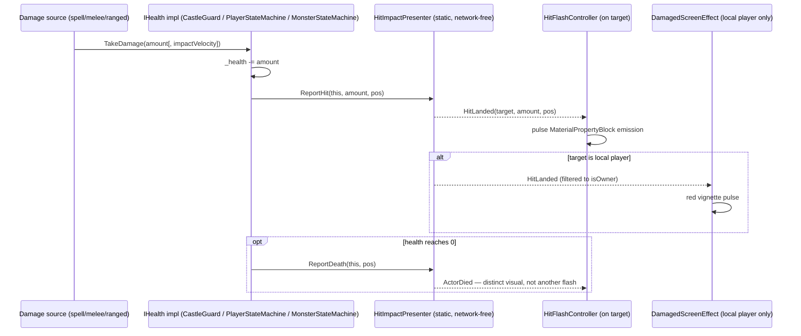

# [Issue #12] No visual feedback for taking or dealing damage

**GitHub:** https://github.com/Ajw2003/PlunderSpell/issues/12
**Labels:** `vfx` `enhancement`
**Phase:** Phase 2 — Make it readable
**Blocks:** #51 (camera shake/hit-stop) benefits from a hit-target/VFX hook existing before it adds
  a shake response — soft dependency, not a hard block. No other issue in this backlog is
  technically blocked from starting.
**Blocked by:** #14 (no usable health or damage model) — every `IHealth.TakeDamage` implementation
  in the repo today is a bare numeric mutation with no event to subscribe a VFX response to; see
  "Root cause" below. #12 cannot be finished as a generic pathway until #14 gives it one contract to
  hook into instead of three independent ones.

## Problem

Nothing on screen indicates that damage happened - no hit flash, no hurt vignette, no hit marker,
no damage numbers. Combat is unreadable.

## Current state

`IHealth` (`Assets/_Project/Scripts/Runtime/Core/Interfaces/IHealth.cs:3-10`) is a four-member
interface: `CurrentHealth`, `MaxHealth`, `TakeDamage(float)`, `TakeDamage(float, float)`. It is
implemented independently by three unrelated classes, none of which raise any event:

- `CastleGuard` (`Assets/_Project/Scripts/Runtime/Guards/CastleGuard.cs:25`) — `TakeDamage`
  (`CastleGuard.cs:379-394`) clamps a `SyncVar<float> _health` and, only on death, calls
  `EnterState(GuardAlertState.Incapacitated, ...)` which raises `StateChanged`
  (`CastleGuard.cs:91`, invoked at `CastleGuard.cs:362`). A non-lethal hit raises nothing at all.
- `PlayerStateMachine` (`Assets/_Project/Scripts/Runtime/Player/PlayerStateMachine.cs:12`) —
  `TakeDamage` (`PlayerStateMachine.cs:171-191`) decrements a plain `float _health` and calls
  `Die()` (`PlayerStateMachine.cs:147-151`) at zero, which does `ChangeState(DeadState)`. No event
  fires on a non-lethal hit either. The class does carry a `public Transform CameraTransform`
  field (`PlayerStateMachine.cs:47`) already wired for the first-person/third-person camera — the
  natural anchor for a hurt vignette or hit-flash overlay.
- `MonsterStateMachine` (`Assets/_Project/Scripts/Runtime/Enemies/MonsterStateMachine.cs:8`) — a
  second, older enemy controller (global namespace, not `RogueAi.*`) used by the combat-test scene
  work (#18), also implements `IHealth` with its own silent `TakeDamage`.

`StatusEffectReceiver` (`Assets/_Project/Scripts/Runtime/Status/StatusEffectReceiver.cs`) applies
burn/stun/sleep/levitate and does raise a `StatusChanged` event (`StatusEffectReceiver.cs:56`,
invoked from every status mutator) — this is presentation-ready today and is a second, independent
hook a damage-feedback layer can use for "on fire" / "asleep" / "stunned" cues, separate from raw
`TakeDamage`.

No VFX or camera code exists anywhere in the runtime assembly (`rg` for `CameraShake`,
`ImpactFeedback`, `HitStop` in `Assets/_Project/Scripts/Runtime/` returns nothing) — this issue is
not "the hook exists but nobody wired it," it is "nothing has ever fired a presentation signal on
damage."

## Root cause / gap analysis

Three separate `TakeDamage` implementations mutate three separate private health fields with three
separate death-transition side effects, and none of them treat "damage happened" as an event worth
publishing. A damage-feedback layer has nowhere to subscribe without either (a) polling
`IHealth.CurrentHealth` every frame per actor and diffing it client-side (laggy, misses
simultaneous multi-hit frames, and duplicates logic already inside three `TakeDamage` bodies), or
(b) #14 unifying the pathway with a shared event contract. Per the backlog's own phase ordering
("a missing core mechanic... blocks the loop from being completable, which outranks feedback/juice
on a loop nobody can finish yet"), #14 is explicitly upstream of this issue.

## Implementation plan

This plan assumes #14 lands first and extends `IHealth` with two events — the shape below is the
recommended contract for #14 to expose; if #14 lands with a different shape, only step 1 changes.

1. **Extend the contract** (owned by #14, consumed here) — add to
   `Assets/_Project/Scripts/Runtime/Core/Interfaces/IHealth.cs`:
   ```csharp
   public interface IHealth
   {
       float CurrentHealth { get; }
       float MaxHealth { get; }
       void TakeDamage(float damage);
       void TakeDamage(float damage, float impactVelocity);

       /// <summary>Raised after damage is applied: (amountApplied, worldPositionOfHit).</summary>
       event Action<float, Vector3> Damaged;
       /// <summary>Raised once, the frame health reaches zero.</summary>
       event Action Died;
   }
   ```
   Each of `CastleGuard.TakeDamage`, `PlayerStateMachine.TakeDamage`, `MonsterStateMachine.TakeDamage`
   invokes `Damaged` before the early-out checks return, and `Died` exactly once inside its existing
   death branch (`CastleGuard.cs:388`, `PlayerStateMachine.cs:175`/`187`). `TakeDamage(float)` has no
   impact position, so pass `transform.position` (or the guard's eye position) as a reasonable
   fallback — precise hit location is a "nice to have," not required for this issue's acceptance
   criteria.

2. **Create `Assets/_Project/Scripts/Runtime/VFX/HitImpactPresenter.cs`** (new file, plain
   `MonoBehaviour`, no networking — this is observer-side presentation only, matching the pattern
   `SpellCastingSystem` already uses for `CastResolved`). Subscribes to every `IHealth` in scene on
   `OnEnable`/spawn (mirrors `CastleGuard.RegisterIntruder`'s static-list pattern, or simpler: each
   `IHealth` implementer calls a static `HitImpactPresenter.Report(IHealth source, float amount,
   Vector3 pos)` from its own `Damaged`/`Died` handlers so this file never needs a scene scan):
   ```csharp
   public static class HitImpactPresenter
   {
       public static event Action<IHealth, float, Vector3> HitLanded;
       public static event Action<IHealth, Vector3> ActorDied;

       public static void ReportHit(IHealth source, float amount, Vector3 pos) =>
           HitLanded?.Invoke(source, amount, pos);
       public static void ReportDeath(IHealth source, Vector3 pos) =>
           ActorDied?.Invoke(source, pos);
   }
   ```
   Wire each `TakeDamage`/death branch to call these (one line each) so #12's presentation layer
   never has to know about `CastleGuard`, `PlayerStateMachine` or `MonsterStateMachine` directly —
   this keeps the VFX assembly from having to reference `Guards`/`Player`/`Enemies`, the same
   cycle-avoidance rule `docs/systems/spells.md` documents for `IBreakable`/`ILevitatable`.

3. **Per-target hit flash** — `Assets/_Project/Scripts/Runtime/VFX/HitFlashController.cs`, a
   `MonoBehaviour` placed on `CastleGuard`/`MonsterStateMachine`/`PlayerStateMachine` prefabs. On
   `HitImpactPresenter.HitLanded` for its own `IHealth`, drives a `MaterialPropertyBlock` emission
   flash (white/red pulse, ~0.15s, via `Renderer.SetPropertyBlock`) on the actor's `MeshRenderer`(s)
   — no material asset duplication needed since `MaterialPropertyBlock` overrides per-instance.
   Guards use this directly; `CastleGuard` currently has no assigned `MeshRenderer` field, so this
   step also adds `[SerializeField] private Renderer[] _flashRenderers;` resolved via
   `GetComponentsInChildren<Renderer>()` in `Awake` when left empty (same fallback pattern
   `LootPickup._meshRenderer` already uses at `LootPickup.cs:79-80`).

4. **Player screen-space response** — `Assets/_Project/Scripts/Runtime/UI/DamagedScreenEffect.cs`
   on the local player's HUD canvas (sibling of `RaidHudView`/`HUDScreen`,
   `Assets/_Project/Scripts/Runtime/UI/Screens/HUDScreen.cs`). Subscribes to the *local* player's
   `PlayerStateMachine.Damaged` only (compare `NetworkIdentity.isOwner`, the same pattern
   `SpellCastingSystem.OnSpawned` uses at `SpellCastingSystem.cs:41` to gate on the owning client).
   Drives a full-screen red vignette `Image` (alpha pulses 0 → ~0.35 → 0 over 0.4s, `AnimationCurve`
   driven, no coroutine leaks — cancel/restart on repeat hits) anchored to `CameraTransform`
   (`PlayerStateMachine.cs:47`) via canvas overlay, not world space, so it reads under any camera
   angle.

5. **Hit marker for the dealer** — extend `HitImpactPresenter` consumption in
   `SpellCastingSystem`'s existing `CastResolved` handler path (`SpellCastingSystem.cs:200`,
   `CastReport.Affected` already reports "how many things a cast affected" —
   `SpellCastingSystem.cs:180-197`) and, once #37/#39 (melee/ranged) land, their own hit-report
   calls. A small screen-center marker sprite briefly flashes (~0.15s) when the *local* caster's own
   action reports `Affected > 0`. This reuses the existing `CastResolved` event — no new spell-layer
   code required, only a new UI listener.

6. **Death distinct from hurt** — `HitImpactPresenter.ActorDied` triggers a *different* visual: for
   guards, a ragdoll-style renderer color-desaturate / disable outline plus a one-shot particle
   burst distinct from the flash pulse (longer, downward-falling motes vs. the hit flash's sharp
   white pulse); for the player, gate `DamagedScreenEffect` to swap the vignette for a full
   grey-out-to-black fade on `Died` rather than the pulsing hurt vignette. Both consume the same
   `ActorDied` event so there is exactly one place that decides "this reads as death, not damage."

## Testing & verification plan

- **EditMode** (extend `Assets/_Project/Scripts/Tests/Runtime/GuardTests.cs`, which already drives
  `CastleGuard` without a live scene via its `Configure`/`Tick` test seams, and add a new
  `HitImpactPresenterTests.cs` beside it): assert `Damaged` fires exactly once per `TakeDamage` call
  with the correct amount, `Died` fires exactly once at the zero-health frame and never again on
  subsequent `TakeDamage` calls against an already-dead actor (mirrors the existing guard-death
  assertions implied by `GuardTests.Test_ABurningGuardEventuallyDies`,
  `GuardTests.cs:307`). `HitImpactPresenter.ReportHit`/`ReportDeath` are static and network-free, so
  they are directly assertable without PurrNet spin-up, the same reasoning `alarm.md` gives for
  keeping `ApplyNoise`/`UpdateState`/`TickDecay` pure.
- **PlayMode**: a scene-level test instantiating a `CastleGuard` prefab, calling `TakeDamage`, and
  asserting `HitFlashController`'s `MaterialPropertyBlock` was touched (readable via
  `Renderer.HasPropertyBlock`) without asserting exact visual pixels.
- **Manual protocol** (unautomatable): in the existing combat-test scene once #18 lands, take damage
  as the local player and confirmly visually distinguish (a) a hit that leaves you alive, (b) a hit
  that kills you, (c) landing a hit on a guard, (d) killing a guard — a human must confirm all four
  read as distinct at a glance, not just that events fired.

## Acceptance criteria

- [ ] Taking damage produces a clear screen-space response.
- [ ] Dealing damage produces a clear response on the target (flash / impact / hit marker).
- [ ] Death is visually distinct from merely being hurt.

## Visual



## Effort & risk

**M.** The event-plumbing half is small and mechanical once #14 defines the contract; the actual
risk is entirely in #14's timing and shape — if #14 chooses a materially different event signature
(e.g. a `DamageInfo` struct instead of two raw events), step 1 needs redoing but steps 2-6 are
insulated from that by `HitImpactPresenter`'s own static events. No networking risk: this is
presentation-only, mirroring `SpellCastingSystem`'s existing "server computes, `ObserversRpc`
presents" split, so nothing here needs to be server-authoritative.

## Open questions

- Should `HitImpactPresenter` live in a new `RogueAi.VFX` assembly, or fold into `RogueAi.UI`
  (screen effects) plus a small addition to `RogueAi.Status`/`RogueAi.Guards`/`RogueAi.Player`
  directly? A dedicated small assembly avoids new cross-references but adds one more asmdef to
  maintain — worth deciding once #14's actual shape is known.
- Exact impact-position precision (nearest hit point vs. actor center) is left to the implementer;
  neither acceptance criterion requires it to be pixel-accurate.

## Definition of done

Every `IHealth` implementer reports a `Damaged`/`Died` event that at least one presentation
consumer (hit flash, screen vignette, or death-distinct visual) is verifiably subscribed to and
triggers from, and a human observer can tell apart "I got hit," "I died," "I hit something," and "I
killed something" without reading the console.
