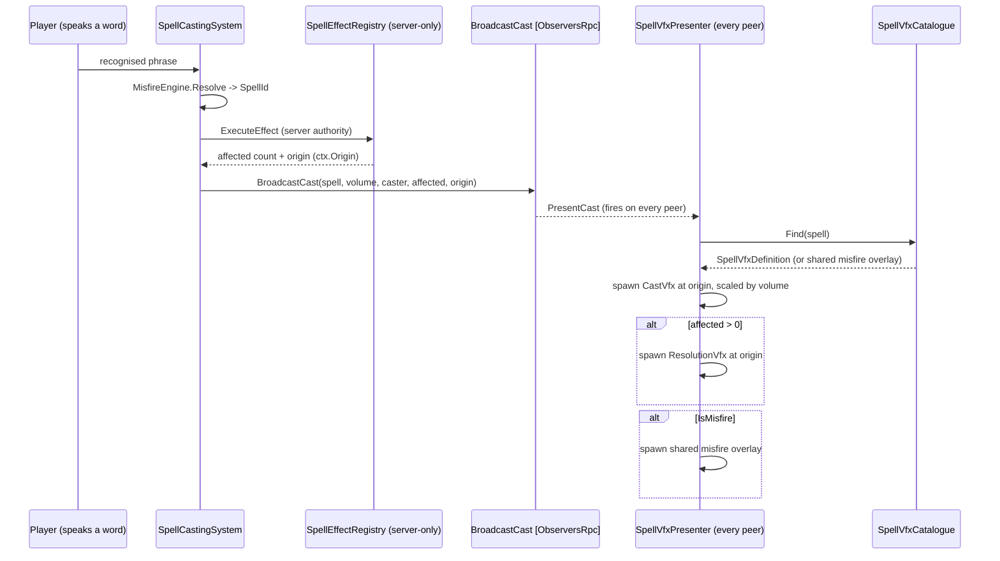

# [Issue #13] No visual feedback for spells

**GitHub:** https://github.com/Ajw2003/PlunderSpell/issues/13
**Labels:** `vfx` `enhancement`
**Phase:** Phase 2 — Make it readable
**Blocks:** none hard. #22 ("No VFX or SFX anywhere") is the systemic foundation issue for
  audio/VFX across the whole game; if this plan's presentation layer (`SpellVfxPresenter`,
  `RogueAi.VFX` assembly) lands first, #22 should extend it rather than build a second one — see
  "Relationship to #22" below. #51 (camera shake/hit-stop) can piggyback on the same
  `SpellCastingSystem.CastResolved` broadcast this plan wires up, but does not require it.
**Blocked by:** none. Unlike #12 (blocked by #14 because no `IHealth` implementer raises an
  event), the spell pipeline already has a fully working, already-networked presentation channel —
  `SpellCastingSystem.CastResolved` — that fires on every peer for every resolved cast today. This
  plan only has to consume it and thread one extra field through it; no upstream system is missing.

## Problem

Casting a spell produces no visible effect. Confirmed in the issue: `[SpellCast] Local cast Ignis`
logs to console and the effect resolves against targets (fire damage is applied, doors open, gold is
conjured, sockets fire), but nothing renders. Misfires are the worst of it — they are supposed to be
the punishing, memorable half of the mechanic (`docs/systems/spells.md:3`: "Say it nearly correctly
and something worse happens") and today a misfire is indistinguishable from a successful cast or from
nothing happening at all, because both are silent to the eye.

## Current state

**The resolution pipeline is complete and correct; only presentation is missing.**

- `SpellCastingSystem.HandlePhrase` (`Assets/_Project/Scripts/Runtime/Spells/SpellCastingSystem.cs:96-121`)
  resolves a recognised phrase through `MisfireEngine.Resolve` and either logs a fizzle or requests a
  cast. Two paths exist: offline/unspawned, it calls `ExecuteEffect` and `PresentCast` directly
  (lines 113-118); networked, it calls the server (`ServerCast`, line 120).
- `ServerCast` (`SpellCastingSystem.cs:128-135`, `[ServerRpc(requireOwnership: true)]`) runs
  authoritatively on the server only, then calls `BroadcastCast` to fan the *outcome* — not the
  effect — out to every peer.
- `ExecuteEffect` (`SpellCastingSystem.cs:142-154`) builds a `SpellEffectContext` (cast origin,
  direction, caster, layer masks) and calls `SpellEffectRegistry.Execute(ctx)`
  (`Assets/_Project/Scripts/Runtime/Spells/Effects/SpellEffectRegistry.cs:58-69`), which dispatches to
  one of 16 registered `ISpellEffect` singletons (8 primary + 8 misfire,
  `SpellEffectRegistry.cs:77-96`) and returns an `int affected` count.
- `BroadcastCast` (`SpellCastingSystem.cs:160-162`, `[ObserversRpc(bufferLast: false)]`) runs on
  *every* peer (including the host) and calls `PresentCast`.
- `PresentCast` (`SpellCastingSystem.cs:168-178`) is the entire presentation layer today: two
  `Debug.Log` lines and `CastResolved?.Invoke(new CastReport(...))`
  (`SpellCastingSystem.cs:177`, static event declared at line 200). `CastReport`
  (`SpellCastingSystem.cs:181-197`) carries `Spell`, `Volume`, `Affected`, `CasterName` —
  **no world position**.
- The one existing consumer of `CastResolved` is `RaidHudPresenter.OnCastResolved`
  (`Assets/_Project/Scripts/Runtime/UI/RaidHud/RaidHudPresenter.cs:97-103`), which turns a resolved
  cast into one line of HUD text (`"{Spell} ({Affected} affected)"` or `"MISFIRE — {Spell}"`) shown
  for `_castLineDuration` seconds. This is the only place in the runtime assembly a cast is currently
  *shown* to the player at all, and it is text-only.
- `ISpellEffect.Execute` (`Assets/_Project/Scripts/Runtime/Spells/Effects/ISpellEffect.cs:20-24`) is
  documented to run "on the server (or on a lone host / in a test), never per-client" — the
  `[ObserversRpc]` broadcasts presentation, consequence stays authoritative. This is not a gap to
  close; it is the project's stated invariant (`docs/systems/spells.md:40-42`, "Consequence is
  server-side... Running effects in the observers RPC would have four clients each applying the same
  damage") and this plan must not violate it.
- Three effects already raise their own static C# events straight from inside `Execute()` —
  `AurumVocoEffect.GoldConjured` (`Assets/_Project/Scripts/Runtime/Spells/Effects/PrimarySpellEffects.cs:129,139`),
  `PrimarySpellEffects.CadaverSurgeEffect.CorpseRaised` (`PrimarySpellEffects.cs:218,232`), and
  `MisfireSpellEffects.CorpseExploded`/`GoldScattered`
  (`Assets/_Project/Scripts/Runtime/Spells/Effects/MisfireSpellEffects.cs:168,181` and `203,219`).
  `ConjuredGoldSpawner` (`Assets/_Project/Scripts/Runtime/Raid/ConjuredGoldSpawner.cs:34-46`)
  subscribes to two of them and spawns a real (networked) loot object. **This pattern only works
  because `Execute()` runs server-side and the consumer spawns a `NetworkBehaviour` that PurrNet then
  replicates on its own** — a client-only VFX consumer subscribed the same way would see nothing on
  remote clients, because `Execute()` never runs on their machine. This is the trap a naive
  implementation of this issue would fall into, and it is why the design below hooks off
  `CastResolved`/`PresentCast` (which does run on every peer) instead of the per-effect events.
- `LootPickup._brokenVfx` (`Assets/_Project/Scripts/Runtime/Loot/LootPickup.cs:49`, a
  `[SerializeField] private ParticleSystem`) is the only VFX hook anywhere in the runtime assembly,
  and it is unassigned (per the issue body) — a real, working pattern (`ApplyBrokenState`,
  `LootPickup.cs:138-148`, calls `_brokenVfx.Play()` guarded by `!= null`) with nothing plugged into
  it. A repo-wide search (`rg "ParticleSystem" Assets/_Project/Scripts/Runtime`) returns only this one
  file — no other VFX code exists anywhere in the runtime assembly.
- No `RogueAi.VFX` (or equivalent) assembly exists yet. `docs/plans/issues/012-no-damage-feedback.md`
  ("Open questions", line 208) leaves "should `HitImpactPresenter` live in a new `RogueAi.VFX`
  assembly" explicitly undecided; this plan creates that assembly, and #12 should reuse it rather
  than deciding independently (see "Relationship to #12" below).

## Root cause / gap analysis

The spell system was built with a deliberate, correct server/observer split for *consequence*
(`docs/systems/spells.md:40-42`), and `PresentCast`/`CastResolved` is already the right, already-wired
place for *presentation* to live — it fires on every peer, including remote clients, exactly once per
resolved cast, with the resolved `SpellId` and `CastVolume` already in hand. Nobody has ever written a
presentation consumer beyond one line of HUD text. This is not "the hook exists but nobody found it"
in the way #5's socket system was unused machinery — `CastResolved` is actively consumed today, just
by exactly one thing, and VFX was never added alongside it.

The one real gap in the data available at `PresentCast` is **position**: `CastReport` carries no world
position, and threading one through is the only non-trivial part of this plan, because the natural
place a position is known — inside `ISpellEffect.Execute`, where an effect finds its target via
`SpellTargeting.FindNearest*`/`FindAll` — runs server-only (see "Current state" above) and returns
only an `int` (`ISpellEffect.cs:24`, deliberately, per `docs/systems/spells.md:14`: "`Execute` returns
how many things an effect affected, so 'cast at nothing' (0) and 'no effect registered' (-1) are
distinguishable outcomes"). Changing that return contract to also carry a target position would touch
all 16 effect classes and the documented invariant behind it, for a precision gain ("VFX exactly on
the target" vs. "VFX at the cast origin, radius-scaled") the acceptance criteria do not actually
require. The plan below instead threads the **cast origin** — already computed once per cast in
`ExecuteEffect` (`SpellCastingSystem.cs:145-151`) and already the center of every effect's radius
search (`SpellEffectContext.Radius`, `SpellEffectContext.cs:53`) — through the existing RPC, which is
a small, additive, low-risk change that satisfies "an effect at the point of resolution" for every one
of these radius-centered spells without touching `ISpellEffect` at all.

## Relationship to #12

#12's plan (`docs/plans/issues/012-no-damage-feedback.md`) builds `HitImpactPresenter`, a static,
network-free presentation bus for damage events, and leaves open ("Open questions", line 208) whether
it should live in a new `RogueAi.VFX` assembly. This plan creates exactly that assembly
(`Assets/_Project/Scripts/Runtime/VFX/RogueAi.VFX.asmdef`) for spell VFX. **If #12 is implemented
after this plan, it should add `HitImpactPresenter.cs` to this same assembly rather than deciding the
question again** — the two presenters are the same shape (static event bus consumed by scene-local
`MonoBehaviour`s that spawn/pool VFX) and neither needs to reference the other, so co-locating them
costs nothing and avoids two near-identical VFX assemblies existing side by side. If #12 lands first
instead, this plan should add `SpellVfxPresenter.cs` to whatever assembly #12 created. Either way, one
`RogueAi.VFX` assembly, not two.

## Relationship to #22

#22 is the broader "no VFX or SFX anywhere" issue and explicitly calls out spell casting as one of its
instances. This plan is scoped to *visual* feedback only (#13's labels are `vfx`/`enhancement`, no
`audio` label, and its acceptance criteria never mention sound) — it does not add any `AudioSource`,
mixer routing, or sound asset. #22's plan should treat this plan's `SpellVfxPresenter` and the
`Vector3 origin` now flowing through `CastResolved` as the attachment point for spell *sound*: the
same event, the same position, a second subscriber. #22 should not re-derive spell-cast position
plumbing; it should consume what this plan adds. See `docs/plans/issues/022-no-vfx-sfx-anywhere.md`,
"Relationship to #13".

## Implementation plan

1. **Thread cast origin through the existing broadcast, additively.** Change
   `Assets/_Project/Scripts/Runtime/Spells/SpellCastingSystem.cs`:

   ```csharp
   // ExecuteEffect (SpellCastingSystem.cs:142-154) — expose the origin it already computes.
   // Was: public int ExecuteEffect(SpellId spellId, CastVolume volume, NetworkIdentity caster)
   public int ExecuteEffect(SpellId spellId, CastVolume volume, NetworkIdentity caster, out Vector3 origin)
   {
       Transform t = caster != null ? caster.transform : transform;
       origin = t.position + t.forward * _castOriginForwardOffset + Vector3.up * _castOriginHeight;
       var ctx = new SpellEffectContext(spellId, volume, origin, t.forward, caster,
           _targetLayers, _geometryLayers);
       return SpellEffectRegistry.Execute(ctx);
   }
   ```

   Update both call sites to capture it:

   ```csharp
   // HandlePhrase's offline branch (SpellCastingSystem.cs:113-117)
   if (!isSpawned)
   {
       int affected = ExecuteEffect(resolved, result.Volume, this, out Vector3 origin);
       PresentCast(resolved, result.Volume, this, default, affected, origin);
       return;
   }

   // ServerCast (SpellCastingSystem.cs:128-135)
   [ServerRpc(requireOwnership: true)]
   private void ServerCast(SpellId spellId, CastVolume volume, NetworkIdentity caster, RPCInfo info = default)
   {
       int affected = ExecuteEffect(spellId, volume, caster, out Vector3 origin);
       BroadcastCast(spellId, volume, caster, info.sender, affected, origin);
   }
   ```

   `BroadcastCast`/`PresentCast`/`CastReport` each gain one `Vector3 origin` parameter/field, threaded
   straight through (`SpellCastingSystem.cs:160-197`):

   ```csharp
   [ObserversRpc(bufferLast: false)]
   private void BroadcastCast(SpellId spellId, CastVolume volume, NetworkIdentity caster,
       PlayerID sender, int affected, Vector3 origin) =>
       PresentCast(spellId, volume, caster, sender, affected, origin);

   private static void PresentCast(SpellId spellId, CastVolume volume, NetworkIdentity caster,
       PlayerID sender, int affected, Vector3 origin)
   {
       string who = caster != null ? caster.name : sender.ToString();
       if (IsMisfire(spellId))
           Debug.Log($"[Misfire] Player {who} misfired → {spellId} (Volume: {volume}, affected: {affected})");
       else
           Debug.Log($"[SpellCast] Player {who} cast {spellId} (Volume: {volume}, affected: {affected})");

       CastResolved?.Invoke(new CastReport(spellId, volume, affected, who, origin));
   }

   public readonly struct CastReport
   {
       public readonly SpellId Spell;
       public readonly CastVolume Volume;
       public readonly int Affected;
       public readonly string CasterName;
       public readonly Vector3 Origin;

       public CastReport(SpellId spell, CastVolume volume, int affected, string casterName, Vector3 origin)
       {
           Spell = spell; Volume = volume; Affected = affected; CasterName = casterName; Origin = origin;
       }

       public bool IsMisfire => SpellCatalogue.IsMisfire(Spell);
   }
   ```

   This is additive to every field already there (`RaidHudPresenter.OnCastResolved` keeps compiling
   unchanged since it only reads `report.IsMisfire`/`report.Spell`/`report.Affected`). PurrNet already
   sends `Vector3`-shaped data over `[ObserversRpc]` elsewhere in the project (loot spawn positions,
   carry-joint anchors) — no new serialisation concern.

2. **Create the `RogueAi.VFX` assembly.**
   `Assets/_Project/Scripts/Runtime/VFX/RogueAi.VFX.asmdef`:

   ```json
   {
       "name": "RogueAi.VFX",
       "rootNamespace": "RogueAi.VFX",
       "references": [ "RogueAi.Spells", "RogueAi.Core" ],
       "includePlatforms": [],
       "excludePlatforms": [],
       "allowUnsafeCode": false,
       "overrideReferences": false,
       "precompiledReferences": [],
       "autoReferenced": true,
       "defineConstraints": [],
       "versionDefines": [],
       "noEngineReferences": false
   }
   ```

   `RogueAi.Spells` has no back-reference to `RogueAi.VFX`, so this cannot cycle — VFX sits strictly
   downstream of Spells, the same "reaching the world without cycling" shape
   `docs/systems/spells.md:25-29` already documents for Loot/Player via interfaces. VFX does not need
   an interface indirection because it only *listens* to `CastResolved`, it never needs Spells to call
   into it.

3. **`SpellVfxDefinition` — one ScriptableObject per spell's look**, matching the project's existing
   "ScriptableObjects for shared config" convention (`SpellWord`, `LootItem`,
   `CastleRoomModuleData` all follow this shape).
   `Assets/_Project/Scripts/Runtime/VFX/SpellVfxDefinition.cs`:

   ```csharp
   using UnityEngine;

   namespace RogueAi.VFX
   {
       /// <summary>One spell's cast and resolution look. Authored per spell; the misfire
       /// tint/overlay is applied uniformly by <see cref="SpellVfxCatalogue"/>, not authored here.</summary>
       [CreateAssetMenu(menuName = "Plunderspell/VFX/Spell VFX Definition")]
       public class SpellVfxDefinition : ScriptableObject
       {
           [Tooltip("The spell this definition is for.")]
           public Spells.SpellId Spell;

           [Tooltip("Played at the cast origin the instant a cast resolves, whether or not it hit anything.")]
           public ParticleSystem CastVfxPrefab;

           [Tooltip("Played at the cast origin only when Affected > 0 — the resolution moment.")]
           public ParticleSystem ResolutionVfxPrefab;

           [Tooltip("Base tint applied to both prefabs via a MaterialPropertyBlock, so one prefab can " +
                     "be reused with a different color per spell without duplicating the asset.")]
           public Color Tint = Color.white;
       }
   }
   ```

4. **`SpellVfxCatalogue` — the SpellId → definition lookup**, mirroring
   `SpellEffectRegistry`'s dictionary shape but data-driven (a ScriptableObject asset, not code) since
   VFX is content, not logic.
   `Assets/_Project/Scripts/Runtime/VFX/SpellVfxCatalogue.cs`:

   ```csharp
   using System.Collections.Generic;
   using UnityEngine;
   using RogueAi.Spells;

   namespace RogueAi.VFX
   {
       [CreateAssetMenu(menuName = "Plunderspell/VFX/Spell VFX Catalogue")]
       public class SpellVfxCatalogue : ScriptableObject
       {
           [SerializeField] private List<SpellVfxDefinition> _definitions = new();

           [Tooltip("Overlay played on top of a spell's own resolution VFX whenever the outcome is a " +
                     "misfire — the one thing that must always read as distinct, per acceptance criteria.")]
           [SerializeField] private ParticleSystem _misfireOverlayPrefab;

           private Dictionary<SpellId, SpellVfxDefinition> _byId;

           /// <summary>The definition for a primary spell id. Misfire ids resolve through
           /// <see cref="SpellCatalogue.PrimaryFor"/> first, so MisfireIgnis reuses Ignis's look plus
           /// the overlay rather than needing a second authored definition.</summary>
           public SpellVfxDefinition Find(SpellId spell)
           {
               BuildIndex();
               SpellId lookupId = SpellCatalogue.IsMisfire(spell) ? SpellCatalogue.PrimaryFor(spell) : spell;
               return _byId.TryGetValue(lookupId, out var def) ? def : null;
           }

           public ParticleSystem MisfireOverlayPrefab => _misfireOverlayPrefab;

           private void BuildIndex()
           {
               if (_byId != null)
                   return;
               _byId = new Dictionary<SpellId, SpellVfxDefinition>();
               foreach (var def in _definitions)
                   if (def != null)
                       _byId[def.Spell] = def;
           }

           private void OnValidate() => _byId = null; // re-index after edits in the Inspector
       }
   }
   ```

   Reusing the primary's look for its misfire (rather than authoring 16 separate VFX assets) keeps the
   authoring cost to 8 definitions + 1 shared overlay, while still satisfying "a misfire is visually
   distinct from a successful cast" — the overlay is what makes it distinct, not a wholly separate look.

5. **`SpellVfxPresenter` — the consumer**, same shape as #12's `HitImpactPresenter`
   (static-event-bus pattern) but subscribing to the event that already exists.
   `Assets/_Project/Scripts/Runtime/VFX/SpellVfxPresenter.cs`:

   ```csharp
   using UnityEngine;
   using RogueAi.Spells;

   namespace RogueAi.VFX
   {
       /// <summary>
       /// Turns every resolved cast into VFX, on every peer. Subscribes to
       /// <see cref="SpellCastingSystem.CastResolved"/> — already fired once per cast on every peer via
       /// the existing <c>[ObserversRpc]</c> — so this needs no networking of its own.
       /// </summary>
       public class SpellVfxPresenter : MonoBehaviour
       {
           [SerializeField] private SpellVfxCatalogue _catalogue;

           private void OnEnable() => SpellCastingSystem.CastResolved += OnCastResolved;
           private void OnDisable() => SpellCastingSystem.CastResolved -= OnCastResolved;

           private void OnCastResolved(SpellCastingSystem.CastReport report)
           {
               if (_catalogue == null)
                   return;

               SpellVfxDefinition def = _catalogue.Find(report.Spell);
               if (def == null)
                   return;

               float scale = SpellTuning.PowerMultiplier(report.Volume);

               Spawn(def.CastVfxPrefab, report.Origin, def.Tint, scale);

               if (report.Affected > 0 && def.ResolutionVfxPrefab != null)
                   Spawn(def.ResolutionVfxPrefab, report.Origin, def.Tint, scale);

               if (report.IsMisfire && _catalogue.MisfireOverlayPrefab != null)
                   Spawn(_catalogue.MisfireOverlayPrefab, report.Origin, Color.white, scale);
           }

           private static void Spawn(ParticleSystem prefab, Vector3 position, Color tint, float scale)
           {
               if (prefab == null)
                   return;

               ParticleSystem instance = Instantiate(prefab, position, Quaternion.identity);
               instance.transform.localScale *= scale;

               var main = instance.main;
               main.startColor = tint;

               float lifetime = main.duration + main.startLifetime.constantMax;
               Destroy(instance.gameObject, lifetime);
           }
       }
   }
   ```

   No pooling in this first pass — `Instantiate`/`Destroy` per cast is simple, matches the project's
   current lack of any pooling infrastructure anywhere (a repo-wide search for `ObjectPool` in
   `Assets/_Project/Scripts/Runtime/` returns nothing), and casts are rate-limited by the voice
   pipeline (a player cannot cast faster than they can speak a word). #22's plan is the right place to
   introduce shared pooling if profiling later shows it is needed across every VFX/SFX source at once
   (see #22's "Relationship to #13" section).

6. **Wire one `SpellVfxCatalogue` asset with 8 `SpellVfxDefinition` entries** (content work, not
   code) under `Assets/_Project/Data/VFX/`, mirroring the existing `Assets/_Project/Data/Spells/`
   convention — one per primary `SpellId` (Ignis, Frango, Levo, AurumVoco, Tonitrus, Somnus,
   CadaverSurge, Porta), each with a distinct particle prefab and tint (fire-orange for Ignis, a
   shatter/glass burst for Frango, upward motes for Levo, a coin-glint burst for AurumVoco, a
   shockwave ring for Tonitrus, a violet sleep-mist for Somnus, a bone-dust plume for CadaverSurge, a
   door-ward sigil for Porta) plus one shared misfire overlay (a sickly green sputter/crackle). This
   step needs an artist/tooling pass — the code above is content-agnostic and works with placeholder
   `ParticleSystem` prefabs (a single-burst sphere emitter is enough to validate the wiring) until real
   art lands.

7. **Add `SpellVfxPresenter` to the raid scene** alongside `RaidHudPresenter`
   (`Assets/_Project/Scripts/Runtime/UI/RaidHud/RaidHudPresenter.cs`), referencing the catalogue asset.
   Since it is a plain `MonoBehaviour` with no networking, one instance per client is correct — each
   peer's own `SpellVfxPresenter` renders VFX for every cast it is told about via `CastResolved`,
   exactly like the HUD's cast-feed text does today.

8. **Update `docs/systems/spells.md`** to add a line under "Execution" noting that presentation
   (`SpellVfxPresenter`, `RogueAi.VFX`) now consumes `SpellCastingSystem.CastResolved`'s `Vector3
   Origin`, so the doc's description of the resolution pipeline doesn't go stale the moment this
   ships — mirroring the doc-update step in issue #5's plan (step 5 there).

## Testing & verification plan

- **EditMode** (extend `Assets/_Project/Scripts/Tests/Runtime/SpellEffectTests.cs`, namespace
  `RogueAi.Tests`, assembly `RogueAi.Tests` — which will need `RogueAi.VFX` added to its
  `references` list in `Assets/_Project/Scripts/Tests/Runtime/RogueAi.Tests.asmdef` once step 2
  lands):
  - `Test_CastResolvedCarriesOrigin` — call `SpellCastingSystem.ExecuteEffect` (now returning
    `out Vector3 origin` per step 1) directly against a test rig (same `MakeActor`/`Track` helpers
    `SpellEffectTests.cs:35-48` already uses) and assert the returned origin matches
    `caster.position + caster.forward * forwardOffset + up * height` for a known caster transform —
    this is the one piece of new logic in the whole plan and the only thing worth unit-testing beyond
    "the event fires."
  - `SpellVfxCatalogueTests` (new file, same assembly): `Find(SpellId.MisfireIgnis)` returns the same
    `SpellVfxDefinition` as `Find(SpellId.Ignis)` (the reuse-via-`PrimaryFor` rule in step 4); `Find`
    on an id with no authored definition returns null rather than throwing.
  - These are the same kind of assertion the project already favors: "assert the rule, not the
    eyeball" (`docs/systems/raid.md:27-30`, cited in issue #5's plan too) — `SpellVfxPresenter` itself
    spawns real `ParticleSystem` GameObjects and is not meaningfully assertable outside a live scene,
    so it is intentionally left to the PlayMode/manual passes below rather than over-mocked in
    EditMode.
- **PlayMode**: a scene-level test (`Assets/_Project/Scripts/Tests/PlayMode/`,
  `Plunderspell.Tests.PlayMode.asmdef`) that raises `SpellCastingSystem.CastResolved` directly (it is
  a public static event, so a test can invoke it without a live cast) with a known `SpellVfxCatalogue`
  wired to a placeholder prefab, and asserts a `ParticleSystem` instance appears in the scene at the
  reported origin (`GameObject.FindObjectsOfType<ParticleSystem>()` count increases by the expected
  amount) and is destroyed after its lifetime elapses.
- **Manual protocol** (unautomatable, same honesty note as issue #5's plan — no confirmed Unity Editor
  install in this environment): in the existing combat-test scene (#18), speak each of the eight
  correct spell words, then each of the eight near-miss misfire words
  (`docs/systems/spells.md`/`MisfireEngine`'s lexicon), at whisper/normal/shout volume, and confirm by
  eye that (a) all eight primary spells look visually distinct from each other, (b) every misfire
  looks visually distinct from its primary's successful cast, (c) a shout is visibly bigger/brighter
  than a whisper for the same spell. This is exactly the acceptance criteria, verified by a human
  because "looks distinct" is not something a unit test can certify.

## Acceptance criteria

- [ ] Each of the eight spells has a distinct cast effect and an effect at the point of resolution.
- [ ] A misfire is visually distinct from a successful cast.
- [ ] Volume (whisper / normal / shout) is reflected in the effect's scale or intensity.

## Visual



## Effort & risk

**M.** The networking change (step 1) is small and additive — one new `Vector3` threaded through an
existing RPC chain, no new RPC, no new SyncVar, no change to what runs on the server vs. observers.
The bulk of the work is content (8 particle prefabs + tints + one overlay, step 6), which is outside
this plan's code scope and needs an art/tooling pass to actually look distinct spell-to-spell — the
code in steps 2-5 works with placeholder prefabs today.

Risks:
- **Precision vs. effort trade-off.** Using `ctx.Origin` (cast origin) rather than the actual target's
  position for "resolution" VFX is a deliberate simplification (see "Root cause / gap analysis") that
  reads fine for every current effect (all are radius searches centered on the origin) but would look
  wrong for a future precise/long-range spell whose target is far from the caster. If such a spell is
  added later, this plan's `ResolutionVfxPrefab` placement assumption needs revisiting — not urgent
  today since no such spell exists in `SpellId` yet among the 8 implemented ones.
- **Misfire-overlay reuse (step 4) is a content simplification**, not a code risk: if a reviewer wants
  each of the 8 misfires to have a wholly bespoke look instead of "primary + overlay," that only
  changes the authoring step (6) and `SpellVfxCatalogue.Find`'s one-line reuse rule, not the
  presenter or the networking change.
- **No confirmed Unity Editor install in this working environment** — same caveat as issue #5's plan:
  the code sketches above are written to the project's conventions and existing APIs but have not been
  compiled, and the PlayMode/manual passes cannot be executed as part of this plan.
- **Assembly ownership overlap with #12** (see "Relationship to #12") — if both plans are implemented
  by different people without coordinating, two `RogueAi.VFX` assemblies could get created
  independently. Flagging it here and in #12's own file is the mitigation; there is no code-level way
  to prevent it ahead of time.

## Open questions

- Should the eight primary `SpellVfxDefinition` assets be authored by hand (a `ParticleSystem` per
  spell, hand-tuned) or generated/templated the way `Tools/AssetPipeline` generates castle props? The
  moodboard-gap-closure audit (`docs/plans/moodboard-gap-closure.md`) doesn't cover spell VFX
  specifically — this is a scope/tooling decision for whoever picks up step 6, not a blocker for
  shipping the code in steps 1-5, 7-8 with placeholder prefabs.
- Exact-target-position VFX (rather than cast-origin) is left out of this plan's scope per the
  precision-vs-effort trade-off above; worth revisiting only if a future spell's target routinely
  lands far enough from the caster that origin-centered VFX reads as wrong.

## Definition of done

Casting each of the eight spells produces a visually distinct effect at the moment of cast and (when
it affects something) at the point of resolution; a misfire of any spell is visually distinguishable
from that spell's successful cast at a glance; casting the same spell at whisper vs. shout volume
produces a visibly different effect scale/intensity; and `SpellEffectTests`/the new
`SpellVfxCatalogueTests` pass.
