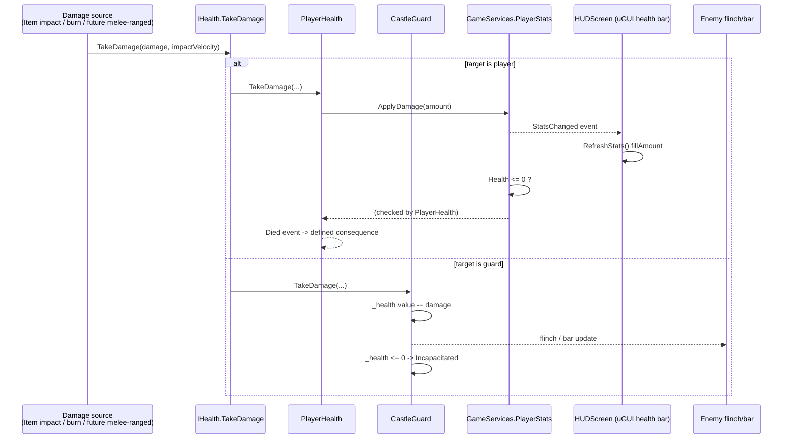

# [Issue #14] No usable health or damage model

**GitHub:** https://github.com/Ajw2003/PlunderSpell/issues/14
**Labels:** `gameplay` `enhancement`
**Phase:** Phase 1 — Close the loop
**Blocks:** #12 (damage VFX needs a damage event to hang a flash/particle off), #18 (a combat test scene needs something to actually damage/be damaged to be worth building), #37 (melee needs a damage pathway to call `TakeDamage` into), #39 (ranged needs the same pathway), #43 (GildedColossus boss telegraphs are meaningless without a health/damage loop to design them against)
**Blocked by:** none — this is the foundational issue everything else in Phase 1 combat stacks on

## Problem

There is no health or damage the player can perceive or act on. You cannot tell whether you are
hurting an enemy, whether you are being hurt, or how close anything is to dying.

## Current state

**The enemy side is a real, working system.** `Interfaces.IHealth` (`Assets/_Project/Scripts/Runtime/Core/Interfaces/IHealth.cs:3-10`)
defines `CurrentHealth`, `MaxHealth`, and two `TakeDamage` overloads. `CastleGuard` implements it
fully: a replicated `SyncVar<float> _health` (`CastleGuard.cs:67`), `TakeDamage`/`TakeDamage(damage,
impactVelocity)` (`CastleGuard.cs:379-394`) that clamps to zero, clears all status effects and
transitions to `GuardAlertState.Incapacitated` on death, and an `IsDead` property
(`CastleGuard.cs:397`). Per-enemy `_maxHealth` is tuned in `EnemyPrefabForge.Specs`
(`Assets/_Project/Scripts/Editor/EnemyPrefabForge.cs:51-74`) — confirmed by direct read: WarHound
55, Watchman 70, ManAtArms 100, SigilWisp 35, Sergeant 130, HexTurret 90, ArcRevenant 150,
CryptRisen 80, VaultWarden 200, GildedColossus 400 — exactly matching the issue body's "55 for a
WarHound up to 400 for the GildedColossus."

**`StatusEffectReceiver`** (`Assets/_Project/Scripts/Runtime/Status/StatusEffectReceiver.cs`)
implements burn (`IIgnitable.Ignite`, `StatusEffectReceiver.cs:142-151`), applying whole-point burn
damage each tick through the same `IHealth.TakeDamage` (`StatusEffectReceiver.cs:98-119`) — it can
kill a guard over time exactly as the issue says. It resolves its `IHealth` target lazily
(`StatusEffectReceiver.cs:72-83`) specifically because `[RequireComponent(typeof(StatusEffectReceiver))]`
on `CastleGuard` makes the receiver's `Awake` run before the guard's own component exists
(`docs/systems/raid.md:69-72` documents this as a project-wide trap).

**`Item.cs`** (`Assets/_Project/Scripts/Runtime/Items/Item.cs`) is the one place damage is actually
dealt today: `OnCollisionEnter` (`Item.cs:61-99`) computes `impactVelocity * _damageMultiplier` and
calls `TryGetComponent(out IHealth targetHealth)` on whatever it hit (`Item.cs:72-77`), then also
self-damages if the item itself carries an `IHealth` (i.e. it's a thrown enemy, `Item.cs:79-92`).
This is the "physics-based throwing with velocity-scaled impact damage" the issue body references.

**The player side has no `IHealth` at all.** `RaidSceneBuilder.BuildPlayer()`
(`Assets/_Project/Scripts/Editor/RaidSceneBuilder.cs:259-305`) — the code that actually builds the
player in the shipped `RaidScene.unity` — attaches `Rigidbody`, `CapsuleCollider`,
`StatusEffectReceiver`, `AcousticEmitter`, `FootstepNoiseEmitter`, `PushToCastController`,
`SpellCastingSystem`, `FreeLookPlaytestController`, `LootInteractor` and `IntruderTag`. No
component on that list implements `IHealth`. Two consequences, both verified by reading the
consumers: `Item.OnCollisionEnter`'s `TryGetComponent(out IHealth targetHealth)`
(`Item.cs:72`) finds nothing on the player, so a swung/thrown object never damages a player; and
`StatusEffectReceiver.Health` (`StatusEffectReceiver.cs:72-83`) resolves to null on the player, so
burn never lands either. The player is currently unkillable and untouchable by every existing
damage path.

**`Plunderspell.Core.PlayerStats`** (`Assets/_Project/Scripts/Runtime/Core/GameFlow/PlayerStats.cs`)
is a plain C# class with `Health`/`MaxHealth`/`Mana`/`Gold` and `ApplyDamage(int)`
(`PlayerStats.cs:25-29`), instantiated once as `GameServices.PlayerStats`
(`Assets/_Project/Scripts/Runtime/Core/GameFlow/GameServices.cs:7,20`). Grepping the whole runtime
tree for `PlayerStats` usage (`Assets/_Project/Scripts/Runtime/UI/Screens/HUDScreen.cs`,
`GameOverScreen.cs`, `GameServices.cs`, and the test file `PlayerStatsTests.cs`) turns up **no
gameplay code that ever calls `ApplyDamage`** — only the HUD reads it.

**A player health bar already exists in the built UI, fully wired, and simply never moves.**
`HUDScreen.OnBuild` (`Assets/_Project/Scripts/Runtime/UI/Screens/HUDScreen.cs:16-30`) creates a
health `Image`/fill bar and a mana bar; `HUDScreen.OnShown`/`RefreshStats`
(`HUDScreen.cs:54-86`) subscribes to `GameServices.PlayerStats.StatsChanged` and sets
`_healthFill.fillAmount = stats.Health / stats.MaxHealth`. `UIBootstrapper`
(`Assets/_Project/Scripts/Runtime/UI/UIBootstrapper.cs:13,23`) is
`[RuntimeInitializeOnLoadMethod(AfterSceneLoad)]`, so it builds a `UIRoot` (which builds
`HUDScreen`, `UIRoot.cs:27`) in **every** scene, including `RaidScene.unity`. `UIRoot.ApplyState`
(`UIRoot.cs:74`) shows `HUDScreen` for `GameState.Playing`/`Paused`/`Inventory` — the same states
the raid runs in. So the health bar the issue asks for is already present on screen during a raid;
it just never changes, because nothing ever calls `PlayerStats.ApplyDamage`.

**A second, separate HUD also runs at the same time and has no health field whatsoever.**
`RaidSceneBuilder.BuildHud` (`RaidSceneBuilder.cs:307-314`) additionally builds
`RaidHudPresenter`/`RaidHudView`, an IMGUI HUD that `docs/systems/raid-scene-assembly.md:109-110`
confirms "renders over the uGUI canvas" — i.e. both HUDs are on screen simultaneously during a raid.
`RaidHudModel` (`Assets/_Project/Scripts/Runtime/UI/RaidHud/RaidHudModel.cs:11-38`) carries `Phase`,
`TimeRemaining`, `Alarm`, `AlarmLevel`, `CarriedLootName`, `CarriedNeedsTwo`, `InteractPrompt`,
`Debt`, `BankedGold`, `LastCastLine` — no health field, no enemy-health field, confirmed by reading
the struct in full. Enemy health also has no in-world presentation: no `HealthBar` instance is
attached by `EnemyPrefabForge.BuildPrefab` (`EnemyPrefabForge.cs:128-163`), even though
`Assets/_Project/Scripts/Runtime/Core/UI/HealthBar.cs` already exists as a generic
`IHealth`-reading world-space slider component, unused by anything in the enemy pipeline.

## Root cause / gap analysis

This is not a missing system — it is two disconnected halves of one, plus a UI split that makes
the disconnection invisible. Enemy damage already works end to end (`Item` → `IHealth.TakeDamage`
→ `CastleGuard._health` → `Incapacitated`). Player damage has no entry point because the player
GameObject was never given an `IHealth` implementation, so every existing damage caller
(`Item.OnCollisionEnter`, `StatusEffectReceiver`, and future melee/ranged code from #37/#39) silently
finds nothing to call `TakeDamage` on. Separately, the HUD that already displays health
(`HUDScreen`) reads a completely different data source (`GameServices.PlayerStats`, a plain C# class
with no `IHealth` implementation) than the `IHealth` interface every damage-dealing component
speaks — so even once the player *can* take damage via `IHealth`, that damage has to be forwarded
into `PlayerStats.ApplyDamage` for the bar to move at all. And enemy health, while tracked
correctly in `CastleGuard`, has no visual representation in-world — `HealthBar.cs` exists but
`EnemyPrefabForge` never attaches one.

## Implementation plan

**Step 1 — write the failing tests first (EditMode).** Create
`Assets/_Project/Scripts/Tests/EditMode/PlayerHealthTests.cs` in the `Plunderspell.Tests.EditMode`
assembly (`Assets/_Project/Scripts/Tests/EditMode/Plunderspell.Tests.EditMode.asmdef`), following
the existing style of `PlayerStatsTests.cs`. Assert:
- A `PlayerHealth` component starts at `MaxHealth == CurrentHealth`.
- `TakeDamage(20)` reduces `CurrentHealth` by 20 and raises `GameServices.PlayerStats.StatsChanged`.
- `TakeDamage` never drops `CurrentHealth` below 0.
- `TakeDamage(damage, impactVelocity)` behaves identically to the single-arg overload (matches the
  `IHealth` contract `CastleGuard` already honours).
- Reaching 0 health raises a `PlayerDied` (or similarly named) event exactly once, even if further
  damage arrives after death (mirrors `CastleGuard.TakeDamage`'s `if (damage <= 0f || _health.value
  <= 0f) return;` guard at `CastleGuard.cs:383`).

**Step 2 — add `PlayerHealth : MonoBehaviour, IHealth`.** New file
`Assets/_Project/Scripts/Runtime/Player/PlayerHealth.cs` (namespace `Interfaces` is already the
home of `IHealth`; put the concrete type under a project namespace, e.g. `RogueAi.Player` to match
the existing `RogueAi.*` convention used by `Guards`, `Status`, `Raid`):

```csharp
using System;
using Interfaces;
using Plunderspell.Core;
using UnityEngine;

namespace RogueAi.Player
{
    /// <summary>
    /// The player's half of the shared IHealth damage pathway. Bridges every existing damage
    /// caller (Item impacts, StatusEffectReceiver burn, future melee/ranged hits) into the HUD's
    /// existing data source, GameServices.PlayerStats, so the health bar HUDScreen already draws
    /// (Assets/_Project/Scripts/Runtime/UI/Screens/HUDScreen.cs) finally moves.
    /// </summary>
    public class PlayerHealth : MonoBehaviour, IHealth
    {
        [SerializeField] private float _maxHealth = 100f;

        public float CurrentHealth => GameServices.PlayerStats?.Health ?? _maxHealth;
        public float MaxHealth => _maxHealth;

        public event Action Died;
        private bool _isDead;

        public void TakeDamage(float damage) => TakeDamage(damage, 0f);

        public void TakeDamage(float damage, float impactVelocity)
        {
            if (damage <= 0f || _isDead || GameServices.PlayerStats == null)
                return;

            GameServices.PlayerStats.ApplyDamage(Mathf.RoundToInt(damage));

            if (GameServices.PlayerStats.Health <= 0f)
            {
                _isDead = true;
                Died?.Invoke();
            }
        }

        /// <summary>Resets death state on respawn / new raid, without resetting Health itself —
        /// PlayerStats.Heal is the caller's job.</summary>
        public void ClearDeath() => _isDead = false;
    }
}
```

**Step 3 — wire it onto the player.** Add `root.AddComponent<PlayerHealth>();` to
`RaidSceneBuilder.BuildPlayer()` (`RaidSceneBuilder.cs:259-305`), alongside the existing
`StatusEffectReceiver` (line 290) — order matters: `PlayerHealth` must exist before
`StatusEffectReceiver.Awake` runs its lazy `IHealth` lookup is fine either way since that lookup is
deferred (`StatusEffectReceiver.cs:72-83`), but adding it near the other status/health components
keeps the builder readable. Re-run `Tools/Plunderspell/Build Playable Raid Scene` to regenerate
`RaidScene.unity` with the new component (this is an Editor menu action, not code the issue's
acceptance criteria require running here — call it out in the manual verification section below).

**Step 4 — a defined consequence at zero health.** Subscribe to `PlayerHealth.Died` from a small
new coordinator, or extend `RaidBootstrapper`
(`Assets/_Project/Scripts/Runtime/Raid/RaidBootstrapper.cs`) since it already owns raid-phase
transitions. On death: stop player input (disable `FreeLookPlaytestController`), and either (a)
treat it as "downed" consistent with the pitch's "the dead are cargo" fiction
(`docs/plunderspell.md:139-140`, and `Assets/_Project/Scripts/Runtime/Loot/DownedPlayerCarryAdapter.cs`
already exists — check whether it currently has any producer; if not, this issue should wire
`PlayerHealth.Died` to activate it) or (b), simpler for a first pass and acceptable per the issue's
plain-language bar ("a defined consequence"), transition to `GameState.GameOver` via
`GameServices.GameState.ChangeState(GameState.GameOver)`, which `GameOverScreen`
(`Assets/_Project/Scripts/Runtime/UI/Screens/GameOverScreen.cs`) already renders. Recommend (b) for
this issue and file the "downed, not dead" carry-out behaviour as a follow-up under #24's scope
rather than growing #14 further — flag this explicitly as an open question below since it is a
design call, not purely technical.

**Step 5 — enemy health becomes readable in-world.** In `EnemyPrefabForge.BuildPrefab`
(`EnemyPrefabForge.cs:128-163`), after `CastleGuard guard = instance.AddComponent<CastleGuard>();`
(line 156), attach a `HealthBar` instance (world-space, above the model) using the existing
`Assets/_Project/Scripts/Runtime/Core/UI/HealthBar.cs` component — it already reads any `IHealth`
via `GetComponentInParent<IHealth>()` (`HealthBar.cs:33`) and needs only a `Canvas`+`Slider` child
built the same way `RaidHudView` builds its bars, or (cheaper, consistent with the project's stated
preference for IMGUI-first HUD in `raid-scene-assembly.md`) skip the uGUI slider and instead extend
`GuardBrain`/`CastleGuard` with a `StateChanged`-driven stagger flinch (a quick scale-pulse or
colour-flash on `TakeDamage`) as the "or equivalent" the acceptance criteria explicitly allow. This
plan recommends the flinch/stagger route over a full world-space slider, because it needs zero new
UI wiring and reads clearly at the distances combat actually happens — call this out as an open
decision for a human since it's a presentation choice, not a correctness one.

**Step 6 — regenerate the raid scene and enemy prefabs.** Both `Tools/Plunderspell/Build Playable
Raid Scene` and `Tools/Plunderspell/Forge Enemy Prefabs + Roster` need re-running after Steps 3 and
5 so the committed `.unity`/`.prefab` assets reflect the new components (per
`docs/systems/raid-scene-assembly.md`'s convention that these are regenerated, not hand-edited).

## Testing & verification plan

- **EditMode:** `Assets/_Project/Scripts/Tests/EditMode/PlayerHealthTests.cs` (new, per Step 1),
  run in the `Plunderspell.Tests.EditMode` assembly alongside the existing `PlayerStatsTests.cs`
  and `InventorySystemTests.cs`.
- **PlayMode / Runtime:** extend `Assets/_Project/Scripts/Tests/Runtime/GuardTests.cs` (confirmed:
  namespace `RogueAi.Tests`, class `GuardTests`, exactly **18** `[Test]` methods and 0
  `[UnityTest]` methods as of this read — matches the 18-test count cited in
  `docs/plans/moodboard-gap-closure.md`) is the wrong place, since it is guard-only; instead add a
  small new `Assets/_Project/Scripts/Tests/Runtime/DamagePipelineTests.cs` in the `RogueAi.Tests`
  assembly (`Assets/_Project/Scripts/Tests/Runtime/RogueAi.Tests.asmdef`) asserting that a shared
  helper (or literally `Item.TakeDamage`-style collision math) applied against both a `CastleGuard`
  and a `PlayerHealth` produces the same `IHealth.TakeDamage` contract behaviour — same clamp-at-zero,
  same overload equivalence — so "one damage pathway used by both player and enemies" is asserted,
  not just eyeballed.
- **Manual protocol (unautomatable: visual HUD confirmation, in-world flinch/bar):** open
  `RaidScene.unity` in Play mode, walk the player into a guard's melee/thrown-item range (or use
  `ItemManager`'s throw against a guard), confirm (1) the guard's health bar/flinch changes and it
  eventually enters `Incapacitated`, (2) throw or collide something into the player and confirm
  `HUDScreen`'s health fill bar visibly decreases, (3) drive player health to 0 and confirm the
  defined consequence (Step 4) actually fires. Screenshot both HUD states for the PR.

## Acceptance criteria

- [ ] One damage pathway used by both player and enemies.
- [ ] Player health is visible on the HUD and can reach zero with a defined consequence.
- [ ] Enemy health is readable in-world (bar, stagger, or equivalent).

## Visual



## Effort & risk

**M.** The mechanical wiring (Steps 1-4) is small and low-risk — it closely mirrors the pattern
`CastleGuard` already proves works. The risk is entirely in Step 4's design call (downed-vs-dead
consequence) and Step 5's presentation choice (world-space bar vs. flinch), both flagged as open
questions rather than pre-decided, since guessing wrong here creates rework once #43 (boss
telegraphs) and #12 (damage VFX) build on top of whatever this issue ships.

## Open questions

1. **Player death consequence:** should zero health trigger `GameState.GameOver` outright (simplest,
   recommended for this issue), or should it plug into the pitch's "downed, carried out as cargo"
   fiction via `DownedPlayerCarryAdapter.cs` (more faithful to `docs/plunderspell.md:139-140`, but
   larger scope — likely belongs to a co-op-specific follow-up rather than this issue)? A human
   should decide before Step 4 lands.
2. **Enemy health presentation:** world-space slider (`HealthBar.cs`, already built but unused) vs.
   a cheaper stagger/flinch on `CastleGuard`. This plan recommends the flinch for now; a human
   should confirm before Step 5, since it affects whether #12 (damage VFX) builds on a UI element or
   an animation hook.
3. Whether `PlayerHealth.MaxHealth` should be the authority (currently proposed) or whether
   `PlayerStats.MaxHealth` (already `100` by default, `PlayerStats.cs:19`) should be — right now the
   plan makes `PlayerStats` the single source of truth and `PlayerHealth` a thin `IHealth` adapter
   over it, which avoids two health values disagreeing; flagged here so a reviewer checks the
   direction of that dependency is intentional.

## Definition of done

A player can be damaged by the same code path that already damages a guard, watch their own HUD
health bar move as a result, reach zero with a consequence the player actually experiences, and see
some in-world signal that a guard they're fighting is taking damage.
