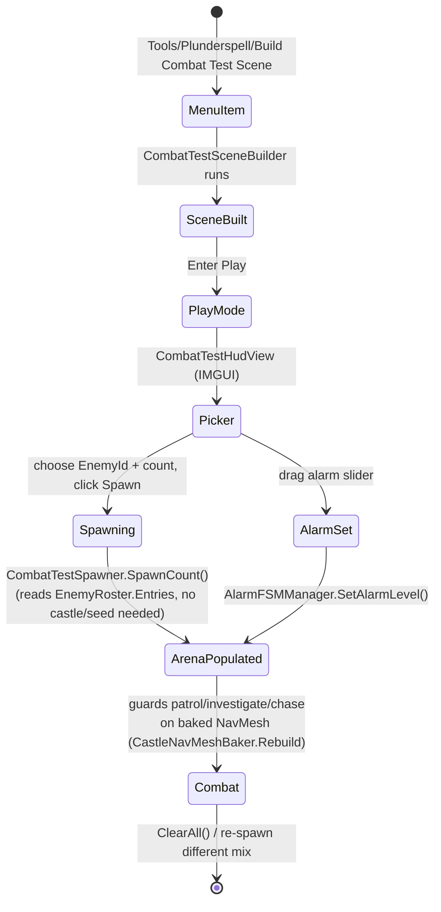

# [Issue #18] No way to test combat

**GitHub:** https://github.com/Ajw2003/PlunderSpell/issues/18
**Labels:** `gameplay` `enhancement`
**Phase:** Phase 1 — Close the loop
**Blocks:** none identified among this backlog's 55 — this is a dev-tooling convenience that
speeds up iteration on #14/#37/#39/#43 but nothing else structurally depends on it existing
**Blocked by:** #14 (no usable health/damage model) — a combat test scene that spawns enemies is of
limited value until there is a damage pathway and visible health to actually exercise; sequencing
after #14 (as the backlog already orders it) means this scene can immediately be used to verify #14

## Problem

There is no quick way to exercise combat. Reaching an enemy means launching a raid, finding a guard
somewhere in a 40+ room castle, and hoping the encounter works.

## Current state

**Guard logic is thoroughly unit-tested, but that is not a playable encounter.** Confirmed by direct
read: `Assets/_Project/Scripts/Tests/Runtime/GuardTests.cs`, namespace `RogueAi.Tests`, class
`GuardTests`, has exactly **18** methods annotated `[Test]` and **0** `[UnityTest]` — matching the
issue body's own citation and `docs/plans/moodboard-gap-closure.md`'s count. These tests drive
`GuardBrain` (a pure decision function) directly or step a `CastleGuard` through `Tick()` one frame
at a time in an empty `GameObject` with no scene, no NavMesh, and no player — see
`GuardTests.MakeGuard` (`GuardTests.cs:36-44`), which builds a bare `GameObject` with only a
`BoxCollider` and a `CastleGuard`. This proves `GuardBrain`'s state transitions are correct; it does
not exercise sight raycasts against real geometry, NavMesh pathing, or how a guard actually reads in
play.

**`TestSceneBuilder` exists exactly as the issue names it, but does not spawn any enemy.** Read in
full: `Assets/_Project/Scripts/Editor/TestSceneBuilder.cs`, menu item `Tools/RogueAi/Build Test
Scene` (`TestSceneBuilder.cs:31`), saves to `Assets/_Project/Scenes/TestScene.unity`
(`TestSceneBuilder.cs:28`). It builds: a directional light (`BuildSceneLight`, lines 56-62); scene
singletons `EventManager` and `ItemManager` (`BuildManagers`, lines 67-71 — note: `ItemManager` is
the *old* mouse-drag/throw system from the pre-raid prototype, distinct from the raid's `LootInteractor`);
a 120×120 unit flat ground box (`BuildGround`, lines 77-83); a `Player.prefab` built fresh each run
from `PlayerStateMachine`+`PlayerInputController`+a `CameraPivot` (`BuildPlayerPrefab`, lines
85-120 — **this is a different, unused-in-the-raid player controller** from the `RaidScene`'s actual
player, which is built by `RaidSceneBuilder.BuildPlayer()` around `FreeLookPlaytestController`,
confirmed by reading both builders); and exactly one interactive `TestItem` cube with an `Item`
component (`BuildTestItem`, lines 134-146). **There is no `CastleGuard`, no `GuardSpawner`, no
`EnemyRoster` reference, and no `AlarmFSMManager` anywhere in this file.** The scene this issue
references as "already exist[ing] to build on" is real, but as of this read it is a physics/movement
sandbox, not a combat sandbox — the issue's own framing ("build on") is accurate only if this gap is
made explicit, which the previous drafts of this plan did not do.

**The raid scene's real enemy-spawning infrastructure is reusable, and is the right thing to build
on instead of (or in addition to) `TestSceneBuilder`.** `GuardSpawner`
(`Assets/_Project/Scripts/Runtime/Raid/GuardSpawner.cs`) already separates "what to spawn" from
"where": `SpawnFor(ProceduralCastleData, seed)` (`GuardSpawner.cs:42-61`) needs a full castle layout
because it delegates placement to `GuardPlacementPlanner`, but the per-guard instantiation logic
(`Spawn`, lines 75-105) only needs a `GameObject` prefab and a `Vector3` position — it composes with
`prefab.transform.rotation` rather than replacing it (line 84-85), which matters because
`docs/systems/raid-scene-assembly.md`'s "Orientation" section documents enemy prefabs as having
their Blender axis correction on the mesh child, identity on the root — instantiating a guard prefab
directly with a bare `Instantiate(prefab, pos, Quaternion.identity)` would still work for enemies
specifically (root rotation is already identity per that doc), but copying `GuardSpawner`'s
composed-rotation convention is safer and cheaper than re-deriving it. `EnemyRoster`
(`Assets/_Project/Scripts/Runtime/Raid/EnemyRoster.cs`) exposes `EntriesFor(CastleZone)`
(lines 43-53) and each `Entry` carries a plain `Prefab` reference (line 36) — so every enemy prefab
in `Assets/_Project/Data/Enemies/EnemyRoster.asset` (10 enemies, confirmed by
`docs/systems/raid-scene-assembly.md`'s roster table) is directly instantiable without going through
zone-weighted picking at all; a flat arena builder can just read `roster.Entries` and offer every
distinct `EnemyId` as a dropdown/count control.

**Alarm level is already a one-line hook.** `AlarmFSMManager.SetAlarmLevel(float)`
(`Assets/_Project/Scripts/Runtime/Alarm/AlarmFSMManager.cs:117-121`) is documented as a "test/setup
helper: force the alarm level and immediately re-evaluate state" — exactly what "alarm level
selectable" in the acceptance criteria needs, with no new code required beyond exposing a control
that calls it.

**No menu entry exists that reaches a combat scenario today.** The full `[MenuItem(...)]` inventory
in the project (`Assets/_Project/Scripts/Editor/*.cs`) is: `Tools/Plunderspell/Fix Castle Prefab
Orientation`, `Plunderspell/Voice/Download Vosk Small Model`, `Tools/RogueAi/Build Test Scene`,
`Tools/Plunderspell/Build Playable Raid Scene`, `Tools/Plunderspell/Forge Raid Loot Table`,
`Tools/Plunderspell/Forge Enemy Prefabs + Roster`. None builds or opens a combat-specific scenario.
`MainMenuScreen` (`Assets/_Project/Scripts/Runtime/UI/Screens/MainMenuScreen.cs:31-33`) offers only
Play/Settings/Quit buttons.

## Root cause / gap analysis

The project has two disjoint pieces of "test tooling" that look related but solve different
problems: `TestSceneBuilder` is a movement/physics sandbox inherited from before the raid loop
existed (its own doc comment marks it "Development convenience only, not shipped gameplay" and it
predates `CastleGuard` entirely — it wires the old `Player.prefab`/`PlayerStateMachine`, not the
raid's `FreeLookPlaytestController`). `GuardTests` proves AI logic correctness in complete isolation
from a scene. Neither gives a human a playable arena with a chosen mix of enemies at a chosen alarm
level. The pieces needed to build one (`GuardSpawner`'s per-guard spawn logic, `EnemyRoster`'s
`Entries`, `AlarmFSMManager.SetAlarmLevel`) already exist and are already decoupled from full castle
generation — this issue is genuinely just missing glue and a menu entry, not missing systems.

## Implementation plan

**Step 1 — decide the shape: extend `TestSceneBuilder` or add a sibling builder.** Recommend a new
Editor tool rather than overloading `TestSceneBuilder` (which is documented as being about movement,
not combat, and reused by whatever future PR still needs a plain physics sandbox): create
`Assets/_Project/Scripts/Editor/CombatTestSceneBuilder.cs`, menu item `Tools/Plunderspell/Build
Combat Test Scene`, saving to `Assets/_Project/Scenes/CombatTestScene.unity`. This keeps
`TestSceneBuilder` untouched and gives combat iteration its own scene, consistent with how
`RaidSceneBuilder` and `TestSceneBuilder` are already two separate builders for two separate
purposes.

**Step 2 — reuse the raid player, not the legacy one.** Since `TestSceneBuilder`'s player
(`PlayerStateMachine`+`PlayerInputController`) is not the controller the raid actually uses, and
this scene's purpose is testing combat *as it will be played*, base the new builder's player-build
step on `RaidSceneBuilder.BuildPlayer()` (`RaidSceneBuilder.cs:259-305`) — same
`FreeLookPlaytestController`, `StatusEffectReceiver`, `LootInteractor`, `IntruderTag` (the last is
required or `CastleGuard.FindVisibleIntruder`, `CastleGuard.cs:192-224`, never sees the player at
all, since it only scans the static `Intruders` list that `IntruderTag` populates at runtime). Once
#14 lands, also add the `PlayerHealth` component from that issue.

**Step 3 — flat arena, real NavMesh.** A `NavMeshAgent`-driven `CastleGuard` needs a baked surface
(`docs/systems/raid-scene-assembly.md`'s "Navigation" section: "A guard spawned before the bake
lands off-mesh and stands still for the entire raid"). Build a flat ground plane (reuse the pattern
from `RaidSceneBuilder.BuildGround`, `RaidSceneBuilder.cs:135-143`, or `TestSceneBuilder.BuildGround`,
`TestSceneBuilder.cs:77-83`) and a `NavMeshSurface` baked the same way
`RaidSceneBuilder.BuildNavigation` does (`RaidSceneBuilder.cs:230-238`) —
`CollectObjects.All`, `NavMeshCollectGeometry.PhysicsColliders` — then call
`CastleNavMeshBaker.Rebuild()` once, before any guard spawns (mirroring the ordering invariant
documented in `docs/systems/raid-scene-assembly.md`'s Invariants section).

**Step 4 — spawn a chosen mix without a castle.** Load `EnemyRoster` from
`Assets/_Project/Data/Enemies/EnemyRoster.asset`, collect `roster.Entries` into distinct `EnemyId`
groups (one `Prefab` per id — an id can repeat across zones with the same prefab reference).
Expose a simple pre-play configuration surface. Two options, pick one and note the choice as an open
question for a human:
  - **(a) Editor-time config asset**, e.g. a small `CombatTestSceneConfig` `ScriptableObject` with a
    `List<(string EnemyId, int Count)>` and a `float AlarmLevel`, read by the builder at
    `Build Combat Test Scene` time — no runtime UI needed, fastest to build, but requires re-running
    the menu item to change the mix.
  - **(b) In-scene runtime picker**, an IMGUI panel (consistent with the project's existing
    IMGUI-first HUD philosophy per `RaidHudView.cs`'s own doc comment) with a dropdown/count per
    enemy id and an alarm slider, spawning guards on a button press via `Instantiate` composed with
    `prefab.transform.rotation` (same convention as `GuardSpawner.Spawn`, `GuardSpawner.cs:84-85`) —
    no scene rebuild needed to try a different mix, closer to what "selectable without editing code"
    in the acceptance criteria implies. **Recommended**, since the acceptance criterion explicitly
    says "selectable without editing code," which (a) does not satisfy (changing the mix means
    re-running an Editor menu item, not "editing code" exactly, but still an Editor-only workflow
    that a non-technical playtester cannot drive at runtime).

  Sketch of the runtime picker (`Assets/_Project/Scripts/Runtime/Playtest/CombatTestSpawner.cs`):

```csharp
using System.Collections.Generic;
using RogueAi.Alarm;
using RogueAi.Guards;
using RogueAi.Raid;
using UnityEngine;

namespace RogueAi.Playtest
{
    /// <summary>Spawns a chosen mix of enemies from the EnemyRoster into a flat arena, with no
    /// castle and no seed — the combat-only counterpart to RaidSceneBuilder's full raid. Dev
    /// tooling only; not part of the shipped raid loop.</summary>
    public class CombatTestSpawner : MonoBehaviour
    {
        [SerializeField] private EnemyRoster _roster;
        [SerializeField] private AlarmFSMManager _alarm;
        [SerializeField] private Transform _spawnArea;
        [SerializeField] private float _spawnRadius = 10f;

        private readonly List<GameObject> _spawned = new List<GameObject>();

        public void SpawnCount(string enemyId, int count)
        {
            GameObject prefab = FindPrefab(enemyId);
            if (prefab == null) return;

            for (int i = 0; i < count; i++)
            {
                Vector2 offset = Random.insideUnitCircle * _spawnRadius;
                Vector3 pos = _spawnArea.position + new Vector3(offset.x, 0f, offset.y);
                GameObject go = Instantiate(prefab, pos, prefab.transform.rotation);
                _spawned.Add(go);
            }
        }

        public void SetAlarm(float level) => _alarm?.SetAlarmLevel(level);

        public void ClearAll()
        {
            foreach (var go in _spawned) if (go != null) Destroy(go);
            _spawned.Clear();
        }

        private GameObject FindPrefab(string enemyId)
        {
            foreach (var entry in _roster.Entries)
                if (entry.EnemyId == enemyId) return entry.Prefab;
            return null;
        }
    }
}
```

  Pair this with a small IMGUI `OnGUI` overlay (new `CombatTestHudView.cs`, following
  `RaidHudView`'s pattern of `GUILayout.BeginArea`/`GUI.Label`/buttons) listing every distinct
  `EnemyId` from the roster with a count field and spawn button, plus a slider calling
  `CombatTestSpawner.SetAlarm`.

**Step 5 — reachable from a menu entry, documented.** Add the `Tools/Plunderspell/Build Combat Test
Scene` menu item (Step 1). For the "reachable from... a scene" half of the acceptance criteria being
satisfiable without an in-game menu button, add a short line to `docs/systems/raid.md` or a new
`docs/systems/combat-testing.md` (prefer extending `docs/systems/raid.md`'s existing structure over
a new tier-4 doc, per `docs/README.md`'s convention of not fragmenting docs unnecessarily) noting
the scene's path and how to open it, and add the pointer to `docs/README.md`'s systems table per its
own stated rule ("Nobody should have to search this folder — if something isn't linked from here,
that's a gap in this document").

## Testing & verification plan

- No new EditMode/PlayMode assertions are strictly required — this issue is dev tooling, not
  gameplay logic — but if `CombatTestSpawner.FindPrefab` or count-spawning logic grows any branching,
  add a small EditMode test in `Assets/_Project/Scripts/Tests/EditMode/` asserting it returns the
  correct prefab for a known `EnemyId` and null for an unknown one, following the existing style of
  `Assets/_Project/Scripts/Tests/EditMode/InventorySystemTests.cs`.
- **Manual protocol (this issue is inherently a manual-verification tool):** run `Tools/Plunderspell/
  Build Combat Test Scene`, enter Play mode, spawn 3 WarHounds and 1 Sergeant via the picker, set
  alarm to Roused via the slider, confirm all four guards path toward the player on the baked
  NavMesh (not standing still — the documented off-mesh symptom), confirm the alarm slider actually
  changes `GuardBrain.SightRange`/`MoveSpeed` behaviour (faster, wider-sighted guards at higher alarm,
  per `GuardBrain`'s existing alarm-scaling contract already covered by `GuardTests`). Screenshot the
  picker UI and the resulting arena for the PR.

## Acceptance criteria

- [ ] A combat test scene or menu entry that spawns chosen enemies in a flat arena with the player.
- [ ] Enemy type, count and alarm level selectable without editing code.
- [ ] Reachable from a single menu item or scene, documented in `docs/systems/`.

## Visual



## Effort & risk

**S.** Every piece this issue needs already exists and is already decoupled from full castle
generation (`GuardSpawner`'s per-entity spawn logic, `EnemyRoster.Entries`,
`AlarmFSMManager.SetAlarmLevel`). The only real risk is scope creep — building a second full scene
builder that drifts out of sync with `RaidSceneBuilder`'s player/guard wiring conventions over time.
Keep this deliberately thin and reuse `RaidSceneBuilder`'s helper methods by extracting the shared
ones (`BuildPlayer`, `BuildNavigation`) into a common static helper class if this is not to become
its own maintenance burden — flagged as a design nicety, not a blocker.

## Open questions

1. **Editor-time config asset vs. runtime IMGUI picker** (Step 4) — this plan recommends the runtime
   picker to satisfy "selectable without editing code" more literally; a human should confirm before
   implementation, since the picker is more work than a `ScriptableObject`.
2. Should `CombatTestSceneBuilder` be a genuinely separate scene/file from `TestSceneBuilder`, or
   should `TestSceneBuilder` be extended in place? This plan recommends separate, to avoid entangling
   the movement-only sandbox with combat-only additions, but it is a judgement call a reviewer may
   overturn.
3. Sequencing against #14: this scene is far more useful once player/enemy health and damage exist.
   Should this issue land before, after, or alongside #14? This plan assumes alongside/after, per the
   backlog's own Phase 1 ordering (#14 listed first).

## Definition of done

A developer (or playtester) can open one scene or run one menu item, choose which enemies and how
many to fight, set the castle's alarm level, and be in combat with them inside a minute, with no
castle to generate and no code to edit.
