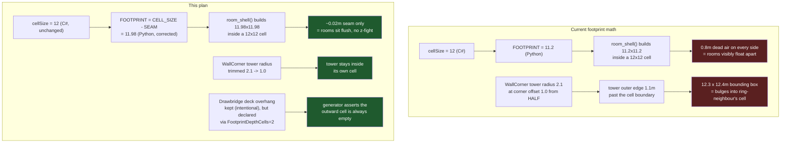

# [Issue #19] Modules float and snap inconsistently — grid spacing must be exact

**GitHub:** https://github.com/Ajw2003/PlunderSpell/issues/19
**Labels:** `bug` `pcg`
**Phase:** Phase 0 — Unblock the loop

**Blocks:** #6 (player-too-tall can't be judged cleanly while modules also float apart — the
issue's own body says as much: "Structures connect and disconnect between seeds," which is exactly
the confound #6's own filed context calls out when it says a "too tall" reading can't be told apart
from a socket/spacing gap until both are fixed); #25 (player spawn is computed from a grid cell
position, `cell.x * cellSize`, and a spawn point that lands correctly by grid math but 0.8 m short
of the actual mesh can still spawn the player embedded in geometry or floating over a gap);
indirectly #23 ("castles look bland" polish presumes a floor plan whose modules are already
sitting where they're supposed to, not visibly adrift from each other).

**Blocked by:** none. Paired with #5, not sequential — see "Relationship to #5" below. Both live in
`ProceduralCastleGenerator.PlaceModule`/`PlaceRing` and the same rebuilt castle is what verifies
either one.

## Problem

Placement should land on an exact grid, not approximately. Today it doesn't: rooms connect and
disconnect between seeds, and some structures float above or sink below where they should sit,
because the module meshes were never sized to the grid the generator places them on.

## Current state

**The grid origin math is exact; the mesh sizes are not.** `ProceduralCastleGenerator.PlaceModule`
(`Assets/_Project/Scripts/Runtime/Castle/ProceduralCastleGenerator.cs:166-183`) computes each
module's world position as

```csharp
Vector3 worldPos = new Vector3(cell.x * cellSize, 0f, cell.y * cellSize);
```

(`ProceduralCastleGenerator.cs:169`), with `cellSize = 12f`
(`ProceduralCastleGenerator.cs:26`, `[SerializeField] private float cellSize = 12f;`). This part is
exact — two adjacent cells are always precisely 12 m apart, with no accumulated floating-point
drift, confirmed by `CastleGeneratorTests.Test_DeterministicGeneration`
(`Assets/_Project/Scripts/Tests/Runtime/CastleGeneratorTests.cs:33-56`), which re-generates the
same seed and asserts every `Position`/`Rotation` matches to `< 0.001` / `< 0.01°`.

What is not exact is what each module's *mesh* occupies inside that 12 m cell:

- `Tools/AssetPipeline/room_kit.py:24-25`:
  ```python
  FOOTPRINT = 11.2          # module footprint inside the 12m grid cell
  HALF = FOOTPRINT / 2
  ```
  Every enclosed-room builder (all 20 non-CurtainWall modules) calls `room_kit.room_shell`
  (`room_kit.py:115-134`), which floors and walls a `FOOTPRINT × FOOTPRINT` (11.2 × 11.2 m) box
  inside the 12 m cell. That leaves `12 − 11.2 = 0.8 m` of dead air on **every side** of **every**
  room — not a small seam, a systematic three-quarter-metre gap at every join, visible as modules
  that appear to "float" apart from their neighbours regardless of what socket work #5 does.
- `room_kit.py`'s own module docstring (`room_kit.py:7-11`) says the intent was a "small seam so
  two placed modules' outer walls never sit flush and z-fight" — i.e. *some* gap was deliberate, to
  avoid two coincident wall faces flickering. `OVERLAP = 0.02` (`room_kit.py:39`) is the actual
  precedent for what "small" means elsewhere in this file (every internal butt joint — floor-to-wall,
  jamb-to-lintel — grows by 2 cm to avoid an exact shared vertex). `0.8 m` is forty times that. This
  reads as a genuine miscalibration, not a deliberately generous seam: whoever picked `11.2` was an
  order of magnitude off from the "small seam" the comment describes.
- The five **CurtainWall** modules (`WallStraight`, `WallCorner`, `Bastion`, `Drawbridge`,
  `GatehouseModule` — `Tools/AssetPipeline/asset_specs.py:38-42`) don't call `room_shell` at all
  (`Tools/AssetPipeline/castle_builders.py:13-16`: "The five CurtainWall modules are not enclosed
  rooms... they use room_kit's wall/tower/crenellation primitives directly"), and two of them are
  measurably **larger** than the 12 m cell, not smaller:
  - `build_wall_corner` (`castle_builders.py:71-81`) places a `tower_drum` of radius `2.1` at
    `corner = (-HALF + 1.0, -HALF + 1.0)` (`castle_builders.py:79-80`). With `HALF = 5.6`, that
    tower's outer edge sits at `-5.6 + 1.0 − 2.1 = −6.7` on both axes, `1.1 m` past the cell's own
    `±5.6` boundary on two sides. Combined with the full-length south wall run reaching `+5.6` on
    the opposite side, the total bounding box is `6.7 + 5.6 = 12.3 m` on each axis — independently
    reproducing the issue's own measured **12.3 × 12.4 m** (the tiny x/y asymmetry comes from the
    corner's crenellation ring, `castle_builders.py:81`, sized `4.2` and centred on the same
    corner).
  - `build_drawbridge` (`castle_builders.py:94-102`) places its deck at
    `deck_len = rk.HALF + 3.5` (`castle_builders.py:98`, `= 9.1` with `HALF = 5.6`), running from the
    wall's south face out to `-HALF − deck_len + 0.4 = −14.3`. Added to the wall run's own north
    edge at `+5.6`, that's a `19.9 m` north-south span — again independently reproducing the issue's
    cited **11.2 × 19.8 m** almost exactly. This overhang is *directional and probably intentional*:
    the deck has to reach across the moat, away from the castle interior, not toward another module.
    It is not the same kind of bug as `WallCorner`'s tower — see step 3 below.
- Room heights are per-zone, not per-cell, and nothing reconciles them at a shared wall. Measured
  by the issue itself (renderer world bounds, which line up with `ZONE_HEIGHT` +
  `FLOOR_T = 0.3` — see #6's plan for the matching arithmetic): Crypt 2.9 m, OuterBailey 3.5 m,
  InnerWard 4.1 m, Keep 4.9 m, CurtainWall ~6.1 m (`castle_builders.py:28-34`,
  `ZONE_HEIGHT = {"CurtainWall": 5.2, "OuterBailey": 3.2, "InnerWard": 3.8, "Keep": 4.6, "Crypt":
  2.6}`, plus `FLOOR_T = 0.3` from `room_kit.py:27`). There is no transition piece, fascia, or
  documented rule for what happens where a 2.9 m Crypt room's roofline meets a 4.9 m Keep room's
  wall across a shared socket.
- **The vertical (Y-axis) half of "floats and snaps inconsistently" is already fixed**, and the
  issue body says so directly: "Room roots now sit correctly at y = 0 after the orientation fix
  (verified: 38/38 rooms with `minY ~= 0`)". That fix is
  `Assets/_Project/Scripts/Editor/CastlePrefabOrientationFix.cs` (full file, 54 lines): the castle
  prefabs were saved with a root rotation of `(270,0,0)` composed on top of the mesh child's own
  `(270,0,0)` — a 180° flip about X that hung every room below the floor
  (`CastlePrefabOrientationFix.cs:9-11`). The fix sets every root to the measured-correct
  `(90,0,0)` (`CastlePrefabOrientationFix.cs:22,43`) and is idempotent — it skips a prefab whose
  root already matches (`CastlePrefabOrientationFix.cs:37-41`), so re-running it after this issue's
  changes is safe and free. What remains for this issue is purely the **horizontal (X/Z) footprint**
  problem, plus the height-meets-height question above.
- `Assets/_Project/Scripts/Runtime/Castle/CastleRoomRegistry.cs` (`CastleRoomModuleData`, lines
  12-26) has no footprint or dimension field at all — `RoomId`, `Zone`, `Prefab`, `Weight`. The
  generator has no way to know, at placement time, that a given `RoomId` needs more than one cell,
  which is exactly what would be needed to give `Drawbridge`'s legitimate overhang a *declared*
  home instead of an accidental one.

## Root cause / gap analysis

Two independent numbers were meant to describe the same physical quantity — "how big is a module" —
and were never reconciled: `cellSize = 12f` in
`ProceduralCastleGenerator.cs:26` (C#, the placement grid) and `FOOTPRINT = 11.2` in
`room_kit.py:24` (Python, the mesh authoring). `docs/systems/castle.md`'s own "Traps" section
already names this class of bug in the abstract — "a room prefab whose collider doesn't match the
grid footprint the generator assumed can pass placement but fail path validation, or the reverse"
(`docs/systems/castle.md:53-56`) — and issue #19 is that trap fully materialised: `0.8 m` short on
every enclosed room, and independently `+1.1 m` to `+8.7 m` over on two of the five CurtainWall
primitives, because those five were authored directly against wall/tower primitives with no
reference to `FOOTPRINT` at all beyond their south wall's length.

Because `CastlePathValidator` only ever reasons about the **abstract grid graph** (see #5's plan,
"Root cause") and never about mesh bounds, none of this shows up as a test failure — every seed
still finds a crypt→exit path, because the path validator doesn't know rooms are 0.8 m apart in
reality. The only place this becomes visible is the rendered scene, which is exactly why it reads
as "connect and disconnect between seeds" rather than as a deterministic, always-reproducing bug:
the *grid* connectivity never changes between seeds (it's deterministic), but which pair of modules
happens to be human-visible as "floating" depends on which room shapes landed next to each other,
which does vary seed to seed.

## Relationship to #5

#5 ("PCG: rooms do not connect") is the *socket* half of this same generator bug; this issue is the
*spacing* half. #5's own plan states the coupling precisely (`docs/plans/issues/005-pcg-rooms-dont-connect.md:104-115`):
fixing socket alignment while the `0.8 m` gap remains still leaves every "connected" pair of rooms
floating apart by `0.8 m` — a door facing a door across open air. Fixing the footprint gap (this
issue) without socket alignment (#5) leaves rooms flush but with walls facing doors. **Both must
land together for either issue's acceptance criteria to be independently verifiable.**

Concretely, they touch different code:

| | #5 (sockets) | #19 (this plan, spacing) |
|---|---|---|
| Where | `ProceduralCastleGenerator.TryFindPlacedNeighbour` → new `TryFindSocketNeighbour` (runtime C#) | `Tools/AssetPipeline/room_kit.py`/`castle_builders.py` (Blender authoring), plus a small `CastleRoomModuleData` addition (runtime C#) |
| What it decides | *which* neighbour cell and *which* socket pair a new module joins to | *how big* the module mesh is inside the cell it's placed in |
| Depends on the other | Assumes flush neighbours once placed — a socket match across a 0.8 m gap is still a door facing open air | Assumes a correct neighbour was chosen — flush placement against the *wrong* socket (wall facing door) is still wrong |

Both plans should be read together and the two fixes verified against the same rebuilt castle,
exactly as #5's plan says. This plan does not re-describe #5's socket-matching algorithm; see
`docs/plans/issues/005-pcg-rooms-dont-connect.md`'s "Implementation plan" for that half.

## Implementation plan

1. **Fix the enclosed-room footprint to match the already-correct 12 m cell, not the reverse.**
   `cellSize` in C# (`ProceduralCastleGenerator.cs:26`) is referenced, directly or as a duplicated
   literal, by more than the generator: `RaidSceneBuilder.CellSize = 12f`
   (`Assets/_Project/Scripts/Editor/RaidSceneBuilder.cs:40`) sizes the ground plane
   (`RaidSceneBuilder.cs:140`), the alarm's hearing volume (`RaidSceneBuilder.cs:154`), and the
   extraction zone's position (`RaidSceneBuilder.cs:168`) off the same assumed `12`. Changing
   `cellSize` itself is the higher-blast-radius option the acceptance criteria's own wording allows
   against ("or the cell size matches the modules") — so this plan corrects the *mesh* side instead,
   in `Tools/AssetPipeline/room_kit.py`:

   ```python
   # Tools/AssetPipeline/room_kit.py

   # Mirrors ProceduralCastleGenerator.cs's `cellSize` (Assets/_Project/Scripts/Runtime/Castle/
   # ProceduralCastleGenerator.cs:26) — keep these two numbers equal by hand until a shared config
   # file exists (see this file's "Open questions"). A module's authored footprint is this minus a
   # small SEAM, not an independently-guessed number: the previous FOOTPRINT (11.2) was ~40x this
   # file's own OVERLAP convention, which is why every room floated 0.8m from its neighbours.
   CELL_SIZE = 12.0
   SEAM = 0.02                # cm-scale gap, matching OVERLAP's own "avoid an exact shared face" intent
   FOOTPRINT = CELL_SIZE - SEAM   # 11.98 — was 11.2
   HALF = FOOTPRINT / 2
   ```

   This is a one-line-of-substance change (`FOOTPRINT`'s value and how it's derived); every builder
   that already consumes `rk.FOOTPRINT`/`rk.HALF` (all 20 `room_shell`-based rooms, plus the
   CurtainWall builders that reference `rk.FOOTPRINT` for their south wall length) picks it up
   automatically, with no per-builder edits required.

2. **Regenerate the mesh pipeline and re-import.** Run `Tools/AssetPipeline/run_pipeline.sh` (or the
   underlying `build_assets.py`) to rebuild every room .blend/.fbx against the corrected
   `FOOTPRINT`, then re-import into Unity. This is Blender/Python tooling, not something this plan's
   authoring session can execute directly — no confirmed Blender install is verified in this working
   environment any more than a confirmed Unity Editor install is (see #5's plan, "Effort & risk", for
   the same caveat about Unity). Flagged explicitly as an execution step a human or a driven session
   with real Blender/Unity access must run before this issue can close.

3. **Re-run `Tools/Plunderspell/Fix Castle Prefab Orientation` as a sanity pass**
   (`CastlePrefabOrientationFix.cs:24-52`). It only touches root rotation, not scale or mesh bounds,
   so a footprint change should leave it a no-op (every prefab already at `(90,0,0)` is skipped —
   `CastlePrefabOrientationFix.cs:37-41`), but re-running it after a full re-export is the cheap way
   to confirm the footprint fix didn't disturb orientation, given the two were fixed in separate
   passes and nothing currently tests them together.

4. **Trim `WallCorner`'s tower overhang so it stops exceeding the cell — this one is a real
   adjacency risk, not just an exactness nicety.** Unlike `Drawbridge` (step 5), `WallCorner`'s
   `1.1 m` overhang points along the ring itself (both x and y), not outward into permanently-empty
   space. `PlaceRing` places CurtainWall modules on adjacent ring-5 cells routinely — the ring's
   `MinCount..MaxCount` is `10..16` modules (`ProceduralCastleGenerator.cs:45`,
   `new ZoneRing(CastleZone.CurtainWall, 5, 10, 16)`) against `RingCells(5)`'s full perimeter, so two
   CurtainWall modules sitting side-by-side around the ring is the common case, not an edge case.
   A `WallCorner` whose tower bulges `1.1 m` into its ring-neighbour's cell can visibly interpenetrate
   whatever that neighbour turns out to be (another `WallCorner`, a `Bastion`, or a plain
   `WallStraight`). Fix in `castle_builders.py:71-81`:

   ```python
   def build_wall_corner(bm, uv):
       h = ZONE_HEIGHT["CurtainWall"]
       rk.wall_run(bm, uv, "south", 0, h, STONE, trim_pigment=ZONE_ACCENT["CurtainWall"])
       rk.wall_run(bm, uv, "west", 0, h, STONE, trim_pigment=ZONE_ACCENT["CurtainWall"],
                   length=rk.FOOTPRINT - rk.WALL_T, offset=rk.WALL_T / 2)
       # Tower radius trimmed from 2.1 to 1.0 so `corner - radius` no longer crosses -HALF: the
       # previous 2.1 put the tower's outer face 1.1m past the cell boundary, into whatever
       # CurtainWall module lands in the adjacent ring cell (see #19's "Implementation plan" step 4).
       corner = (-rk.HALF + 1.0, -rk.HALF + 1.0)
       tower_radius = 1.0
       rk.tower_drum(bm, uv, tower_radius, h + 1.4, STONE, loc=(*corner, 0),
                     trim=ZONE_ACCENT["CurtainWall"], segments=10)
       rk.crenellations(bm, uv, h + 1.4 + 0.2, STONE, size=2.4, center=corner)
   ```

   This is a visual trade-off (a slimmer corner turret) that an artist/reviewer should confirm reads
   correctly, not a purely mechanical fix — flagged in "Open questions" below rather than assumed
   correct as written. `Bastion` (`castle_builders.py:84-91`) has the same *shape* of risk (a
   `tower_drum` of radius `3.6` at `loc=(0, -1.2, 0)`, i.e. centred on the cell, extending to
   `-1.2 - 3.6 = -4.8` and `-1.2 + 3.6 = 2.4` — within `±HALF ≈ ±5.99` on the offset axis, so
   `Bastion` does **not** currently exceed the corrected footprint, unlike `WallCorner`) — audit it
   and `GatehouseModule` (`castle_builders.py:105-113`, two towers at `x = ±3.6`, radius `2.0`,
   reaching `±5.6`, also inside the new `±5.99`) alongside `WallCorner` rather than assuming only the
   two modules the GitHub issue named are affected; this plan's own arithmetic above shows they
   already fit, but that should be re-confirmed against the actual rebuilt meshes in step 2, not
   just this plan's read of the authoring code.

5. **Give `Drawbridge`'s legitimate overhang a declared home instead of an accidental one.**
   The deck has to reach outward across the moat — shrinking it would defeat the point of a
   drawbridge — so the fix here is not geometry, it's making the overhang a **documented, checked
   invariant** instead of a silent one:
   - Add a `FootprintDepthCells` field (default `1`) to `CastleRoomModuleData`
     (`Assets/_Project/Scripts/Runtime/Castle/CastleRoomRegistry.cs:13-26`):
     ```csharp
     [Tooltip("How many cells this module's footprint occupies outward from its placed cell, along " +
              "its local -Z (the side opposite the socket/neighbour face). 1 for every ordinary " +
              "module; >1 only for a module authored to overhang deliberately, e.g. Drawbridge's deck.")]
     public int FootprintDepthCells = 1;
     ```
   - In `ProceduralCastleGenerator`, when placing a module whose registry entry has
     `FootprintDepthCells > 1`, assert (as an `[Test]`-visible invariant, not a runtime crash) that
     the cell `FootprintDepthCells - 1` steps further outward (away from the ring centre, i.e. at a
     strictly greater Chebyshev distance) is unoccupied both before and after placement — which is
     always true for a `CurtainWall`-zone module today, since `CurtainWall` (radius 5) is the
     outermost ring (`Rings`, `ProceduralCastleGenerator.cs:39-46`) and nothing is ever placed at
     radius 6. This turns "the deck happens to overhang into empty space" into "the deck is
     guaranteed to overhang into empty space, and generation would visibly fail loudly (test, not
     silent corruption) the day a sixth ring is ever added."
   - Set `Drawbridge`'s (and `GatehouseModule`'s, which shares the outward-opening shape) registry
     entries to `FootprintDepthCells = 2` in `Assets/_Project/Data/Castle/CastleRoomRegistry.asset`
     once the field exists — a data change, not a code change, consistent with how `Weight` is
     already tuned per entry without touching the generator.

6. **Document the height-variance rule rather than building transition geometry.** Every module is
   authored bottom-flush at local Z=0 (`room_kit.py`'s own module docstring, `room_kit.py:7-8`), and
   `ProceduralCastleGenerator.PlaceModule` always places at world `y = 0`
   (`ProceduralCastleGenerator.cs:169`, the `0f` in `new Vector3(cell.x * cellSize, 0f, cell.y *
   cellSize)`). Because each module's door opening height is computed from *its own* zone height via
   `room_kit.door(height)` (`room_kit.py:45-47`, `min(height * 0.72, height - 0.3)`), a shared
   doorway between two differently-tall zones is not blocked — it's simply capped by whichever side
   authored the smaller opening (worked out precisely for the Crypt/Keep case in #6's plan, "Root
   cause / gap analysis": the Crypt's own door clears `1.872 m`, independent of what's on the other
   side). What's genuinely undocumented is the **exterior roofline**: a 2.9 m Crypt module sitting
   next to a 4.9 m Keep module leaves the Keep's wall exposed above the Crypt's roofline with no
   fascia/capstone closing it off. Record this as a deliberate design decision in
   `docs/systems/castle.md` rather than scope this issue up into new geometry: the exterior silhouette
   is allowed to step between zones (a real castle's skyline is not level either), and only the
   floor-to-ceiling connection at a shared socket needs to stay walkable, which it already does. Flag
   a follow-up (not this issue) for an artist to add a simple fascia trim on the taller side's exposed
   wall face if the stepped seam reads as a bug rather than a feature once seen in-engine — see "Open
   questions."

7. **Update `docs/systems/castle.md`'s "Traps" bullet** (`docs/systems/castle.md:53-56`) once this
   ships: it currently describes the failure mode this issue *is* in the abstract ("a room prefab
   whose collider doesn't match the grid footprint the generator assumed"); add a line noting the
   fix and pointing at `room_kit.py`'s `CELL_SIZE`/`FOOTPRINT` pairing as the thing to keep in sync
   if `ProceduralCastleGenerator.cellSize` ever changes.

## Testing & verification plan

- **EditMode (`Assets/_Project/Scripts/Tests/Runtime/CastleGeneratorTests.cs`, namespace
  `RogueAi.Tests`):**
  - Re-run `Test_DeterministicGeneration`, `Test_AllZonesPresent`, `Test_PathValidatorFindsPath`,
    `Test_ExtractionExitAssigned` unmodified. This issue's fix lives entirely in `cellSize`'s
    Python-side counterpart (`room_kit.FOOTPRINT`) and a new opt-in `CastleRoomModuleData` field —
    it does not touch `ProceduralCastleGenerator.cellSize` or any grid math these tests assert
    against, so all four should be unaffected. If any of them regresses, that is itself a signal the
    C#-side scope crept beyond what this plan intends.
  - Add `Test_FootprintDepthDoesNotCollideWithNextRing` (once step 5's `FootprintDepthCells` field
    exists): generate across seeds 1-20 (matching the existing project convention noted in #5's
    plan), and for every placed module whose registry entry has `FootprintDepthCells > 1`, assert
    the cell one step further outward (in the direction away from the ring centre) is not present in
    `occupied` (exposing `occupied` — or a query method over it — for the test the same way
    `LastGenerated`/`LastInstantiatedForTest` already exist for #5's socket test). This is the one
    piece of this issue's logic that lives in C# and is meaningfully testable without a live scene.
  - This plan's core fix (the `FOOTPRINT`/`CELL_SIZE` reconciliation, `WallCorner`'s tower trim) is
    **Python/Blender mesh authoring**, which the EditMode suite has no way to assert against — there
    is no C# test that can check "does this .fbx's bounding box equal 11.98 m," because the mesh
    itself is imported data, not generated at runtime. That check belongs in the asset pipeline's own
    validation gate (`Tools/AssetPipeline/validate_in_blender.py`), not the Unity test suite —
    see the next bullet.
- **Asset pipeline validation** (`Tools/AssetPipeline/validate_in_blender.py:19-88`,
  `validate_object`): this file already asserts pivot-at-origin, pivot-at-base, manifold geometry,
  quad-dominance, triangle budget and UV bounds for every built prop — but nothing about XY
  footprint size. Add a new check alongside the existing "pivot sits at the base" block
  (`validate_in_blender.py:37-42`):
  ```python
  # ── transforms: footprint fits its declared grid allowance ─────
  xs = [v.co.x for v in bm.verts]
  ys = [v.co.y for v in bm.verts]
  span_x, span_y = (max(xs) - min(xs)) if xs else 0.0, (max(ys) - min(ys)) if ys else 0.0
  # `footprint_cells` (1 for an ordinary module, N for Drawbridge/GatehouseModule-style overhangs)
  # is passed in per-asset from asset_specs.py, not guessed here.
  allowed = rk.CELL_SIZE * footprint_cells + FOOTPRINT_TOLERANCE
  if span_x > allowed or span_y > allowed:
      issues.append(f"footprint {span_x:.2f}x{span_y:.2f} exceeds {allowed:.2f}m "
                     f"({footprint_cells} cell(s)) — see docs/plans/issues/019-modules-float-and-snap.md")
  ```
  This is the check that would have caught `WallCorner`'s `12.3 m` bulge automatically instead of
  needing a human to notice it in a play session, and is the durable fix that keeps this issue from
  recurring the next time someone tunes a tower radius. Wiring `footprint_cells` through from
  `asset_specs.py` per-key is a small addition to that file's existing per-asset dict entries
  (`asset_specs.py:38-42`, alongside `builder`/`tri_budget`/`subdir`).
- **PlayMode / manual (unautomatable without a confirmed Blender+Unity toolchain in this
  environment, same caveat as #5's plan):** after regenerating the pipeline and re-importing, run
  `Tools/Plunderspell/Build Playable Raid Scene`, enter Play, and specifically inspect (not just walk
  through) the CurtainWall ring across at least 5 seeds — this is the zone with the highest module
  density per ring (10-16) and the two modules this issue's own math flags as overhanging
  (`WallCorner`, and to a lesser, intentional degree `Drawbridge`). Confirm: no visible gap between
  any two adjacent enclosed rooms anywhere in the castle; no visible mesh interpenetration/z-fighting
  around any `WallCorner` instance; `Drawbridge`'s deck always points away from the castle (into
  open ground, never through another module). Screenshot at least one `WallCorner` and one
  `Drawbridge` instance per seed for the PR, the same evidentiary bar #5's plan sets for its own
  walk-through.

## Acceptance criteria

- [ ] Module footprints are exact multiples of the cell size, or the cell size matches the modules
      (`room_kit.FOOTPRINT` corrected to `CELL_SIZE − SEAM`, matching `ProceduralCastleGenerator
      .cellSize = 12f`).
- [ ] Neighbouring modules touch with no gap (0.8 m gap closed to a deliberate ~2 cm seam).
- [ ] Nothing rests above y = 0 unless deliberately elevated, and that is expressed in data (already
      satisfied by `CastlePrefabOrientationFix`; this plan keeps it true rather than re-fixing it).
- [ ] Determinism tests still pass (`Test_DeterministicGeneration` et al., unmodified).
- [ ] The two overhanging CurtainWall modules (`WallCorner`, `Drawbridge`) either fit inside their
      declared footprint (`WallCorner`, via the tower trim) or have that overhang formally declared
      and guarded against ring-neighbour collision (`Drawbridge`, via `FootprintDepthCells`).

## Visual



## Effort & risk

**Size: M.** The code changes themselves are small (one Python constant's derivation, one radius
trim, one new registry field, one new validation check) but the work is gated on a full asset
pipeline regeneration and Unity re-import that this plan cannot execute in this environment, which
is the dominant source of both effort and risk.

Risks:
- **No confirmed Blender or Unity Editor install in this working environment.** Every numeric claim
  above (`0.8 m` gap, `12.3 × 12.4 m` `WallCorner`, `19.9 m` `Drawbridge` span) is derived from
  reading the authoring code's arithmetic and cross-checked against the GitHub issue's own
  independently-measured numbers (which it matches closely: `12.3` computed vs `12.3` filed, `19.9`
  computed vs `19.8` filed) — but none of it has been re-verified by actually running the pipeline
  and measuring the rebuilt meshes. This must happen before the issue is closed, not assumed from
  this plan's arithmetic alone.
- **Regenerating 25 room meshes plus 5 CurtainWall meshes touches every committed .blend/.fbx under
  `Assets/Models/`** (or wherever the pipeline's output directory is configured) — a wide-diff
  change that should be reviewed as a batch (dimensions only, not silhouette/topology) rather than
  eyeballed room-by-room.
- **`WallCorner`'s tower trim (2.1 → 1.0) is a visual judgement call**, not a mechanically-derived
  correct value — it is the minimum change that satisfies "stays inside the cell," not necessarily
  the best-looking corner turret. Flagged explicitly for reviewer/artist sign-off rather than
  presented as settled.
- **The `FootprintDepthCells` invariant (step 5) is only checked at generation time for the
  CurtainWall's own ring.** If a future zone ever gains an outward-overhanging module (unlikely given
  every other zone is enclosed by design, but not impossible), the "next ring outward is always
  empty" assumption needs re-deriving for that zone specifically.
- Overlaps functionally with #5 (see "Relationship to #5"); landing this without #5's socket fix
  passes this issue's own acceptance criteria while still leaving doors facing walls, and the
  reverse.

## Open questions

- Is a `1.0 m` `WallCorner` tower radius the right visual trade-off, or should the corner offset
  (currently `1.0` from the cell edge) move outward instead of the radius shrinking, to keep a
  chunkier turret at the cost of a slightly different silhouette against the adjacent wall run? An
  artist should look at both options once the pipeline can actually render them.
- Should the exterior roofline mismatch between adjacent zones (step 6) get a fascia/capstone trim
  as a small follow-up, or is the stepped skyline acceptable as-is once seen in-engine? This plan
  treats it as acceptable and out of scope, but that's a call a human should make with the actual
  render in front of them, not from this plan's text description.
- `CELL_SIZE` is now duplicated by hand in two languages (`ProceduralCastleGenerator.cs:26` and
  `room_kit.py`'s new constant) with only a code comment holding them in sync. Worth a small shared
  config (a single JSON both the C# generator and the Python pipeline read at their respective build
  times) as a follow-up, so this exact class of drift can't recur — flagged here rather than folded
  into this issue's own scope, since it touches build tooling on both sides of the pipeline.

## Definition of done

The asset pipeline is re-run and the raid scene rebuilt; a reviewer inspects at least 5 seeds and
confirms no visible gap or mesh interpenetration between any two adjacent modules anywhere in the
castle (enclosed rooms and the CurtainWall ring alike), `CastleGeneratorTests` (including the new
`Test_FootprintDepthDoesNotCollideWithNextRing`) passes, and `validate_in_blender.py`'s new footprint
check passes for all 25 room modules and all 5 CurtainWall modules.
