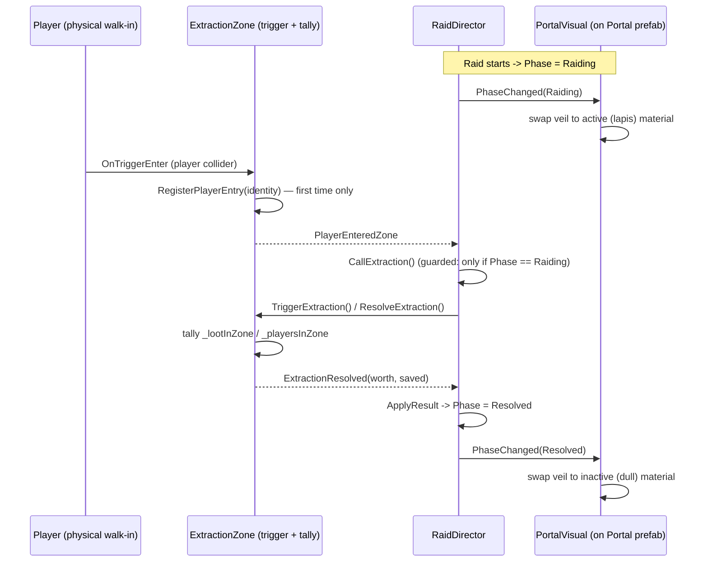

# [Issue #21] No portal - no asset and no way to travel to or from the lair

**GitHub:** https://github.com/Ajw2003/PlunderSpell/issues/21
**Labels:** `art` `enhancement` `gameplay`
**Phase:** Phase 1 — Close the loop
**Blocks:** #24 (the full-loop epic lists "#21 no portal asset or portal in the world" as one of its
five unclosed gaps under "Extraction that exists in the fiction"); #46 (portal closing-countdown
feedback, `docs/plans/moodboard-gap-closure.md:157-159` — "the portal has no closing urgency... a
trigger volume with a timer value nobody can see change") needs an actual portal object to hang a
countdown effect on before it can be built — soft dependency, not a hard block, since #46 could in
principle animate the bare box.
**Blocked by:** none. The extraction point sits outside the curtain wall
(`RaidSceneBuilder.BuildExtractionZone`, `Assets/_Project/Scripts/Editor/RaidSceneBuilder.cs:164-183`,
position `(CellSize * 6, 0, 0)`), independent of the interior castle-connectivity fixes in #5/#19 —
the portal doesn't need rooms to line up to exist or to be walked into.

## Problem

There is no portal asset and no portal in the world. Extraction is an invisible trigger volume, and
the return to the lair is a UI state change rather than something in the fiction. Per the issue body:
a portal model must exist at the extraction point, entering it must be what triggers extraction
(replacing the bare trigger box), and it must read as active/inactive to match extraction
availability.

## Current state

**The extraction point today is a green quad on a cube, not a portal.** `BuildExtractionZone`
(`RaidSceneBuilder.cs:164-183`) creates a `GameObject` named `ExtractionZone`, gives it an 8×6×8
`BoxCollider` trigger (line 170-172), and parents a flattened primitive `Cube` named `Marker` under
it purely for visibility (lines 174-180) — 0.1 units tall, coloured `(0.2, 0.65, 0.35)` via
`MakeMaterial` (line 332-337, `Universal Render Pipeline/Lit` or `Standard`). There is no mesh, no
archway, nothing that reads as a threshold between the castle and the way out — exactly what the
issue calls "an invisible trigger volume" (the marker makes it visible from above, not recognisable
as a portal from any other angle).

**Entering the zone does not trigger extraction today — it only tracks who and what is inside it.**
`ExtractionZone.OnTriggerEnter`/`OnTriggerExit` (`Assets/_Project/Scripts/Runtime/Extraction/ExtractionZone.cs:144-170`)
add/remove `LootPickup`s and `NetworkIdentity`s to/from `_lootInZone`/`_playersInZone` — pure
bookkeeping for a later tally. The only two things that actually *resolve* the raid are the
300-second clock in `Update` (`ExtractionZone.cs:70-81`, `RaidSeconds = 300f` set from
`RaidSceneBuilder.cs:44,253`) and `RaidDirector.CallExtraction()`
(`Assets/_Project/Scripts/Runtime/Raid/RaidDirector.cs:189-210`), which is wired to the **F5 key** —
documented in `RaidBootstrapper.cs:29-31,98-99` as a "playtest key," and in `docs/systems/raid.md:32-34`
as one of "the two controls nothing else provides" for "a playtester," not a shipping player. Read
literally, **a real player today has no in-fiction way to end a raid early at all** — they either
wait out the clock or a developer presses F5 for them. This is the second half of the issue the
title only implies: "no way to travel... to or from the lair" is not just missing art, it is a
missing control surface.

**Returning to the Lair is already a real state transition, just with no portal step in it.**
`RaidBootstrapper.OnRaidResolved` (`RaidBootstrapper.cs:63-66`) calls
`GameServices.GameState.ChangeState(GameState.Lair)` the moment `RaidDirector.RaidResolved` fires
(`RaidDirector.cs:82`, invoked from `ApplyResult`, `RaidDirector.cs:216-231`). This part of the issue
("the return to the lair happens through `GameState.Lair`... a UI state change rather than something
in the fiction") is accurate and is explicitly the epic's (#24) territory, not this issue's — #21's
three acceptance criteria are about the portal *object* and the *act of entering it*, not about
building a Lair scene to walk back into (that's #30, "EPIC: The Lair is a menu, not a place"). This
plan does not attempt to fictionalise the Lair-return; it only replaces the bare trigger box and
wires the walk-in.

**A second, disconnected "extraction" concept exists and is unrelated.**
`Plunderspell.Core.GameFlow.ExtractionController`
(`Assets/_Project/Scripts/Runtime/Core/GameFlow/ExtractionController.cs`), exposed as
`GameServices.Extraction` (`Assets/_Project/Scripts/Runtime/Core/GameFlow/GameServices.cs:9,22`), is
a timer-only class covered by `ExtractionControllerTests.cs`
(`Assets/_Project/Scripts/Tests/EditMode/ExtractionControllerTests.cs`). A repo-wide grep confirms
nothing outside its own test calls it — it is not the same system as
`RogueAi.Extraction.ExtractionZone` and this plan does not touch it; flagged only so a reviewer
doesn't confuse the two when searching for "extraction" in the codebase.

**No portal geometry exists anywhere in the art pipeline.** `Tools/AssetPipeline/asset_specs.py`
defines exactly three prop categories — `WEAPON_SPECS`, `LOOT_SPECS`, `CASTLE_SPECS`
(`Tools/AssetPipeline/asset_specs.py:9-69`) — none of which is "a freestanding world prop." A
repo-wide search for "portal" (case-insensitive) turns up only prose references
(`docs/plunderspell.md:72` — "**The Portal.** Step through, into a castle that did not exist an hour
ago"; `docs/plunderspell.md:259,273` — the "Ground Lapis" pigment `#7A6AA0` is explicitly "reserved
for the voice alone — incantations, portals, and whatever it is that answers them," and named
`docs/plunderspell.md:273` as one of the pitch's six defining reference-lighting frames), the
`Spell_PORTA` asset (`Assets/_Project/Data/Spells/Spell_PORTA.asset:15,21` — "Open a door/portal," a
Latin-word spell unrelated to the extraction portal beyond sharing a root word), and this same
GitHub issue's own text. There is no `Portal` prefab, no `PortalVisual` component, no lapis-tinted
material anywhere in `Assets/_Project/`.

## Root cause / gap analysis

This is two separable gaps wearing one issue number, exactly as the issue's acceptance criteria list
them: (1) no modelled geometry exists for the extraction point, so the "portal" is a flat green
primitive with no fictional identity, and (2) the trigger volume at that point is presentation-only —
walking into it changes nothing, so the *mechanic* the issue calls "a way to travel... from the
lair" doesn't exist yet even setting the art aside. Both gaps share one root cause: `ExtractionZone`
was built purely as a **tally volume** (what's inside when someone else decides to resolve), never
as an **actor-triggered gate**. `RaidDirector` already has a clean, tested,
server-authoritative `CallExtraction()` path (`RaidDirector.cs:189-210`) and `ExtractionZone` already
tracks exactly the information (`_playersInZone`) needed to know when to call it — the gap is that
nothing currently connects "a player entered" to "call extraction," and nothing renders anything a
player would recognise as the thing they're supposed to walk toward.

## Implementation plan

1. **Add a `Portal` prop to the asset pipeline.** `Tools/AssetPipeline/asset_specs.py` currently has
   three spec lists folded into `ALL_SPECS` (line 69); none fits a freestanding archway that is
   neither a weapon/loot pickup nor a castle room module. Add a fourth:

   ```python
   # A freestanding world prop — not a pickup, not a castle room module. One entry today
   # (the extraction portal); a natural home for any future non-room, non-pickup set dressing.
   PROP_SPECS = [
       dict(key="Portal", builder="build_portal", tri_budget=900, subdir="Props"),
   ]

   ALL_SPECS = WEAPON_SPECS + LOOT_SPECS + CASTLE_SPECS + PROP_SPECS
   ```

   `build_assets.py` resolves `spec["subdir"]` generically into
   `Assets/_Project/Art/Models/<subdir>/<Key>.fbx` (`Tools/AssetPipeline/build_assets.py:61`) and
   resolves `spec["builder"]` by `getattr(builders, name, None) or getattr(castle_builders, name)`
   (`build_assets.py:51`), so `build_portal` can live in `builders.py` alongside the weapon/loot
   builders rather than `castle_builders.py` — it isn't a room, it doesn't sit on the 12m grid, and
   it doesn't use `room_kit`'s wall/floor primitives.

2. **Write `build_portal(bm, uv)` in `Tools/AssetPipeline/builders.py`**, following the file's own
   stacking convention (`builders.py:1-10`: bottom-flush at local Z=0, stack `mesh_kit.add_box` /
   `add_cylinder` calls, `mesh_kit.paint(...)` each part from the palette). A freestanding archway two
   jambs wide, tall enough to walk through, reusing `room_kit.door()`'s opening-sizing idea
   (`Tools/AssetPipeline/room_kit.py:45-47`) without importing `room_kit` itself (that module is
   scoped to the 12m grid-cell castle modules per its own docstring, `room_kit.py:1-17`):

   ```python
   def build_portal(bm, uv):
       # A freestanding archway, not a room: two stone jambs, a lintel, and a lapis-tinted
       # "veil" plane inside the opening that reads as active/inactive by material swap at
       # runtime (see PortalVisual.cs) rather than by any change to this mesh.
       jamb_w, jamb_d, jamb_h = 0.5, 0.5, 3.0
       opening_w = 2.2

       for side in (-1, 1):
           x = side * (opening_w / 2 + jamb_w / 2)
           mk.paint(bm, mk.add_box(bm, (jamb_w, jamb_d, jamb_h), loc=(x, 0, jamb_h / 2)), "granite", uv)

       lintel_h = 0.6
       lintel_w = opening_w + jamb_w * 2
       mk.paint(bm, mk.add_box(
           bm, (lintel_w, jamb_d, lintel_h), loc=(0, 0, jamb_h + lintel_h / 2),
       ), "granite", uv)

       # The veil: a thin box (not a flat plane — the validator's manifold check wants closed
       # geometry, same reasoning every other builder in this file already follows) filling the
       # opening. Runtime swaps its material between an emissive lapis "open" look and a dull
       # grey "closed" look — see PortalVisual.cs.
       veil_h = jamb_h - 0.1
       mk.paint(bm, mk.add_box(bm, (opening_w - 0.1, 0.06, veil_h), loc=(0, 0, veil_h / 2 + 0.05)), "lapis", uv)
   ```

   `"granite"` and `"lapis"` must already exist as named pigments in `Tools/AssetPipeline/palette.py`
   (`"lapis": "#7A6AA0"` is confirmed present, `palette.py:27`; confirm `"granite"` exists too or
   substitute an existing stone-grey pigment already used by the castle builders — check
   `palette.py`'s full pigment list before writing this function, since `mesh_kit.paint` looks pigment
   names up by name and fails loudly on a miss). This sketch has not been run against Blender in this
   environment — see "Effort & risk."

3. **Run the pipeline and the Unity-side wiring pass**, per
   `Tools/AssetPipeline/README.md`'s existing recipe (`run_pipeline.sh`, then the "In-Editor wiring"
   step, `Tools/AssetPipeline/README.md:227-254`, done live through the Unity CLI Pipeline connection
   the same way the 25 castle prefabs and 5 loot prefabs were wired). This produces
   `Assets/_Project/Art/Models/Props/Portal.fbx` and, following the same pattern as
   `Assets/_Project/Prefabs/Loot/*.prefab`/`Castle/*.prefab`, a new
   `Assets/_Project/Prefabs/World/Portal.prefab` — a variant of the FBX (never a copy, per
   `docs/systems/raid-scene-assembly.md:116-117`'s "enemy prefabs are variants" invariant extended to
   every authored-art family) carrying a `BoxCollider` sized to the archway opening and the new
   `PortalVisual` component from step 4. Measure this prefab's correct root rotation the same
   empirical way `docs/systems/raid-scene-assembly.md`'s Orientation table was built ("measured by
   instantiating each prefab at candidate rotations and reading world bounds, not reasoned about,"
   lines 76-93) and add a fourth row — `Props | ? | ?` — to that table once known; do not guess it
   here.

4. **Add `PortalVisual`** — new file `Assets/_Project/Scripts/Runtime/Extraction/PortalVisual.cs`
   (namespace `RogueAi.Extraction`, alongside `ExtractionZone`), a presentation-only `MonoBehaviour`
   that swaps the veil's material between an "open" (emissive lapis) and "closed" (dull grey) look to
   satisfy "it reads as active/inactive to match extraction availability":

   ```csharp
   using RogueAi.Raid;
   using UnityEngine;

   namespace RogueAi.Extraction
   {
       /// <summary>
       /// Swaps the portal's veil material between an "open" (lapis, extraction available) and
       /// "closed" (dull stone) look, tracking RaidDirector.Phase. Presentation only — the trigger
       /// logic that actually resolves the raid lives on ExtractionZone/RaidDirector; this never
       /// decides anything, it only reflects what they've already decided.
       /// </summary>
       public class PortalVisual : MonoBehaviour
       {
           [Tooltip("Renderer(s) swapped between the active/inactive material. Falls back to every " +
                     "child Renderer if left empty (same fallback LootPickup._meshRenderer uses).")]
           [SerializeField] private Renderer[] _veilRenderers;

           [SerializeField] private Material _activeMaterial;
           [SerializeField] private Material _inactiveMaterial;
           [SerializeField] private RaidDirector _director;

           private void Awake()
           {
               if (_veilRenderers == null || _veilRenderers.Length == 0)
                   _veilRenderers = GetComponentsInChildren<Renderer>();
           }

           private void OnEnable()
           {
               if (_director != null)
                   _director.PhaseChanged += OnPhaseChanged;
               ApplyState(_director != null && _director.Phase == RaidPhase.Raiding);
           }

           private void OnDisable()
           {
               if (_director != null)
                   _director.PhaseChanged -= OnPhaseChanged;
           }

           private void OnPhaseChanged(RaidPhase phase) => ApplyState(phase == RaidPhase.Raiding);

           private void ApplyState(bool active)
           {
               Material mat = active ? _activeMaterial : _inactiveMaterial;
               if (mat == null)
                   return;
               foreach (Renderer r in _veilRenderers)
                   if (r != null)
                       r.sharedMaterial = mat;
           }

           /// <summary>Wired by RaidSceneBuilder at scene-assembly time, once RaidDirector exists.</summary>
           public void Configure(RaidDirector director)
           {
               if (_director != null)
                   _director.PhaseChanged -= OnPhaseChanged;
               _director = director;
               if (isActiveAndEnabled)
                   OnEnable();
           }
       }
   }
   ```

   Active = `Phase == RaidPhase.Raiding` only (not `Extracting`/`Resolved`/`Generating`/`InLair`) —
   the portal should read closed the instant it stops being useful to walk into, which is also the
   instant `CallExtraction()` moves the phase past `Raiding` (`RaidDirector.cs:196`).

5. **Make entering the portal call extraction — the actual mechanic, not just the art.** Add a new
   event to `ExtractionZone` (`ExtractionZone.cs`) and thread the first-entry case in
   `OnTriggerEnter` (`ExtractionZone.cs:144-156`) through it, without touching the tally behaviour:

   ```csharp
   /// <summary>Raised (server-authoritative) the first time a not-already-tracked player enters
   /// the zone. RaidDirector subscribes and calls extraction — the "walk into the portal" control
   /// a real player has, distinct from the F5 playtest key.</summary>
   public event Action PlayerEnteredZone;

   private void OnTriggerEnter(Collider other)
   {
       if (isSpawned && !isServer)
           return;

       var pickup = other.GetComponentInParent<LootPickup>();
       if (pickup != null && !_lootInZone.Contains(pickup))
           _lootInZone.Add(pickup);

       var identity = other.GetComponentInParent<NetworkIdentity>();
       if (identity != null && pickup == null)
           RegisterPlayerEntry(identity);
   }

   private void RegisterPlayerEntry(NetworkIdentity identity)
   {
       if (_playersInZone.Contains(identity))
           return;
       _playersInZone.Add(identity);
       PlayerEnteredZone?.Invoke();
   }
   ```

   **Deliberately do not route the existing `TrackPlayer` test seam** (`ExtractionZone.cs:209-214`)
   through `RegisterPlayerEntry`/`PlayerEnteredZone`. `TrackPlayer` is documented as "register a
   player identity as being inside the zone" for tally setup and is already called by six existing
   tests (`FullRaidIntegrationTests.cs:248`, `RaidLoopTests.cs` multiple) that expect to control
   *when* extraction resolves themselves, via an explicit later `CallExtraction()`/`ResolveLocally()`
   call — making `TrackPlayer` also auto-fire extraction would silently resolve those raids one line
   earlier than the test expects and is not what any of those tests are testing. Add a second, new
   seam instead for exercising the new behaviour on its own:

   ```csharp
   /// <summary>Test seam for the walk-in-triggers-extraction behaviour (distinct from TrackPlayer,
   /// which only sets up tally state): simulates the same first-entry path OnTriggerEnter takes.</summary>
   public void SimulatePlayerWalkIn(NetworkIdentity identity) => RegisterPlayerEntry(identity);
   ```

6. **Wire `RaidDirector` to the new event**, mirroring its existing `SubscribeToZone`/
   `UnsubscribeFromZone` pattern (`RaidDirector.cs:259-273`) exactly — add one more subscribe/
   unsubscribe pair and a handler:

   ```csharp
   private void SubscribeToZone()
   {
       if (_subscribedToZone || _extractionZone == null)
           return;
       _extractionZone.ExtractionResolved += OnExtractionResolved;
       _extractionZone.PlayerEnteredZone += OnPlayerEnteredZone;
       _subscribedToZone = true;
   }

   private void UnsubscribeFromZone()
   {
       if (!_subscribedToZone || _extractionZone == null)
           return;
       _extractionZone.ExtractionResolved -= OnExtractionResolved;
       _extractionZone.PlayerEnteredZone -= OnPlayerEnteredZone;
       _subscribedToZone = false;
   }

   /// <summary>A player physically walked into the portal — the real-player equivalent of the F5
   /// playtest key. Only meaningful mid-raid; harmless no-op otherwise via CallExtraction's own
   /// phase guard (RaidDirector.cs:193-194).</summary>
   private void OnPlayerEnteredZone() => CallExtraction();
   ```

   `CallExtraction()`'s existing `if (_phase.value != RaidPhase.Raiding) return;` guard
   (`RaidDirector.cs:193-194`) already makes this safe against a player brushing the (inactive)
   portal outside the `Raiding` phase — there is no window where the portal object exists in the
   scene but the phase check could be bypassed, since the object persists across phases (see step 7).

7. **Replace the placeholder marker in `RaidSceneBuilder.BuildExtractionZone`, without breaking the
   "abort when authored art is missing" policy — deliberately, see the note below.** Per
   `docs/systems/raid-scene-assembly.md:114-115` ("The scene is assembled from authored assets or not
   at all... the silent fallback to primitives is what hid the problem for so long"), a strictly
   consistent change would add the `Portal` prefab to `TryLoadAuthoredAssets`
   (`RaidSceneBuilder.cs:101-122`) as a fourth required catalogue and abort the whole scene build when
   it's missing, exactly like the room registry/loot table/enemy roster today. This plan recommends
   **not** doing that for this one prop, and instead warning and keeping the placeholder cube when
   `Portal.prefab` isn't found yet:

   ```csharp
   private static GameObject BuildExtractionZone(GameObject portalPrefab)
   {
       var go = new GameObject("ExtractionZone");
       go.transform.position = new Vector3(CellSize * 6f, 0f, 0f);

       var collider = go.AddComponent<BoxCollider>();
       collider.isTrigger = true;
       collider.size = new Vector3(8f, 6f, 8f); // TODO: re-fit to Portal's measured archway bounds
                                                  // once the prefab exists (see step 3).

       GameObject visual;
       if (portalPrefab != null)
       {
           // Compose with the prefab's own rotation, never replace it — the invariant every
           // other spawn site in this file already follows (raid-scene-assembly.md:122-123).
           visual = Object.Instantiate(portalPrefab, go.transform.position, portalPrefab.transform.rotation, go.transform);
       }
       else
       {
           Debug.LogWarning("Plunderspell: no Portal prefab at " + PortalPrefabPath +
                             "; using a placeholder marker. Run the asset pipeline (see " +
                             "Tools/AssetPipeline/README.md) then re-run this builder to replace it.");
           visual = GameObject.CreatePrimitive(PrimitiveType.Cube);
           visual.name = "Marker";
           visual.transform.SetParent(go.transform, false);
           visual.transform.localScale = new Vector3(8f, 0.1f, 8f);
           visual.GetComponent<Renderer>().sharedMaterial = MakeMaterial("ExtractionMaterial",
               new Color(0.2f, 0.65f, 0.35f));
           Object.DestroyImmediate(visual.GetComponent<BoxCollider>());
       }

       return go.AddComponent<ExtractionZone>();
       // PortalVisual.Configure(director) is wired later, once BuildDirector has run — see below.
   }
   ```

   The reasoning: the three existing catalogues (rooms, loot, enemies) are load-bearing for whether a
   raid can be *played at all* — a missing one produces an empty castle. A missing Portal model
   degrades one prop's fidelity, not the loop's playability, and this issue's own gameplay acceptance
   criterion (entering triggers extraction) should be independently verifiable via the placeholder
   cube's collider before the art exists, exactly the way `PortalVisual`'s active/inactive swap can be
   tested against any renderer, real or primitive. **Flagged as an explicit open question below** —
   a reviewer may prefer strict consistency with the existing abort-on-missing policy instead.

   Wire the visual's `Configure` call after `BuildDirector` runs (director doesn't exist yet at
   `BuildExtractionZone`'s call site, `RaidSceneBuilder.cs:76` vs. `RaidSceneBuilder.cs:82`):

   ```csharp
   // in BuildRaidScene(), after: RaidDirector director = BuildDirector(...);
   PortalVisual portalVisual = extraction.GetComponentInChildren<PortalVisual>();
   portalVisual?.Configure(director);
   ```

   And add the fourth path constant and loosen `TryLoadAuthoredAssets` to *report* (not require) it:

   ```csharp
   private const string PortalPrefabPath = "Assets/_Project/Prefabs/World/Portal.prefab";
   // ...
   GameObject portalPrefab = AssetDatabase.LoadAssetAtPath<GameObject>(PortalPrefabPath);
   ```

## Testing & verification plan

- **EditMode / offline PlayMode** (extend `Assets/_Project/Scripts/Tests/Runtime/RaidLoopTests.cs`,
  namespace `RogueAi.Tests`, using its existing `MakeDirector` helper, `RaidLoopTests.cs:88-106`,
  which already builds an unspawned `RaidDirector` + `ExtractionZone` pair and relies on the
  `isSpawned`/`isServer` offline-authority pattern `docs/systems/raid.md:63-67` documents):
  - `Test_WalkingIntoThePortalTriggersExtraction` — start a raid, call
    `zone.SimulatePlayerWalkIn(identity)` (the new seam from step 5), assert `director.Phase ==
    RaidPhase.Resolved` without any explicit `CallExtraction()`/`ResolveLocally()` call, mirroring the
    structure of `Test_ARaidStartsInTheLairAndEndsBackInIt` (`RaidLoopTests.cs:110-125`) but replacing
    its `zone.ResolveLocally()` line with the walk-in seam.
  - `Test_WalkingInASecondTimeDoesNotDoubleResolve` — call `SimulatePlayerWalkIn` twice with the same
    identity (simulating a player standing in the zone across two overlapping colliders, or PhysX
    re-firing `OnTriggerEnter`); assert `ExtractionResolved` fires exactly once (guarded by
    `_playersInZone.Contains(identity)` in `RegisterPlayerEntry`, and by `ExtractionZone.ResolveExtraction`'s
    own `if (_extractionComplete.value) return;` at `ExtractionZone.cs:101-102`).
  - **Regression guard:** re-run every existing `TrackPlayer`-based test unmodified
    (`RaidLoopTests.cs`, `FullRaidIntegrationTests.cs:248`, `PlunderspellIntegrationTests.cs`) and
    confirm they still pass exactly as before — `TrackPlayer` deliberately does not route through
    `PlayerEnteredZone` (step 5's design note), so none of these six+ existing call sites should
    change behaviour.
- **New file** `Assets/_Project/Scripts/Tests/Runtime/PortalVisualTests.cs` (same `RogueAi.Tests`
  assembly, since `PortalVisual` references `RaidDirector`): build an unspawned `RaidDirector` the
  same way `RaidLoopTests.MakeDirector` does, attach a `PortalVisual` with two distinct test
  `Material` instances, call `Configure(director)`, drive `director.StartRaid(...)` and
  `director.CallExtraction()` (via the existing seam), and assert the veil renderer's
  `sharedMaterial` is the active material during `Raiding` and the inactive material immediately
  after — readable without a live scene, following the same "assert the rule, not the pixel" pattern
  `docs/systems/raid.md:27-30` and the #12 plan (`docs/plans/issues/012-no-damage-feedback.md:158-160`)
  both already use for property-block/material assertions.
- **Manual protocol (unautomatable: real mesh, real trigger geometry, and "does this read as a
  portal" is a human judgement call):** run `Tools/Plunderspell/Build Playable Raid Scene`, enter Play,
  start a raid, walk up to the portal and confirm (1) it reads as an archway with a visibly distinct
  lapis "open" look while the raid is running, (2) walking into it ends the raid immediately without
  pressing F5, (3) after a raid resolves and a new one starts, the portal is visibly "closed" again
  the instant the previous raid ended and "open" again once the new one starts. **No confirmed Unity
  Editor or Blender install is verified in this environment** (see "Effort & risk"), so this manual
  step — and the actual regeneration of `Portal.fbx`/`Portal.prefab` in step 3 — cannot be executed as
  part of this plan; it is the acceptance gate a human (or a driven-Editor CLI session per
  `docs/systems/raid-scene-assembly.md`'s "Verification" section) must run before closing the issue.

## Acceptance criteria

- [ ] A portal model exists and is placed at the extraction point.
- [ ] Entering it is what triggers extraction, replacing the bare trigger box.
- [ ] It reads as active/inactive to match extraction availability.

## Visual



## Effort & risk

**M.** The C# side (steps 4-7) is small, mechanical, and closely follows patterns already proven
elsewhere in the file (`SubscribeToZone`/`UnsubscribeFromZone`, the `MakeDirector` test helper, the
`_meshRenderer` fallback in `LootPickup.cs:79-80`) — low risk. The art side (steps 1-3) is the real
unknown:

- **No confirmed Blender or Unity Editor install in this working environment.** The `build_portal`
  Python sketch in step 2 has not been run — it may reference a pigment name (`"granite"`) that
  doesn't exist in `palette.py`, produce a non-manifold mesh, or blow the 900-tri budget, any of which
  `build_assets.py`'s validation gate would catch on a real run but none of which can be verified here.
- **Orientation is unmeasured.** Every other prefab family's root rotation
  (`docs/systems/raid-scene-assembly.md:74-93`) was determined empirically, not by convention; the
  Portal family has no entry yet and guessing wrong here is exactly the bug that shipped the castle
  prefabs upside-down once already (`raid-scene-assembly.md:86-88`).
- **The "abort vs. warn-and-fallback" decision in step 7** is a deliberate deviation from this
  project's stated art-completeness policy, made for pragmatic reasons but explicitly flagged rather
  than silently decided — see "Open questions."
- **Single-player-ends-the-raid-for-everyone is not a new asymmetry.** The F5 key already does this
  today (`RaidBootstrapper.cs:98-99`, `CallExtraction()` has no per-player scoping,
  `RaidDirector.cs:189-210`), so wiring the portal to the same call does not introduce a new co-op
  fairness problem, only makes an existing one physically reachable by any player instead of only a
  developer. Still worth a design gut-check — see "Open questions."

## Open questions

1. **Abort-on-missing vs. warn-and-fallback for `Portal.prefab`** (step 7): this plan recommends
   warn-and-fallback so the gameplay wiring (steps 4-6) is independently verifiable before the art
   pipeline has actually been run in a Blender-capable environment. A reviewer who wants strict
   consistency with `docs/systems/raid-scene-assembly.md:114-115`'s "assembled from authored assets or
   not at all" policy should override this and add `Portal` to `TryLoadAuthoredAssets`'s required list
   instead.
2. **Should any single player entering the portal end the raid for the whole party, or should
   extraction require every living player to be inside the zone (or an explicit multi-player
   confirmation)?** This plan preserves today's existing single-trigger-ends-it-for-everyone behaviour
   (`CallExtraction()` already has no per-player scoping) rather than redesigning raid-ending
   authority as part of a portal-art issue — but it is a real co-op design question a human should
   weigh in on, since it becomes far more visible once a physical action (not a dev keypress) can
   trigger it accidentally.
3. **Should entering require a brief confirm/telegraph (e.g., a 1-2s "committing to extract" window)
   rather than resolving the instant a collider overlaps the veil?** The issue's literal acceptance
   criterion ("entering it is what triggers extraction") argues for the immediate version this plan
   implements; the pitch's "the way home begins to narrow... it will not wait up for you"
   (`docs/plans/moodboard-gap-closure.md:157-159`) argues for something with more weight. This plan
   recommends leaving that nuance to #46 (portal closing-countdown feedback) rather than growing #21's
   scope, but flags it here since #46's design may want to *change* the immediate-trigger behaviour
   this plan ships, not just decorate it.

## Definition of done

A player can see a modelled portal (not a flat cube) at the extraction point, watch it read visibly
different while a raid is winnable versus while it isn't, and walk into it to end the raid — with no
F5 keypress required — while every existing extraction/tally test (`RaidLoopTests`,
`FullRaidIntegrationTests`, `PlunderspellIntegrationTests`) still passes unmodified.
