# [Issue #25] Player spawn can be inside or flush against castle geometry

**GitHub:** https://github.com/Ajw2003/PlunderSpell/issues/25
**Labels:** `bug` `gameplay`
**Phase:** Phase 0 — Unblock the loop

**Blocks:** none identified among this backlog's 55 issues directly — this is a leaf bug fix that
nothing downstream structurally depends on existing first. It is, however, a precondition for
Phase 3's `#55` (M2 acceptance never run) and `#50` (M1 acceptance never measured) being
*meaningful*: a playtest run that starts with the camera half inside a wall is not measuring the
loop, it is measuring the spawn bug.

**Blocked by:** `#5` (PCG: rooms don't connect) and `#19` (modules float and snap inconsistently)
— both soft blocks, not hard ones. `#5`'s own plan states the dependency directly: *"player spawn
is currently a hardcoded world position; deriving it from the layout only makes sense once the
layout reliably reads as connected rooms"* (`docs/plans/issues/005-pcg-rooms-dont-connect.md:7-8`).
Concretely: this plan's fix leans on `NavMesh.SamplePosition` finding a walkable point near a
castle-derived anchor. If `#5`'s socket-matching and `#19`'s footprint-gap fixes have not landed,
the NavMesh baked over the generated castle may contain doors that don't face doors and ~0.8 m
gaps between modules (`docs/plans/issues/005-pcg-rooms-dont-connect.md:106-115`) — the sampled
"walkable" point nearest the anchor could still read as legitimate open space while being a sliver
of floor wedged in a seam that doesn't connect to the room a player would expect to start in. The
code in this plan does not require `#5`/`#19` to compile or run; it requires them to have landed
for the *result* to reliably look right in play, which is why Phase 0 orders `#5`/`#19` before
`#25` in `docs/plans/playable-state-backlog.md:47-57`.

## Problem

The player spawns at a fixed world position regardless of what the seed placed there, so the
first-person view can start half inside a wall or under a room's roof.

## Current state

**The spawn position is a literal constant, set once, before any seed exists.**
`RaidSceneBuilder.BuildPlayer` (`Assets/_Project/Scripts/Editor/RaidSceneBuilder.cs:259-262`):

```csharp
private static GameObject BuildPlayer()
{
    var root = new GameObject("Player");
    root.transform.position = new Vector3(CellSize * 5f, PlayerHeight * 0.5f, 0f);
```

`CellSize`, `PlayerHeight` are compile-time constants (`RaidSceneBuilder.cs:40-41`: `CellSize =
12f`, `PlayerHeight = 2f`), so this line places the player root at world `(60, 1, 0)` — grid cell
`(5, 0)` — every single time `Tools/Plunderspell/Build Playable Raid Scene` runs, regardless of
seed. Crucially, `BuildRaidScene` (`RaidSceneBuilder.cs:59-95`) runs entirely in the **Editor**,
**before Play mode**, and the castle is not generated at Editor time at all — `ProceduralCastleGenerator`
is merely wired up (`BuildGenerator`, `RaidSceneBuilder.cs:185-191`) with no `Generate` call. The
actual seed is rolled and the layout built only once `RaidDirector.StartRaid` runs in Play mode
(`Assets/_Project/Scripts/Runtime/Raid/RaidDirector.cs:115-142`, `BuildCastle` at lines 151-179).
So the player's spawn point is fixed at a time when the castle that will occupy that cell does not
exist yet, for a game whose entire premise (`docs/systems/castle.md`) is that the floor plan is
regenerated from a different seed on every raid.

**The issue's own diagnosis matches exactly**: "That was harmless when rooms were short placeholder
boxes; now that rooms are full height and correctly oriented, whatever the generator placed at that
cell is solid geometry around the spawn." This is corroborated by `docs/systems/raid-scene-assembly.md`'s
"placeholder era" section (`raid-scene-assembly.md:168-179`): the whole scene, including presumably
this spawn point, was tuned against a "primitive box room used for all five zones," not the 25
modelled room prefabs now wired in.

**Nothing today derives a position from `ProceduralCastleData`.** A repo-wide read of
`RaidDirector.BuildCastle` (`RaidDirector.cs:151-179`) shows it: generates the castle
(`GenerateWalkable`, lines 299-316), replicates the seed, rebuilds the NavMesh
(`_navigation?.Rebuild()`, line 168), then spawns loot and guards — but never touches a player
reference. `RaidDirector` has no `[SerializeField]` for the player at all (confirmed: no `Player`,
`_player`, or `Transform` field referring to the player anywhere in `RaidDirector.cs`). The
sibling systems that *do* derive their position from the generated layout —
`LootPlacementPlanner.Plan` (`Assets/_Project/Scripts/Runtime/Raid/LootPlacementPlanner.cs:59-99`)
and `GuardPlacementPlanner.Plan`
(`Assets/_Project/Scripts/Runtime/Raid/GuardPlacementPlanner.cs:64-91`) — both run *after*
`ProceduralCastleGenerator.Generate` and read `ProceduralCastleData.PlacedModules[i].Position`
directly. The player is the one actor in the raid whose starting position was never given this
treatment.

**The walkable surface the fix needs already exists at the right time.**
`CastleNavMeshBaker.Rebuild()` (`Assets/_Project/Scripts/Runtime/Castle/CastleNavMeshBaker.cs:31-44`)
bakes a `NavMeshSurface` from `NavMeshCollectGeometry.PhysicsColliders` over whatever the generator
just instantiated, and `RaidDirector.BuildCastle` already calls it in exactly the window this fix
needs — after the rooms exist, before anything else spawns (`RaidDirector.cs:165-168`,
comment: *"the walkable surface has to be built between generating them and posting the
garrison"*). A `NavMesh.SamplePosition` query run in this same window is guaranteed to return a
point on real, walkable floor, which is the strongest available guarantee against "inside a
collider" — stronger than a raycast (the raid-scene-assembly doc's own documented trap: "Room
centres have no floor collider... a downward ray from a room's centre passes through the room and
hits the ground plane," `docs/systems/raid-scene-assembly.md:155-157`).

**A structurally identical bug exists on the extraction zone, and is explicitly out of this
issue's scope.** `BuildExtractionZone` (`RaidSceneBuilder.cs:164-183`) places the extraction
trigger at a hardcoded `new Vector3(CellSize * 6f, 0f, 0f)` — one cell past the generator's
outermost `CurtainWall` ring (`ProceduralCastleGenerator.cs:39-46`, `CurtainWall` radius `5`) —
with a comment reading "Just outside the curtain wall: the carry out has to be earned." This is the
same "hardcoded world position, independent of the seed" pattern #25 reports for the player, but
for the exit rather than the entry. It is not touched by this plan (the GitHub issue's acceptance
criteria only mention the player), but is noted here honestly since a reviewer comparing the two
will otherwise wonder why only one was fixed — see "Open questions."

## Root cause / gap analysis

The scene-assembly tool (`RaidSceneBuilder`) and the raid's runtime driver (`RaidDirector`) are
split at exactly the wrong seam for spawn placement: `RaidSceneBuilder` runs once, in the Editor,
before a seed is ever chosen, and is the only thing that currently places the player. `RaidDirector`
runs every time a raid starts, knows the seed, generates the layout, and rebuilds the NavMesh — but
has no reference to the player and no code path that would reposition one. The fix is not a
smarter constant; it is moving "where does the player start" from a build-time decision to a
run-time decision, the same move `LootPlacementPlanner`/`GuardPlacementPlanner` already made for
loot and guards.

## Implementation plan

1. **Add a pure `PlayerSpawnPlanner`** (new file,
   `Assets/_Project/Scripts/Runtime/Raid/PlayerSpawnPlanner.cs`), mirroring the
   `LootPlacementPlanner`/`GuardPlacementPlanner` split: this half picks *which module* to spawn
   near, as a deterministic function of `ProceduralCastleData` alone — no scene, no physics, fully
   unit-testable. The second half (below, `PlayerSpawner`) is the scene-touching half that turns
   that approximate point into an actual, collider-free world position via the NavMesh.

   ```csharp
   using RogueAi.Castle;
   using UnityEngine;

   namespace RogueAi.Raid
   {
       /// <summary>
       /// Picks an approximate world point to start the raid from, as a pure function of the
       /// generated layout. "Approximate" is deliberate: this only decides which module's
       /// neighbourhood is the right *place* to arrive at (the gatehouse if one was rolled,
       /// otherwise the guaranteed extraction module) — <see cref="PlayerSpawner"/> is what turns
       /// this into a collider-free point via the NavMesh, since only it has scene access.
       /// </summary>
       public static class PlayerSpawnPlanner
       {
           /// <summary>
           /// The module id substring that marks the castle's entrance, when one was rolled for
           /// this seed's CurtainWall/OuterBailey pool. Matches both "GatehouseModule" and
           /// "Drawbridge" (Tools/AssetPipeline/castle_builders.py's gate-family prefabs).
           /// </summary>
           private static readonly string[] EntranceRoomIdHints = { "Gatehouse", "Drawbridge" };

           /// <summary>
           /// Returns an approximate arrival point: the entrance module if the seed placed one,
           /// otherwise the guaranteed extraction exit module (always present, per
           /// CastleGeneratorTests.Test_ExtractionExitAssigned), otherwise the outermost-ring
           /// module of any kind, otherwise Vector3.zero for an empty/data-only layout.
           /// </summary>
           public static Vector3 Plan(ProceduralCastleData castle)
           {
               if (castle?.PlacedModules == null || castle.PlacedModules.Count == 0)
                   return Vector3.zero;

               int entranceIndex = FindByRoomIdHint(castle);
               if (entranceIndex >= 0)
                   return castle.PlacedModules[entranceIndex].Position;

               if (castle.ExtractionExitIndex >= 0 &&
                   castle.ExtractionExitIndex < castle.PlacedModules.Count)
                   return castle.PlacedModules[castle.ExtractionExitIndex].Position;

               return OutermostModule(castle).Position;
           }

           private static int FindByRoomIdHint(ProceduralCastleData castle)
           {
               for (int i = 0; i < castle.PlacedModules.Count; i++)
               {
                   string id = castle.PlacedModules[i].RoomId;
                   if (string.IsNullOrEmpty(id))
                       continue;
                   foreach (string hint in EntranceRoomIdHints)
                       if (id.IndexOf(hint, System.StringComparison.OrdinalIgnoreCase) >= 0)
                           return i;
               }
               return -1;
           }

           private static ProceduralCastleData.PlacedModule OutermostModule(ProceduralCastleData castle)
           {
               ProceduralCastleData.PlacedModule best = castle.PlacedModules[0];
               int bestRing = Chebyshev(best.GridPosition);
               for (int i = 1; i < castle.PlacedModules.Count; i++)
               {
                   int ring = Chebyshev(castle.PlacedModules[i].GridPosition);
                   if (ring > bestRing)
                   {
                       best = castle.PlacedModules[i];
                       bestRing = ring;
                   }
               }
               return best;
           }

           private static int Chebyshev(Vector2Int c) =>
               Mathf.Max(Mathf.Abs(c.x), Mathf.Abs(c.y));
       }
   }
   ```

   The entrance/extraction/outermost fallback chain matters: `GatehouseModule`/`Drawbridge` are
   weighted pool entries (`CastleRoomRegistry.GetModulesForZone`), not guaranteed to be rolled for
   every seed (`ProceduralCastleGenerator.cs:216`, `PickWeighted`), so a plan that only knew about
   the gatehouse would leave some seeds with no answer. The extraction module, by contrast, is
   asserted present for every generation by the existing
   `CastleGeneratorTests.Test_ExtractionExitAssigned` (`Assets/_Project/Scripts/Tests/Runtime/CastleGeneratorTests.cs:109-119`),
   so it is the always-safe fallback.

2. **Add the scene-touching half, `PlayerSpawner`** (new file,
   `Assets/_Project/Scripts/Runtime/Raid/PlayerSpawner.cs`), matching `LootSpawner`/`GuardSpawner`'s
   shape (a small `MonoBehaviour` the director owns):

   ```csharp
   using RogueAi.Castle;
   using UnityEngine;
   using UnityEngine.AI;

   namespace RogueAi.Raid
   {
       /// <summary>
       /// Moves the player to a collider-free point near <see cref="PlayerSpawnPlanner"/>'s pick,
       /// using the NavMesh <see cref="CastleNavMeshBaker"/> just rebuilt as the source of truth for
       /// "walkable and not inside anything" — the same guarantee guards get before they path, given
       /// to the player before they can look around.
       /// </summary>
       public class PlayerSpawner : MonoBehaviour
       {
           [Tooltip("How far from the planned point to search the NavMesh for a walkable spot.")]
           [SerializeField] private float _sampleRadius = 6f;

           [Tooltip("Vertical offset from the sampled floor point to the player's transform pivot " +
                    "(capsule centre), matching RaidSceneBuilder's PlayerHeight * 0.5f convention.")]
           [SerializeField] private float _pivotHeight = 1f;

           /// <summary>
           /// Repositions <paramref name="player"/> to a walkable point near the castle's entrance
           /// (or extraction exit, if no entrance was rolled this seed). Safe to call with a null
           /// player (nothing wired yet) or a null/empty castle (data-only layout, e.g. in tests) —
           /// both are no-ops rather than exceptions, matching this project's spawner conventions.
           /// </summary>
           public bool PositionPlayer(Transform player, ProceduralCastleData castle)
           {
               if (player == null)
                   return false;

               Vector3 approximate = PlayerSpawnPlanner.Plan(castle);
               if (!NavMesh.SamplePosition(approximate, out NavMeshHit hit, _sampleRadius, NavMesh.AllAreas))
               {
                   Debug.LogError($"[Raid] No walkable NavMesh point within {_sampleRadius} m of " +
                                  $"{approximate}; leaving the player where it was rather than " +
                                  "guessing a position that might be inside geometry.");
                   return false;
               }

               player.position = hit.position + Vector3.up * _pivotHeight;

               // A player repositioned mid-fall (e.g. a rebuilt raid) must not carry stale velocity
               // into the new position — that reads as an invisible shove the instant the raid starts.
               if (player.TryGetComponent(out Rigidbody rb))
               {
                   rb.linearVelocity = Vector3.zero;
                   rb.angularVelocity = Vector3.zero;
               }

               return true;
           }
       }
   }
   ```

   `NavMesh.SamplePosition` cannot return a point inside solid geometry by construction — it only
   ever returns points on the baked walkable surface — which is what directly satisfies the issue's
   third acceptance criterion ("Spawning never places the player inside a collider") rather than
   merely making it less likely.

3. **Wire `PlayerSpawner` into `RaidDirector`.** Add the two fields and extend `Configure` with
   trailing optional parameters, so every existing call site
   (`RaidLoopTests.MakeDirector`: `director.Configure(MakeGenerator(), spawner, zone, lair)`,
   `Assets/_Project/Scripts/Tests/Runtime/RaidLoopTests.cs:104`; and
   `FullRaidIntegrationTests.cs:219`) keeps compiling unmodified:

   ```csharp
   // RaidDirector.cs — new fields, alongside the existing ones:
   [Tooltip("Moves the player to a safe point once the castle and its NavMesh exist.")]
   [SerializeField] private PlayerSpawner _playerSpawner;

   [Tooltip("The player to position at the start of every raid. Optional: a scene with no player " +
            "reference simply skips spawn placement (e.g. a data-only test castle).")]
   [SerializeField] private Transform _player;
   ```

   ```csharp
   // BuildCastle — insert immediately after the NavMesh rebuild, before loot/guards spawn (order
   // does not matter relative to those, but must be after _navigation?.Rebuild()):
   _navigation?.Rebuild();

   _playerSpawner?.PositionPlayer(_player, Castle);

   if (!isSpawned || isServer)
   {
       _lootSpawner?.SpawnFor(Castle, seed);
       _guardSpawner?.SpawnFor(Castle, seed);
   }
   ```

   ```csharp
   // Configure — two new trailing optional parameters, existing callers unaffected:
   public void Configure(ProceduralCastleGenerator generator, LootSpawner spawner,
       ExtractionZone zone, LairHubManager lair, AlarmFSMManager alarm = null,
       CastleNetworkManager castleNetwork = null, GuardSpawner guardSpawner = null,
       CastleNavMeshBaker navigation = null, PlayerSpawner playerSpawner = null,
       Transform player = null)
   {
       // ...existing body...
       _playerSpawner = playerSpawner;
       _player = player;
   }

   /// <summary>Assigns the player after the fact — used when the player is built after the
   /// director, as RaidSceneBuilder currently does.</summary>
   public void SetPlayer(Transform player) => _player = player;
   ```

   Running the reposition **unconditionally** (not gated behind `isSpawned && isServer`) matches
   the existing pattern for `Castle` and `_navigation?.Rebuild()` in the same method: every peer
   independently regenerates the identical castle from the replicated seed and bakes its own local
   NavMesh (`docs/systems/castle.md:27-31`, "no mesh... is ever sent"), so every peer can
   independently compute the identical deterministic spawn point and reposition its own local
   player object the same way, with no network traffic needed for this either.

4. **Wire the new pieces into `RaidSceneBuilder`.** Add a builder step and call `SetPlayer` once
   both the director and the player exist:

   ```csharp
   private static PlayerSpawner BuildPlayerSpawner()
   {
       var go = new GameObject("PlayerSpawner");
       return go.AddComponent<PlayerSpawner>();
   }
   ```

   In `BuildRaidScene` (`RaidSceneBuilder.cs:77-86`):

   ```csharp
   CastleNavMeshBaker navigation = BuildNavigation();
   PlayerSpawner playerSpawner = BuildPlayerSpawner();

   RaidDirector director = BuildDirector(generator, lootSpawner, guardSpawner, extraction,
       lair, alarm, navigation, playerSpawner);

   GameObject player = BuildPlayer();
   director.SetPlayer(player.transform);
   BuildHud(director, extraction, alarm, lair, player.GetComponentInChildren<LootInteractor>());
   ```

   `BuildDirector` (`RaidSceneBuilder.cs:240-255`) gains a `PlayerSpawner playerSpawner` parameter
   and passes it into `director.Configure(...)`. `BuildPlayer`'s existing hardcoded
   `root.transform.position = new Vector3(CellSize * 5f, PlayerHeight * 0.5f, 0f);`
   (`RaidSceneBuilder.cs:262`) is **left in place**, not deleted — it is now only the position the
   player sits at in the Editor scene view and for the few frames before `RaidDirector.BuildCastle`
   first runs; `PlayerSpawner.PositionPlayer` overwrites it the moment a raid actually starts, and
   keeping a deterministic, harmless placeholder (rather than the origin, which could be inside the
   crypt final chamber at cell `(0,0)`) avoids a visible pop from "inside geometry" to "correct
   position" during the one-frame startup window.

5. **Update `docs/systems/raid.md`** to record the new spawn pathway (a one- or two-line addition
   to "How it works", noting `PlayerSpawnPlanner`/`PlayerSpawner` alongside the existing
   `LootPlacementPlanner`/`GuardPlacementPlanner` mention at `raid.md:27-30`) so the doc does not go
   stale the moment this ships. (Note: per this plan's constraints, this plan does not itself edit
   `docs/systems/raid.md` — that edit belongs to implementation, not planning.)

## Testing & verification plan

- **EditMode** (new file, `Assets/_Project/Scripts/Tests/Runtime/PlayerSpawnPlannerTests.cs`,
  namespace `RogueAi.Tests`, mirroring `CastleGeneratorTests`'/`RaidLoopTests`' fixture style —
  `ProceduralCastleGenerator` built via a tracked bare `GameObject`, torn down in `[TearDown]`):
  - `Test_PlanIsDeterministic` — same seed, same `PlayerSpawnPlanner.Plan(castle)` result, across
    seeds 1–20 (matching the existing seed-range convention in
    `RaidLoopTests.Test_TheCryptAlwaysHoldsItsRelic`, `RaidLoopTests.cs:206`).
  - `Test_PlanAlwaysReturnsAPlacedModulesPosition` — for every seed 1–20, assert the returned
    `Vector3` exactly matches the `.Position` of *some* entry in `castle.PlacedModules` (guards
    against the fallback chain ever synthesizing a position that does not correspond to a real
    module).
  - `Test_PlanPrefersTheEntranceWhenOneExists` — construct (or find, across the seed sweep) a
    castle whose `PlacedModules` contains a `RoomId` matching `"Gatehouse"` or `"Drawbridge"`, and
    assert `Plan` returns that module's position rather than the extraction exit's.
  - `Test_PlanFallsBackToTheExtractionExit` — for a castle with no gate/drawbridge module rolled
    (achievable by scanning seeds 1–40 for one where `FindByRoomIdHint` returns none, or by
    constructing a `ProceduralCastleData` by hand with only `OuterBailey`/`CurtainWall` non-gate
    modules), assert `Plan` returns `castle.PlacedModules[castle.ExtractionExitIndex].Position`.
  - `Test_PlanOnEmptyCastleReturnsZero` — `PlayerSpawnPlanner.Plan(new ProceduralCastleData(0))`
    (no modules) returns `Vector3.zero` without throwing, matching
    `CastlePathValidator`'s own empty-data handling (`CastlePathValidator.cs:34-35`).
- **PlayMode-shaped but not physically executable here**: `PlayerSpawner.PositionPlayer` depends on
  `NavMesh.SamplePosition`, which requires a baked `NavMeshSurface` — that only exists in a live
  scene with `Unity.AI.Navigation` loaded, which is exactly the kind of assertion
  `PlunderspellIntegrationTests`/`FullRaidIntegrationTests` already make for loot and guard spawning
  (`Assets/_Project/Scripts/Tests/Runtime/FullRaidIntegrationTests.cs`,
  `Assets/_Project/Scripts/Tests/Runtime/IntegrationTests/PlunderspellIntegrationTests.cs`). Add a
  `[UnityTest]` to `FullRaidIntegrationTests.cs` once implementation lands:
  `Test_PlayerSpawnsOnTheNavMeshNotInsideAnything` — build a director with a real
  `CastleRoomRegistry`-backed generator, a `NavMeshSurface`/`CastleNavMeshBaker`, a player capsule
  and a `PlayerSpawner`; call `StartRaid`; assert (a) `NavMesh.SamplePosition(player.position, out
  _, 0.5f, NavMesh.AllAreas)` succeeds (the player is *on* the mesh, not just near it), and (b)
  `Physics.CheckCapsule` (or `Physics.OverlapCapsule`) at the player's capsule bounds returns no
  collider other than the player's own — the direct, mechanical form of "never inside a collider."
  This cannot be run in this working environment (no confirmed Unity Editor install — see "Effort &
  risk"), so it is written here as the test a human/CI run must add and pass, not as verified output.
- **Manual protocol (the acceptance gate for a human):** run `Tools/Plunderspell/Build Playable Raid
  Scene`, enter Play, use `RaidBootstrapper`'s auto-start or the Lair's "Set Out" to begin a raid
  across at least 5 distinct seeds (F6 to go again between them, per
  `docs/systems/raid-scene-assembly.md:94-107`), and confirm at raid start: the camera is not
  clipped into a wall/roof, the player is standing on a floor (not falling), and the starting room
  reads as being near the castle's edge (gatehouse or exit), not floating in the crypt.

## Acceptance criteria

- [ ] The player spawns in open, walkable space for any seed.
- [ ] The spawn is derived from the generated layout (e.g. just outside the gatehouse, or on the
      NavMesh near the extraction point) rather than hardcoded.
- [ ] Spawning never places the player inside a collider.

## Visual

```mermaid
flowchart TD
    subgraph Today["Current spawn (RaidSceneBuilder.BuildPlayer)"]
        A1["Tools/Plunderspell/Build Playable Raid Scene\n(Editor time, no seed chosen yet)"] --> A2["root.transform.position =\nnew Vector3(CellSize*5f, PlayerHeight*0.5f, 0f)"]
        A2 --> A3["Scene saved with player fixed\nat world (60, 1, 0)"]
        A3 --> A4["Play mode: RaidDirector.StartRaid\nrolls a seed, builds a DIFFERENT castle\nat that same cell every time"]
        A4 --> A5["Whatever the generator placed at\ncell (5,0) is now solid room geometry\naround a spawn point nobody re-checked"]
    end

    subgraph Fixed["Fixed spawn (this plan)"]
        B1["RaidDirector.BuildCastle(seed)"] --> B2["Castle generated,\nCastleNavMeshBaker.Rebuild()"]
        B2 --> B3["PlayerSpawnPlanner.Plan(castle):\ngatehouse -> extraction exit -> outermost module"]
        B3 --> B4["PlayerSpawner.PositionPlayer:\nNavMesh.SamplePosition near that point"]
        B4 --> B5{"Walkable point\nfound?"}
        B5 -- yes --> B6["player.position = hit.position + pivot offset\nrigidbody velocity zeroed"]
        B5 -- no --> B7["Debug.LogError, leave player where it was\n(never guess a position that could be inside geometry)"]
        B6 --> B8["Loot + guards spawn next,\nas today"]
    end

    style A5 fill:#5a2020,color:#fff
    style B6 fill:#1f5a2e,color:#fff
    style B7 fill:#5a4a1f,color:#fff
```



## Effort & risk

**Size: M.** The new `PlayerSpawnPlanner`/`PlayerSpawner` pair is small and follows an established
project pattern almost exactly (`LootPlacementPlanner`/`LootSpawner`,
`GuardPlacementPlanner`/`GuardSpawner`), but wiring touches `RaidDirector.Configure`'s signature and
`RaidSceneBuilder`'s build order, both of which have several existing call sites to keep compiling.

Risks:
- **Multiplayer player-spawn architecture is not evidenced in the codebase.** `RaidSceneBuilder`
  builds exactly **one** `Player` `GameObject` directly into the scene
  (`RaidSceneBuilder.cs:259-305`); nothing under `Assets/_Project/Scripts/Runtime/` instantiates a
  player prefab per connected peer (confirmed: no `PlayerPrefab`, `SpawnPlayer`, or
  per-`PlayerID` instantiation anywhere in `Runtime/`; `CastleNetworkManager.cs` only replicates the
  seed). This plan repositions that one local object correctly for a solo/local playtester, which is
  the demonstrated scope of the current scene; a real 4-player raid's per-peer spawn story is an
  unaddressed gap this issue does not claim to close (see "Open questions").
- **NavMesh bake quality depends on `#5`/`#19` landing.** A `NavMesh.SamplePosition` call is only as
  good as the walkable surface baked under it; a castle with socket-blind placement or 0.8 m gaps
  (both still open per `#5`/`#19`) can still bake a technically-walkable sliver that doesn't read as
  "the room you'd expect to start in," even though it satisfies the literal "not inside a collider"
  criterion.
- **`_sampleRadius` tuning.** 6 m (half a `cellSize=12` grid cell) is a starting guess; too small and
  an odd layout's entrance/exit module fails to sample a point at all (falls into the `Debug.LogError`
  branch, leaving the player at whatever the Editor placed); too large and the sample could resolve
  to a walkable point in an unrelated, distant room. This should be re-tuned once a human can run a
  live raid across many seeds — flagged rather than hard-coded confidently.
- **No confirmed Unity Editor install in this working environment.** The code sketches above are
  written to match the project's actual APIs and conventions but have not been compiled, and the
  PlayMode test and manual protocol in "Testing & verification plan" cannot be executed here.

## Open questions

- Should the sibling extraction-zone hardcoded-position issue (`RaidSceneBuilder.cs:164-183`,
  described in "Current state") be filed and fixed alongside this one, or tracked separately? It is
  the same defect shape (fixed world position, independent of the seed) but for the exit rather than
  the entry, and is not covered by `#25`'s filed acceptance criteria.
- Is a real per-peer multiplayer player-spawn pathway tracked anywhere already (a GitHub issue not
  in this 55-issue backlog, or planned but unbuilt), or is the single-`Player`-object scene the
  intended shape until a later networking pass? This plan cannot answer that from the code alone.

## Definition of done

A reviewer regenerates the raid scene, starts a raid across at least 5 distinct seeds, and confirms
in each case the player's camera begins on open, walkable floor near the castle's entrance or
extraction point — never clipped into a wall, roof, or prop — and that `PlayerSpawnPlannerTests`
passes alongside the existing `CastleGeneratorTests`/`RaidLoopTests` suites.
