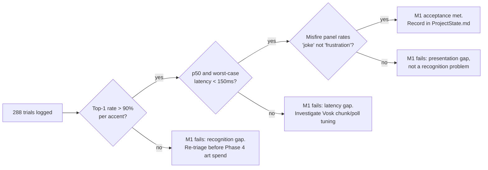

# [Issue #50] M1's acceptance criterion has never been measured — real microphone, multi-accent recognition

**GitHub:** https://github.com/Ajw2003/PlunderSpell/issues/50
**Labels:** `testing` `audio`
**Phase:** Phase 3 — Measure the milestones
**Blocks:** nothing downstream in the backlog directly, but a failed or un-run measurement here is
what `docs/plans/playable-state-backlog.md`'s Phase 3 note calls a **re-triage signal** for Phase 4:
"`P3 -.re-triages.-> P4`" (`docs/plans/playable-state-backlog.md:116`) — if recognition or latency
fails against real speech, Phase 4 art/juice work should not proceed on the assumption that voice
casting works as designed.
**Blocked by:** #47 (no loudness meter), #49 (no recognised-phrase caption), #12 (no damage
feedback), #13 (no spell VFX), #22 (no VFX/SFX anywhere), #48 (casting invisible to teammates), #14
(no usable health/damage model), #18 (no way to test combat) — reasoning below in "What must exist
first" distinguishes which parts of this measurement each one blocks, rather than listing them as a
rubber-stamped dependency on "Phase 0-2 generally."

## Problem

`docs/Roadmap.md:29` defines M1 as done when there is ">90% top-1 recognition across four accents
on the 40-word lexicon, under 150 ms from word-end to effect, and misfires that land as jokes rather
than frustration." That same line continues: "This requires a real microphone and real speakers of
different accents — a unit test against the mock provider does not check this criterion." No such
test has ever been run. `docs/ProjectState.md:13` states this plainly in the milestone table: M1 is
"Code complete, acceptance unchecked" with "❌ — no real-microphone, multi-accent, latency
measurement exists anywhere in the repo." This issue tracks the measurement itself as a deliverable,
not the prose describing its absence.

The gap matters because voice casting is, per `docs/README.md:3-4` and the pitch bible, the single
riskiest and most identity-defining mechanic in the game ("the riskiest assumption in the project —
whether shouting at your own computer feels like power or embarrassment," `docs/Roadmap.md:23`). All
116 automated tests passing (`docs/ProjectState.md:3`, `docs/systems/raid-scene-assembly.md:190`)
proves the mock keyboard path and the misfire-resolution logic are correct; it proves nothing about
whether an actual offline speech model, on real hardware, understands a stranger's voice well enough
to make the pitch's central promise true.

## Current state

**What the acceptance criterion actually says**, quoted verbatim from `docs/Roadmap.md:29`:

> **Acceptance:** >90% top-1 recognition across four accents on the 40-word lexicon, under 150 ms
> from word-end to effect, and misfires that land as jokes rather than frustration. This requires
> a real microphone and real speakers of different accents — a unit test against the mock provider
> does not check this criterion; see `docs/ProjectState.md`.

**What exists today, checked against the source, not assumed:**

- The real recognition path is `VoskVoiceInputService`
  (`Assets/_Project/Scripts/Runtime/Voice/VoskVoiceInputService.cs:33-289`). It opens a 16 kHz mono
  `Microphone.Start()` capture (line 89), feeds 4096-sample chunks to an offline Vosk recognizer on
  a background thread polling at ~100 Hz (`Thread.Sleep(10)`, line 217 — the comment on that exact
  line already claims this "keeps latency well under the 150ms target," which is an unverified
  assertion, not a measurement), and marshals the result back to the main thread via
  `MainThreadPump.DrainPending()` (lines 264-271, 282-287).
- `VoiceServiceLocator` (`Assets/_Project/Scripts/Runtime/Voice/VoiceServiceLocator.cs`, described
  in `docs/systems/voice.md:26-28`) auto-selects `MockVoiceInputService` — never the real Vosk
  path — in the editor, in `HEADLESS` builds, in batch mode, or on a machine with zero microphone
  devices. This means the entire 116-test automated suite, and any driven-Editor CLI session used
  to verify other systems (e.g. `docs/systems/raid-scene-assembly.md:183-191`'s CLI-driven
  verification), **structurally cannot exercise `VoskVoiceInputService` at all** — it always runs
  against the mock. Confirmed by `docs/systems/voice.md:26-28` and by
  `Assets/_Project/Scripts/Tests/Runtime/VoiceCastingTests.cs:56-60`, whose only provider helper
  (`MakeMock`) constructs a `MockVoiceInputService`; no test in that file, or anywhere else found by
  search, ever constructs `VoskVoiceInputService`.
- The authored lexicon is smaller than the acceptance criterion's "40-word" figure describes, and
  this is a real discrepancy worth flagging before the measurement is designed, not after: the
  committed `SpellLexicon.asset` (`Assets/_Project/Data/Spells/SpellLexicon.asset:15-23`) references
  exactly **8** `SpellWord` assets. Each carries 2 `AltPronunciations`
  (e.g. `Assets/_Project/Data/Spells/Spell_IGNIS.asset:17-19`: `IGNIS` with alts `AGNIS`, `IGNISH`;
  every other spell asset in `Assets/_Project/Data/Spells/` follows the same 1-primary + 2-alt
  shape, confirmed by reading all 8). That is 8 × 3 = **24** distinct phrase strings the lexicon
  will accept, not 40. `SpellLexicon.FindByWord`/`FindByNearMatch`
  (`Assets/_Project/Scripts/Runtime/Spells/SpellLexicon.cs:20-85`) operate correctly over whatever
  is authored — this is not a bug in the matching logic, it is a content gap between what
  `docs/Roadmap.md:29` describes and what is actually authored. See "Open questions" below: this
  measurement cannot honestly claim to test "the 40-word lexicon" until either the lexicon is
  expanded to 40 entries or the roadmap's wording is corrected to match the 24 that exist. Both are
  legitimate resolutions; this plan does not pick one, because that is a content/roadmap decision,
  not a testing one.
- Misfires are logged (`SpellCastingSystem.cs:101,107,109,172-176`) but have **no perceivable
  presentation** beyond a `Debug.Log` line: no VFX (#13, #22), no SFX (#22), no damage feedback for
  the misfires that self-damage the caster (#12 — e.g. `Spell_IGNIS.asset:21`'s description "Misfire
  (AGNIS/IGNISH) sets the caster on fire instead," which reads as a `StatusEffectReceiver`-driven
  burn that needs #14's health/damage model wired in to even register). "Misfires that land as jokes
  rather than frustration" is a criterion about a *human's perception of a presented outcome* — there
  is currently nothing presented for a human panel to judge as either a joke or frustration; the
  only artifact is a console log line a player never sees.
- No latency instrumentation exists anywhere in the runtime voice or spell pipeline. A repo-wide
  search for `Stopwatch`, `DateTime.Now` and `Time.realtimeSinceStartup` inside
  `Assets/_Project/Scripts/Runtime` returns matches only in unrelated systems (`RaidHudView.cs`,
  `RaidDirector.cs`, `PlayerInputs.cs`, an editor validator) — none in `Voice/` or `Spells/`. The
  "word-end to effect" clock in the acceptance criterion has never been started or stopped by any
  code in the repo.
- No accent-labelled test data, recording, or results table exists anywhere under `docs/` or
  `Assets/`. There is no `docs/testing/` or equivalent directory holding prior voice-measurement
  runs.

## What must exist first

This is not a rubber-stamped "blocked by all of Phase 0-2" — the two *quantitative* halves of the
criterion (top-1 recognition rate, word-end-to-effect latency) do not actually require a walkable
castle, discoverable loot, or a locked mouse cursor to measure; they only require the real
`VoskVoiceInputService` running against a live scene with `PushToCastController` and
`SpellCastingSystem` wired up, which already exists today. Reasoning through each candidate
dependency rather than assuming it:

- **Does NOT block the recognition-rate / latency measurement:** #5, #19, #6, #25 (castle
  geometry/scale — irrelevant to whether a spoken word is transcribed correctly), #20, #15 (loot
  spawning/discoverability — irrelevant to voice), #8, #9, #7 (mouse lock, menu input gating,
  crosshair — cosmetic to a voice-only test). A tester can stand in the Lair, or any scene with a
  `PushToCastController` + `SpellCastingSystem` + `VoskVoiceInputService` wired up, and speak the
  lexicon; none of Phase 0's castle-walkability fixes change whether Vosk transcribes "IGNIS"
  correctly or how many milliseconds that takes. Listing these as blockers would be exactly the kind
  of rubber-stamp the assignment warns against.
- **DOES block the "misfires land as jokes, not frustration" half of the criterion**, because that
  half is a judgment about *presentation*, and there is currently no presentation to judge:
  - #14 (`docs/plans/issues/014-no-health-damage-model.md`) — a misfire that is supposed to read as
    "the caster catches fire" (`Spell_IGNIS.asset:21`) needs a health/damage model wired to
    `StatusEffectReceiver` before that consequence is anything a tester can see happen to their own
    character.
  - #18 (no way to test combat) — the backlog's own listing
    (`docs/plans/playable-state-backlog.md:148`) names this the venue for exercising combat/misfire
    consequences in isolation; without it, judging a misfire's *feel* means interrupting a live raid,
    which confounds the measurement with unrelated raid state.
  - #12 (no visual feedback for damage), #13 (no visual feedback for spells), #22 (no VFX/SFX
    anywhere), #48 (casting invisible to teammates) — these are the actual presentation layer the
    "joke, not frustration" judgment is about. Right now a misfire is a console line; no human panel
    can rate an unseen, unheard event.
  - #47 (no loudness meter), #49 (no recognised-phrase caption) — not strictly required to *measure*
    accuracy/latency (that can be read from logs and a stopwatch), but both materially help a live
    test session run smoothly: the loudness meter lets a tester confirm they are actually hitting
    `Shout`/`Normal`/`Whisper` buckets deliberately rather than by accident
    (`VoiceUtility.ClassifyVolume`, referenced in `docs/systems/voice.md:35`), and the caption lets an
    operator confirm in real time what Vosk actually heard without tailing a log file mid-session.
    Recommended, not strictly blocking — see "Measurement protocol" for how to run without them if
    time-boxed.
- **Reveals a real prerequisite the backlog doesn't name**: the lexicon-size discrepancy above (8
  words / 24 phrases vs. the roadmap's "40-word" figure) must be resolved — either by authoring 32
  more `SpellWord` entries (a content task, not in this backlog at all) or by correcting
  `docs/Roadmap.md:29`'s wording — before this measurement can honestly claim to test "the 40-word
  lexicon." This plan flags it as an open question rather than picking a side, because it is a
  content/scope decision, not a testing-protocol decision.

## Measurement protocol

This cannot be run as an automated test; `docs/Roadmap.md:29` says so explicitly ("a unit test
against the mock provider does not check this criterion"). It is a human-administered session.

**Who:** one operator (runs the session, records data) plus four speakers with genuinely distinct
accents (e.g. General American, a non-rhotic British accent, a non-native English speaker with
audible L1 interference, and a fourth distinct regional or non-native accent — the specific four are
a scheduling decision, not a technical one, but they must be *real, distinct* accents, not four
speakers of the same accent doing impressions). A single operator can serve as one of the four
speakers if only four people are available in total.

**Setup, per speaker:**
1. Build (or open in the Editor, forcing the real provider) a scene with
   `VoskVoiceInputService` active — this requires bypassing `VoiceServiceLocator`'s editor-always-
   mock rule (`docs/systems/voice.md:26-28`) via `VoiceServiceLocator.Register(new
   VoskVoiceInputService())` before first use, or running an actual Windows player build (which
   `docs/ProjectState.md:82-84` notes has never been produced — see "Effort & risk"; a player build
   may be a soft prerequisite for a fully realistic session, though an Editor Play session with the
   provider force-registered is an acceptable substitute since `VoskVoiceInputService` itself does
   not behave differently in Play mode vs. a standalone build).
2. Confirm the Vosk model is present at `StreamingAssets/VoskModels/small-en-us`
   (`VoskVoiceInputService.cs:39,143`) — `TryLoadModel` (lines 141-164) logs a warning and silently
   returns false if it is missing, which would make every trial silently fail with no error visible
   to a player, only a console warning.
3. Seat the speaker at a real microphone (not a headset optimized for noise cancellation beyond
   what a typical player would use — the point is to measure realistic conditions, not a lab-clean
   signal) in a normal room (not an acoustically treated booth).

**Per-trial procedure (repeat for all 8 lexicon entries × primary word + up to 2 alt pronunciations
— see "Open questions" on whether alts count toward the 40-word figure — for each of the 4
speakers):**
1. Operator names the target spell word (does not show it in writing, to avoid the speaker
   subconsciously over-enunciating from reading text — reading vs. speaking naturally is itself a
   confound worth deciding on deliberately; default: speak it aloud to the tester once, they repeat
   it back from memory/hearing, matching how a player would actually learn a spell word in-game).
2. Speaker holds the push-to-cast key (`PushToCastController._pushToCastKey`, default `KeyCode.V`,
   `PushToCastController.cs:19`), speaks the word, releases.
3. Operator records: the raw text Vosk returned (`VoiceRecognizerJson.text`,
   `VoskVoiceInputService.cs:29`, visible via the `[Vosk] Recognized ...` log line at
   `VoskVoiceInputService.cs:268`), whether it exact-matched or near-matched the intended spell
   (`SpellLexicon.FindByWord`/`FindByNearMatch`), whether the *resolved* `SpellId` was the intended
   spell (a near-match landing on the wrong spell's misfire counts as a miss for accuracy purposes,
   even though the pipeline "worked" in the sense of resolving to something), and the measured
   latency (see "Instrumentation needed" below — this cannot be read from existing logs; it does not
   exist yet).
4. Repeat 3 times per word per speaker (minimum) to get a per-word hit rate rather than a single
   coin-flip sample; more repetitions materially improve statistical confidence at negligible added
   time cost (each trial is under 5 seconds).

**Data to capture**, per trial: speaker (accent label), target word, recognized text, exact/near/no
match, resolved `SpellId`, correct/incorrect, latency in ms, cast volume bucket
(`CastVolume.Whisper/Normal/Shout`), any operator note (e.g. background noise, mic issue).

**Misfire "joke vs. frustration" pass** (run once #14/#18/#12/#13/#22/#48 above have landed):
deliberately trigger each of the 8 spells' misfire (near-match alt pronunciations are authored
specifically to trigger these, e.g. `AGNIS`/`IGNISH` for Ignis) in front of all four speakers acting
as a co-op group in a real short session (the #18 combat test scene, once it exists), and have each
speaker rate the outcome verbally (a joke / neutral / frustrating) — record all four ratings per
misfire, not just the operator's impression.

**How long:** with 4 speakers × 8 words × 3 pronunciation variants (primary + 2 alts) × 3
repetitions = 288 trials at roughly 5-10 seconds each (including recording data) — 25-50 minutes of
raw speaking time, realistically a 90-120 minute session per speaker group once setup, breaks and
data transcription are included. The misfire "joke vs. frustration" pass is a separate short
session (15-20 minutes) once its dependencies land.

## Instrumentation needed

Yes — latency and per-trial accuracy logging do not exist and must be added before this measurement
is possible; console logs alone (`VoskVoiceInputService.cs:268`, `SpellCastingSystem.cs:101-109`)
are not structured or timestamped for this purpose.

**Latency**: the acceptance criterion's clock is "word-end to effect." In this codebase, "word-end"
is best approximated by the moment the push-to-cast key is released — `PushToCastController.EndCasting`
(`Assets/_Project/Scripts/Runtime/Voice/PushToCastController.cs:64-75`), which calls
`service.StopListening()` (line 71) and *that* is what triggers Vosk's `FinalResult()` parse
(`VoskVoiceInputService.cs:117-129`). "Effect" is the moment `SpellCastingSystem` resolves and
executes the spell (`ExecuteEffect`, `SpellCastingSystem.cs:142-154`), which in the offline/
non-networked path this measurement should run in (a solo test rig, not a live 4-player raid — see
"Open questions") happens synchronously in the same call as `HandlePhrase`
(`SpellCastingSystem.cs:96-121`, specifically the `!isSpawned` branch at lines 113-118), so the
dominant latency source is entirely inside `VoskVoiceInputService` between `StopListening()` and
`OnPhraseRecognized` firing — not inside `SpellCastingSystem`, which adds negligible time in this
path. A networked 4-player session would add an additional `ServerRpc`/`ObserversRpc` round trip
(`SpellCastingSystem.cs:128-135,160-162`) on top of this; that additional latency is real but is
M2's concern (#55), not M1's — this measurement should be run solo/offline to isolate the voice
pipeline's own latency, matching how the acceptance criterion is written ("word-end to effect," not
"word-end to every peer's effect").

Add a small diagnostic class in the same assembly as the two events it bridges
(`RogueAi.Voice`, `Assets/_Project/Scripts/Runtime/Voice/RogueAi.Voice.asmdef` — this keeps the
existing "Spells depends on Voice, not the other way around" boundary intact,
`docs/systems/voice.md:29-32`, since this only touches `PushToCastController` and
`IVoiceInputService`, both already in `RogueAi.Voice`):

```csharp
// Assets/_Project/Scripts/Runtime/Voice/VoiceLatencyProbe.cs
using System;
using System.IO;
using UnityEngine;

namespace RogueAi.Voice
{
    /// <summary>
    /// Measurement-only diagnostic for M1's acceptance criterion (docs/Roadmap.md "under 150 ms
    /// from word-end to effect"). Not part of the shipped voice pipeline — attach only during a
    /// measurement session (see docs/plans/issues/050-m1-acceptance-unmeasured.md). Times from the
    /// push-to-cast key release (StopListening — the closest available proxy for "word-end," since
    /// nothing in this codebase detects the end of speech independent of the player's key release)
    /// to the recognized-phrase callback, and appends one CSV row per trial.
    /// </summary>
    [RequireComponent(typeof(PushToCastController))]
    public class VoiceLatencyProbe : MonoBehaviour
    {
        [Tooltip("Speaker/accent label recorded on every row this session. Set per test subject.")]
        [SerializeField] private string _speakerLabel = "unlabeled";

        [Tooltip("CSV path, relative to Application.persistentDataPath.")]
        [SerializeField] private string _outputFileName = "voice-latency-log.csv";

        private PushToCastController _controller;
        private IVoiceInputService _voice;
        private double _wordEndTimestamp;
        private bool _armed;

        private void Awake() => _controller = GetComponent<PushToCastController>();

        private void OnEnable()
        {
            _controller.OnCastingStateChanged.AddListener(OnCastingStateChanged);
            _voice = VoiceServiceLocator.Current;
            if (_voice != null)
                _voice.OnPhraseRecognized += OnPhraseRecognized;

            string path = LogPath();
            if (!File.Exists(path))
                File.AppendAllText(path,
                    "timestamp_utc,speaker,raw_text,normalized_text,volume,latency_ms\n");
        }

        private void OnDisable()
        {
            _controller.OnCastingStateChanged.RemoveListener(OnCastingStateChanged);
            if (_voice != null)
                _voice.OnPhraseRecognized -= OnPhraseRecognized;
        }

        private void OnCastingStateChanged(bool isCasting)
        {
            if (isCasting)
                return; // only care about release (word-end), not press
            _wordEndTimestamp = Time.realtimeSinceStartupAsDouble;
            _armed = true;
        }

        private void OnPhraseRecognized(VoiceRecognitionResult result)
        {
            if (!_armed)
                return; // a stray recognition with no matching release this session
            _armed = false;

            double latencyMs = (Time.realtimeSinceStartupAsDouble - _wordEndTimestamp) * 1000.0;
            string row = string.Join(",",
                DateTime.UtcNow.ToString("o"),
                _speakerLabel,
                Csv(result.RawText),
                Csv(result.NormalizedText),
                result.Volume.ToString(),
                latencyMs.ToString("F1"));

            File.AppendAllText(LogPath(), row + "\n");
            Debug.Log($"[VoiceLatencyProbe] {_speakerLabel}: \"{result.NormalizedText}\" in {latencyMs:F1} ms");
        }

        private string LogPath() => Path.Combine(Application.persistentDataPath, _outputFileName);

        private static string Csv(string s) =>
            string.IsNullOrEmpty(s) ? "" : "\"" + s.Replace("\"", "\"\"") + "\"";
    }
}
```

This assumes `VoiceRecognitionResult` exposes `RawText`/`NormalizedText`/`Volume` fields — confirm
against `Assets/_Project/Scripts/Runtime/Voice/VoiceRecognitionResult.cs` before wiring, since this
sketch has not been compiled (see "Effort & risk"). Attach `VoiceLatencyProbe` next to the player's
existing `PushToCastController` only for the duration of the measurement session; it is not meant to
ship. Accuracy (exact/near/no-match, correct/incorrect spell) is not logged automatically by this
probe — the operator records that by comparing the logged `normalized_text` column against the
intended word per the protocol above, since "was this the spell the operator intended" requires the
human-known ground truth this component has no way to see.

## Acceptance criteria

- [ ] A real-microphone test pass is run across at least four distinct accents against the lexicon
  as currently authored (24 phrase variants across 8 spells) or against an expanded 40-word lexicon,
  whichever the "Open questions" decision below resolves to.
- [ ] Top-1 recognition rate is computed and recorded, broken down per accent and overall, and
  checked against the >90% threshold.
- [ ] Word-end-to-effect latency (per "Instrumentation needed" above) is measured for every trial and
  checked against the <150 ms threshold (median and worst-case both reported, since a threshold
  stated as a hard ceiling is not satisfied by a passing average alone).
- [ ] The misfire "lands as a joke, not frustration" criterion is assessed with a real four-person
  panel rating real presented misfires (not console logs), once its Phase 1/2 dependencies land.
- [ ] Results (pass/fail against each of the three sub-criteria, with the actual numbers) are written
  into `docs/ProjectState.md`'s M1 row, replacing "❌ — no real-microphone, multi-accent, latency
  measurement exists anywhere in the repo" with the measured outcome.

## Visual

```mermaid
sequenceDiagram
    participant Op as Operator
    participant Sp as Speaker (accent N)
    participant PTC as PushToCastController
    participant Vosk as VoskVoiceInputService
    participant Probe as VoiceLatencyProbe
    participant Lex as SpellLexicon/MisfireEngine

    Op->>Sp: names target word (spoken, not shown)
    Sp->>PTC: hold V, speak word, release V
    PTC->>Vosk: StopListening() on release
    Note over Probe: t0 = release timestamp (word-end proxy)
    Vosk->>Vosk: FinalResult() parses JSON on worker thread
    Vosk-->>PTC: OnPhraseRecognized(result) (main thread, next Update)
    Vosk-->>Probe: OnPhraseRecognized(result)
    Note over Probe: t1 = recognition timestamp; latency = t1-t0
    Probe->>Probe: append CSV row (speaker, text, volume, latency)
    Lex->>Lex: MisfireEngine.Resolve(result, lexicon)
    Op->>Op: compare recognized text to intended word,<br/>mark exact/near/no-match, correct/incorrect
```



## Effort & risk

**Size: M** for the instrumentation + protocol design (this plan); the measurement session itself is
a fixed multi-hour human-scheduling cost, not an engineering cost, once instrumentation lands.

Risks:
- **No confirmed Unity Editor install, real microphone, or human test subjects are available to an
  agent in this working environment.** This plan can design and (once compiled and verified by a
  human with an Editor) provide the instrumentation, but the measurement session itself is
  irreducibly a human-administered task — an agent cannot recruit four distinct-accent speakers, sit
  them at a real microphone, or judge whether a misfire feels like a joke. This plan is the protocol
  and the tooling; running it is out of scope for anything that isn't a person with a working build.
- **`VoiceLatencyProbe`'s code sketch has not been compiled** against the real
  `VoiceRecognitionResult` type or Unity 6000.3.15f1's exact `Time.realtimeSinceStartupAsDouble` API
  surface — verify field names before use.
- **The lexicon-size discrepancy (8 words/24 phrases vs. "40-word") must be resolved by a human
  decision before the recognition-rate number can be reported against the roadmap's literal wording**
  — see "Open questions."
- **`VoiceServiceLocator` always resolves to the mock in the Editor** (`docs/systems/voice.md:26-28`),
  so the measurement session needs either a real standalone player build (which
  `docs/ProjectState.md:81-84` says has never been produced — itself #53's open item) or an explicit
  `VoiceServiceLocator.Register(new VoskVoiceInputService())` override before first use in a Play
  session. The latter is faster to set up but is not exactly what a shipped build's boot path does;
  a discrepancy here (e.g. `VoiceServiceLocator`'s batch-mode/no-graphics-device checks,
  `docs/systems/voice.md:27`) could make an Editor-session measurement not fully represent what a
  player experiences.
- **A machine with no microphone silently downgrades to the mock even in a shipped build**
  (`docs/systems/voice.md:57`) — the test rig itself must be double-checked to confirm it is actually
  exercising the real provider (e.g. by confirming the `[Vosk] Listening on '...'` log line,
  `VoskVoiceInputService.cs:102`) rather than silently measuring the mock and reporting nonsense
  numbers.

## Open questions

- Does "the 40-word lexicon" in `docs/Roadmap.md:29` mean 40 authored `SpellWord.Word` primary
  triggers (would require authoring 32 more spells' worth of content, a large scope addition well
  beyond this issue), or does it loosely describe the current 8 words × ~3 pronunciation variants
  ≈ 24-ish surface forms (in which case the roadmap's wording, not the lexicon, needs correcting)?
  This needs a decision from whoever owns the roadmap before the recognition-rate number can be
  reported as satisfying or failing the literal criterion.
- Should recognition accuracy be measured only against each spell's primary `Word`, or also against
  its `AltPronunciations` (which are semantically *supposed* to be near-matches that trigger a
  misfire, not the intended spell)? Counting an alt-pronunciation "hit" as correct vs. as an intended
  misfire changes the accuracy math meaningfully and should be decided before running trials, not
  during analysis.
- Should this measurement be re-run after a standalone player build exists (#53), given the Editor
  measurement caveat above, or is an Editor Play session with the provider force-registered
  considered representative enough to close this issue on its own?

## Definition of done

A human operator has run the protocol above against four real, distinct-accent speakers on the
lexicon as it exists (or as expanded, per the open question above), recorded top-1 accuracy and
word-end-to-effect latency numbers with the instrumentation in this plan, run the misfire panel pass
once its Phase 1/2 dependencies land, and written the measured pass/fail outcome — with the actual
numbers, not just a checkmark — into `docs/ProjectState.md`'s M1 row.
