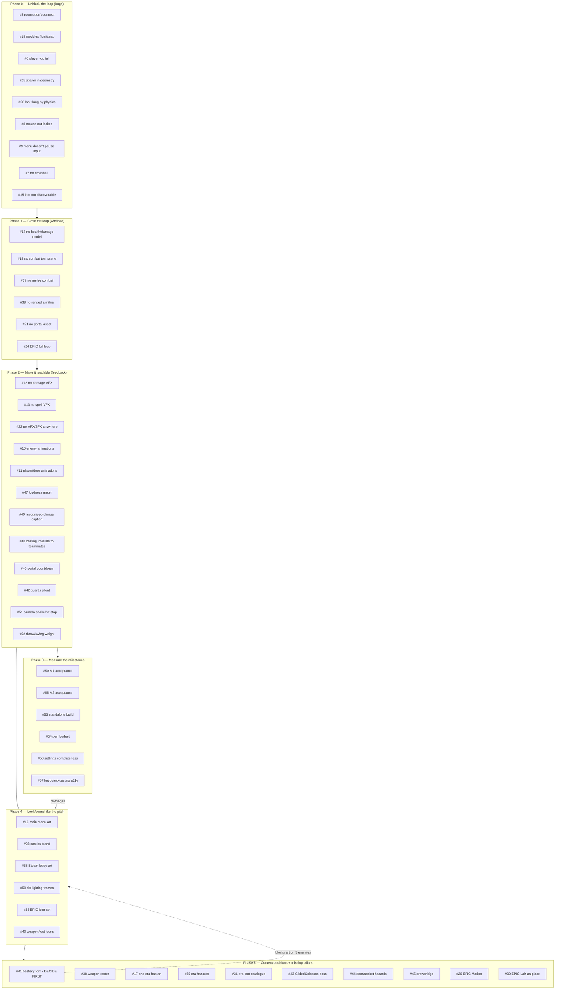

# Playable-state backlog

The organized, deduplicated, phase-ordered version of the full GitHub issue backlog, built to
answer one question: **what does it take to get Plunderspell to a state where four people can sit
down and play a raid together and it feels like the pitch, in the shortest path that doesn't
paint the project into a corner?**

Live until the backlog below is closed out or re-triaged; supersedes ad hoc issue-by-issue work.
Companion to [`docs/plans/moodboard-gap-closure.md`](moodboard-gap-closure.md) (the audit that
produced 34 of these 55 issues) and [`docs/ProjectState.md`](../ProjectState.md) (the milestone
scorecard this backlog moves). Each issue below has its own exhaustive plan in [`Plans/`](../../Plans/) at the repo root
(`Plans/Issue_<n>_Plan.md`), alongside [`Plans/Priority_Queue.md`](../../Plans/Priority_Queue.md);
this document is the map, not the territory.

## Its ordering is superseded (2026-09-18)

`Plans/Priority_Queue.md` is the live execution order, not the phases below. It was written later,
against the directive "get each individual feature completed first to see if the game is fun
mechanically before doing any more artwork," and it orders the same 55 issues differently: all VFX,
SFX, animation and art land in its Phase 4-5, where this document's Phase 2 puts feedback work
ahead of the milestone measurements.

What stays useful here is the **map** — the dedup record, the issue-to-plan index, and the
reasoning about what blocks what. Read the phase tables below as groupings, and take the order to
work in from `Plans/Priority_Queue.md`.

## Dedup pass (2026-09-17)

GitHub had **89 open issues**, but the moodboard-gap-closure backlog (`Tools/mkissues_moodboard_gap.py`)
had been filed twice — #26–59 and an exact re-run as #60–93, same titles, same bodies, same
labels. All 34 duplicates (#60–93) are now closed with `state_reason: duplicate`, pointing at
their original (`duplicate_of`). **55 unique open issues remain: #5–25 (the 2026-09-16 playtesting
backlog) and #26–59 (the moodboard-gap-closure backlog).** Nothing else in the backlog needed
deduplication — the two source audits were explicitly designed not to re-file each other's ground
(`docs/plans/moodboard-gap-closure.md`, "Method").

## How phases were decided

Ordered by **what blocks what**, not by label or issue number:

1. A bug that makes the castle unwalkable blocks every other feature from being evaluated in
   context, so it outranks any feature.
2. A missing core mechanic (health, combat, a portal) blocks the loop from being *completable*,
   which outranks feedback/juice on a loop nobody can finish yet.
3. Feedback and readability (VFX, SFX, animation, captions) make a completable loop legible,
   which is a precondition for a meaningful playtest.
4. The two milestone acceptance criteria (M1 voice, M2 four-player raid) should be **measured**
   once the loop is legible, not before (measuring an illegible loop just re-discovers phase 1–3)
   and not after everything else (a failed measurement should redirect later phases before more
   effort goes in).
5. Art/juice polish and the two missing pillars (Market, Lair-as-a-place) make the game match the
   pitch, but neither blocks a raid from being playable — they're what makes it feel like
   *Plunderspell* rather than merely *a working extraction game*.
6. Content decisions (bestiary fork, weapon roster, eras) are cross-cutting and cheaper to resolve
   before more art is built on top of an unresolved premise — deliberately not last, but not
   blocking either.

## Phase 0 — Unblock the loop

**Why first:** every one of these makes the castle physically or perceptually broken in a way
that invalidates testing anything downstream. #20 and #15 are linked (loot you can't reach because
it flew across the map). #6/#19/#5 are the same generator; #25/#8/#9/#7 are basic playable-state
hygiene that costs nothing to fix and blocks nothing else.

| # | Title | Labels | Plan |
|---|---|---|---|
| [5](https://github.com/Ajw2003/PlunderSpell/issues/5) | PCG: rooms don't connect | `pcg` `bug` | [Issue_5_Plan.md](../../Plans/Issue_5_Plan.md) |
| [19](https://github.com/Ajw2003/PlunderSpell/issues/19) | Modules float and snap inconsistently | `pcg` `bug` | [Issue_19_Plan.md](../../Plans/Issue_19_Plan.md) |
| [6](https://github.com/Ajw2003/PlunderSpell/issues/6) | Player too tall for the rooms | `gameplay` `bug` | [Issue_6_Plan.md](../../Plans/Issue_6_Plan.md) |
| [25](https://github.com/Ajw2003/PlunderSpell/issues/25) | Player spawn inside castle geometry | `gameplay` `bug` | [Issue_25_Plan.md](../../Plans/Issue_25_Plan.md) |
| [20](https://github.com/Ajw2003/PlunderSpell/issues/20) | Loot flung across the map by physics | `physics` `bug` | [Issue_20_Plan.md](../../Plans/Issue_20_Plan.md) |
| [15](https://github.com/Ajw2003/PlunderSpell/issues/15) | No carryable objects discoverable | `gameplay` `bug` | [Issue_15_Plan.md](../../Plans/Issue_15_Plan.md) |
| [8](https://github.com/Ajw2003/PlunderSpell/issues/8) | Mouse not locked or hidden | `ui` `bug` | [Issue_8_Plan.md](../../Plans/Issue_8_Plan.md) |
| [9](https://github.com/Ajw2003/PlunderSpell/issues/9) | Player moves while main menu open | `ui` `bug` | [Issue_9_Plan.md](../../Plans/Issue_9_Plan.md) |
| [7](https://github.com/Ajw2003/PlunderSpell/issues/7) | No crosshair | `ui` `enhancement` | [Issue_7_Plan.md](../../Plans/Issue_7_Plan.md) |

## Phase 1 — Close the loop

**Why second:** a raid that can't be won or lost isn't a game yet. These are the systems that
turn "walk around a pretty castle" into "raid it."

| # | Title | Labels | Plan |
|---|---|---|---|
| [14](https://github.com/Ajw2003/PlunderSpell/issues/14) | No usable health or damage model | `gameplay` `enhancement` | [Issue_14_Plan.md](../../Plans/Issue_14_Plan.md) |
| [18](https://github.com/Ajw2003/PlunderSpell/issues/18) | No way to test combat | `gameplay` `enhancement` | [Issue_18_Plan.md](../../Plans/Issue_18_Plan.md) |
| [37](https://github.com/Ajw2003/PlunderSpell/issues/37) | No melee combat system | `gameplay` `combat` | [Issue_37_Plan.md](../../Plans/Issue_37_Plan.md) |
| [39](https://github.com/Ajw2003/PlunderSpell/issues/39) | Ranged weapons have no aim/fire | `gameplay` `enhancement` | [Issue_39_Plan.md](../../Plans/Issue_39_Plan.md) |
| [21](https://github.com/Ajw2003/PlunderSpell/issues/21) | No portal asset | `art` `gameplay` | [Issue_21_Plan.md](../../Plans/Issue_21_Plan.md) |
| [24](https://github.com/Ajw2003/PlunderSpell/issues/24) | EPIC: build the game loop end to end | `epic` `gameplay` | [Issue_24_Plan.md](../../Plans/Issue_24_Plan.md) |

## Phase 2 — Make it readable

**Why third:** once the loop can be won or lost, a player needs to *perceive* why. This is the
largest phase because "silent, invisible feedback" is the single most repeated finding across
both source audits.

| # | Title | Labels | Plan |
|---|---|---|---|
| [12](https://github.com/Ajw2003/PlunderSpell/issues/12) | No visual feedback for damage | `vfx` `enhancement` | [Issue_12_Plan.md](../../Plans/Issue_12_Plan.md) |
| [13](https://github.com/Ajw2003/PlunderSpell/issues/13) | No visual feedback for spells | `vfx` `enhancement` | [Issue_13_Plan.md](../../Plans/Issue_13_Plan.md) |
| [22](https://github.com/Ajw2003/PlunderSpell/issues/22) | No VFX or SFX anywhere | `vfx` `audio` | [Issue_22_Plan.md](../../Plans/Issue_22_Plan.md) |
| [10](https://github.com/Ajw2003/PlunderSpell/issues/10) | Enemies have no animations | `animation` `enhancement` | [Issue_10_Plan.md](../../Plans/Issue_10_Plan.md) |
| [11](https://github.com/Ajw2003/PlunderSpell/issues/11) | No player/door animations | `animation` `enhancement` | [Issue_11_Plan.md](../../Plans/Issue_11_Plan.md) |
| [47](https://github.com/Ajw2003/PlunderSpell/issues/47) | No loudness meter | `ui` `audio` | [Issue_47_Plan.md](../../Plans/Issue_47_Plan.md) |
| [49](https://github.com/Ajw2003/PlunderSpell/issues/49) | Recognised phrase has no caption | `ui` `accessibility` | [Issue_49_Plan.md](../../Plans/Issue_49_Plan.md) |
| [48](https://github.com/Ajw2003/PlunderSpell/issues/48) | Casting invisible to teammates | `networking` `vfx` `audio` | [Issue_48_Plan.md](../../Plans/Issue_48_Plan.md) |
| [46](https://github.com/Ajw2003/PlunderSpell/issues/46) | Portal has no closing-countdown feedback | `vfx` `audio` `gameplay` | [Issue_46_Plan.md](../../Plans/Issue_46_Plan.md) |
| [42](https://github.com/Ajw2003/PlunderSpell/issues/42) | Guards are silent | `audio` `enhancement` | [Issue_42_Plan.md](../../Plans/Issue_42_Plan.md) |
| [51](https://github.com/Ajw2003/PlunderSpell/issues/51) | No camera shake, hit-stop, or juice | `juice` `vfx` | [Issue_51_Plan.md](../../Plans/Issue_51_Plan.md) |
| [52](https://github.com/Ajw2003/PlunderSpell/issues/52) | Throwing/swinging have no wind-up weight | `animation` `juice` | [Issue_52_Plan.md](../../Plans/Issue_52_Plan.md) |

## Phase 3 — Measure the milestones

**Why fourth:** measuring now (not before Phase 2, not after Phase 5) means the loop is legible
enough that a failed measurement is informative rather than a re-discovery of Phase 0–2 gaps.

| # | Title | Labels | Plan |
|---|---|---|---|
| [50](https://github.com/Ajw2003/PlunderSpell/issues/50) | M1 acceptance never measured | `testing` `audio` | [Issue_50_Plan.md](../../Plans/Issue_50_Plan.md) |
| [55](https://github.com/Ajw2003/PlunderSpell/issues/55) | M2 acceptance never run | `testing` `gameplay` | [Issue_55_Plan.md](../../Plans/Issue_55_Plan.md) |
| [53](https://github.com/Ajw2003/PlunderSpell/issues/53) | No standalone player build | `testing` `build` | [Issue_53_Plan.md](../../Plans/Issue_53_Plan.md) |
| [54](https://github.com/Ajw2003/PlunderSpell/issues/54) | No performance budget/profiling | `testing` `performance` | [Issue_54_Plan.md](../../Plans/Issue_54_Plan.md) |
| [56](https://github.com/Ajw2003/PlunderSpell/issues/56) | Settings menu completeness unverified | `ui` `settings` | [Issue_56_Plan.md](../../Plans/Issue_56_Plan.md) |
| [57](https://github.com/Ajw2003/PlunderSpell/issues/57) | No keyboard-casting accessibility mode | `accessibility` | [Issue_57_Plan.md](../../Plans/Issue_57_Plan.md) |

## Phase 4 — Look and sound like the pitch

**Why fifth:** cosmetic/production-value work. Deliberately after the loop is provably playable
(Phase 0–3) so art isn't spent on a loop that might still change shape.

| # | Title | Labels | Plan |
|---|---|---|---|
| [16](https://github.com/Ajw2003/PlunderSpell/issues/16) | Main menu has no art | `art` `ui` | [Issue_16_Plan.md](../../Plans/Issue_16_Plan.md) |
| [23](https://github.com/Ajw2003/PlunderSpell/issues/23) | Castles look bland | `art` `enhancement` | [Issue_23_Plan.md](../../Plans/Issue_23_Plan.md) |
| [58](https://github.com/Ajw2003/PlunderSpell/issues/58) | Steam lobby has no art/branding | `ui` `art` `networking` | [Issue_58_Plan.md](../../Plans/Issue_58_Plan.md) |
| [59](https://github.com/Ajw2003/PlunderSpell/issues/59) | Six reference lighting frames missing | `art` `lighting` `design` | [Issue_59_Plan.md](../../Plans/Issue_59_Plan.md) |
| [34](https://github.com/Ajw2003/PlunderSpell/issues/34) | EPIC: no icon set exists | `epic` `art` `ui` | [Issue_34_Plan.md](../../Plans/Issue_34_Plan.md) |
| [40](https://github.com/Ajw2003/PlunderSpell/issues/40) | Weapon and loot icons don't exist | `art` `ui` | [Issue_40_Plan.md](../../Plans/Issue_40_Plan.md) |

## Phase 5 — Content decisions and missing pillars

**Why last (but not lowest priority):** #41 is flagged to decide **first within this phase** —
every hour spent animating/scoring the five divergent enemies before that decision is hours that
may need redoing. The Market and Lair epics are the biggest remaining pieces of net-new scope in
the project; both are pitch-critical but neither blocks a raid from being playable today.

| # | Title | Labels | Plan |
|---|---|---|---|
| [41](https://github.com/Ajw2003/PlunderSpell/issues/41) | Bestiary thematic divergence — **decide first** | `decision-needed` | [Issue_41_Plan.md](../../Plans/Issue_41_Plan.md) |
| [38](https://github.com/Ajw2003/PlunderSpell/issues/38) | Weapon roster doesn't match the pitch | `art` `content` `design` | [Issue_38_Plan.md](../../Plans/Issue_38_Plan.md) |
| [17](https://github.com/Ajw2003/PlunderSpell/issues/17) | Only one era has art and models | `art` `enhancement` | [Issue_17_Plan.md](../../Plans/Issue_17_Plan.md) |
| [35](https://github.com/Ajw2003/PlunderSpell/issues/35) | Era-specific hazards unimplemented | `gameplay` `content` `design` | [Issue_35_Plan.md](../../Plans/Issue_35_Plan.md) |
| [36](https://github.com/Ajw2003/PlunderSpell/issues/36) | Era-specific loot catalogue unauthored | `content` `art` `design` | [Issue_36_Plan.md](../../Plans/Issue_36_Plan.md) |
| [43](https://github.com/Ajw2003/PlunderSpell/issues/43) | GildedColossus boss has no behaviour | `gameplay` `design` | [Issue_43_Plan.md](../../Plans/Issue_43_Plan.md) |
| [44](https://github.com/Ajw2003/PlunderSpell/issues/44) | Door/socket types aren't functional hazards | `gameplay` `design` | [Issue_44_Plan.md](../../Plans/Issue_44_Plan.md) |
| [45](https://github.com/Ajw2003/PlunderSpell/issues/45) | Drawbridge has no operable mechanism | `gameplay` `animation` | [Issue_45_Plan.md](../../Plans/Issue_45_Plan.md) |
| [26](https://github.com/Ajw2003/PlunderSpell/issues/26) | EPIC: The Mystical Market pillar | `epic` `market` | [Issue_26_Plan.md](../../Plans/Issue_26_Plan.md) |
| [27](https://github.com/Ajw2003/PlunderSpell/issues/27) | Build the market hub | `market` `ui` | [Issue_27_Plan.md](../../Plans/Issue_27_Plan.md) |
| [28](https://github.com/Ajw2003/PlunderSpell/issues/28) | Author wares/pricing for all stalls | `market` `content` `design` | [Issue_28_Plan.md](../../Plans/Issue_28_Plan.md) |
| [29](https://github.com/Ajw2003/PlunderSpell/issues/29) | Market mark-up / leftover-spend rules | `market` `gameplay` | [Issue_29_Plan.md](../../Plans/Issue_29_Plan.md) |
| [30](https://github.com/Ajw2003/PlunderSpell/issues/30) | EPIC: The Lair is a menu, not a place | `epic` `lair` `art` | [Issue_30_Plan.md](../../Plans/Issue_30_Plan.md) |
| [31](https://github.com/Ajw2003/PlunderSpell/issues/31) | Build a 3D Lair space | `lair` `art` | [Issue_31_Plan.md](../../Plans/Issue_31_Plan.md) |
| [32](https://github.com/Ajw2003/PlunderSpell/issues/32) | Lair lighting and mood pass | `lair` `art` `lighting` | [Issue_32_Plan.md](../../Plans/Issue_32_Plan.md) |
| [33](https://github.com/Ajw2003/PlunderSpell/issues/33) | Debt/hoard have no in-fiction representation | `lair` `ui` | [Issue_33_Plan.md](../../Plans/Issue_33_Plan.md) |

## Status

| Phase | Issues | Status |
|---|---|---|
| 0 — Unblock the loop | 9 | Not started |
| 1 — Close the loop | 6 | Not started |
| 2 — Make it readable | 12 | Not started |
| 3 — Measure the milestones | 6 | Not started |
| 4 — Look/sound like the pitch | 6 | Not started |
| 5 — Content decisions + pillars | 16 | Not started |
| **Total** | **55** | |

Update the phase status rows as issues close. This document does not get rewritten per-issue —
only the status table and the "Dedup pass" date if a future re-triage happens.
